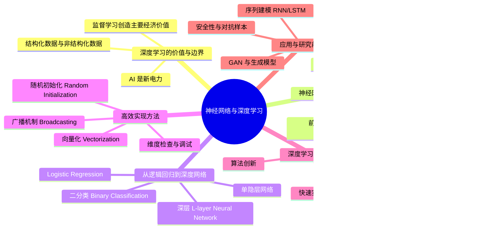

# neural-networks-and-deep-learning

# 1. 🧠 课程思维导图 (Mind Map)



---

# 2. 📌 核心精要 (Executive Summary)

- **深度学习（Deep Learning）本质上是训练大规模神经网络（Neural Networks）来学习从输入 \(x\) 到输出 \(y\) 的复杂映射，其最成熟、最具经济价值的落地形式是监督学习（Supervised Learning）。**
- 深度学习近年爆发的核心原因不是“概念新”，而是**数据规模（Data Scale）**、**计算能力（Computation）**和**算法创新（Algorithmic Innovation）**三者同时成熟，尤其是大数据与 GPU 支持下的大模型训练。
- 从工程实现角度，课程的核心方法链条是：**逻辑回归（Logistic Regression） → 单隐层神经网络 → 深层网络**，并通过**前向传播、损失函数、反向传播、梯度下降、向量化实现**完成训练。
- 深度学习的真正门槛不只是理解公式，而是能把公式转化为**高效、无 bug 的矩阵化代码**；因此本课程特别强调**向量化（Vectorization）**、**广播（Broadcasting）**、**维度检查**与**随机初始化**。
- 深度网络之所以强大，在于它能逐层构建**从简单到复杂的层次化表示（Hierarchical Representation）**：例如图像中从边缘到部件到整体物体，语音中从波形到音素到单词到句子。

---

# 3. 📖 详细知识模块 (Detailed Notes)

---

## 模块一：深度学习的定位、价值与应用版图

### 1.1 深度学习是什么：定义与本质

#### What
- **深度学习（Deep Learning）**：指训练**神经网络（Neural Networks）**，尤其是**层数较深、参数较多的大型神经网络**。
- 神经网络的目标，是从大量样本中学习一个从**输入 \(x\)** 到**输出 \(y\)** 的函数映射。

#### Why
- 传统方法往往依赖手工设计特征（Feature Engineering），而神经网络能够**自动学习有用特征表示**。
- 当数据量足够、网络足够大时，神经网络可以逼近复杂函数，尤其适合高维、非线性、非结构化数据。

#### How
- 典型任务：
  - 房价预测：输入房屋面积、卧室数、邮编、社区财富等，输出价格
  - 图像分类：输入像素，输出“猫 / 非猫”
  - 语音识别：输入音频，输出文本
  - 机器翻译：输入英文句子，输出中文句子
  - 自动驾驶：输入图像与雷达，输出其他车辆位置

---

### 1.2 Andrew Ng 的核心判断：**“AI is the new electricity”**

#### What
- 课程提出一个重要判断：**“人工智能（AI）是新的电力（new electricity）。”**

#### Why
- 电力在约 100 年前改造了几乎所有行业：交通、制造、医疗、通信。
- AI 尤其是深度学习，正在以类似方式重塑互联网、医疗、教育、农业、自动驾驶等领域。

#### How
- 课程给出的场景：
  - 医疗：深度学习已很擅长读取 **X-ray images（X 光图像）**
  - 个性化教育（personalized education）
  - 精准农业（precision agriculture）
  - 自动驾驶（self-driving cars）

**核心结论：**
- **深度学习不是单一行业技术，而是通用基础能力。**

---

### 1.3 当前经济价值主要来自哪里：监督学习

#### What
- **监督学习（Supervised Learning）**：给定带标签样本 \((x, y)\)，学习从输入 \(x\) 到输出 \(y\) 的映射函数。

#### Why
- 截至课程内容所述阶段，**神经网络创造的几乎全部主要经济价值都来自监督学习**。
- 因为业务目标通常可转化为明确预测问题：
  - 是否点击广告
  - 图片属于哪一类
  - 音频对应什么文本
  - 是否存在病灶
  - 车辆位置在哪里

#### How
- 课程中的经典监督学习映射：
  - 房价预测：\(x=\) 房屋特征，\(y=\) 价格
  - 广告点击预测：\(x=\) 用户与广告信息，\(y=\) 是否点击
  - 图像识别：\(x=\) 图像，\(y=\) 类别索引
  - 语音识别：\(x=\) 音频，\(y=\) 文本转写
  - 机器翻译：\(x=\) 英文句子，\(y=\) 中文句子
  - 自动驾驶感知：\(x=\) 图像+雷达，\(y=\) 车辆位置

**关键观点：**
- **很多深度学习成功的关键，不只是模型本身，而是巧妙定义“什么是 \(x\)，什么是 \(y\)”**。

---

### 1.4 结构化数据与非结构化数据

#### What
- **结构化数据（Structured Data）**：表格/数据库型数据，每个字段含义清晰。
- **非结构化数据（Unstructured Data）**：图像、音频、文本等原始感知数据。

#### Why
- 历史上，计算机更擅长处理结构化数据。
- 深度学习的重要突破之一，是显著提升了机器处理非结构化数据的能力。

#### How
- 结构化数据示例：
  - 房屋面积、卧室数量
  - 用户年龄、广告特征
- 非结构化数据示例：
  - 图像像素值
  - 音频波形
  - 文本中的词序列

**核心结论：**
- 媒体更常报道“识别猫”“听懂语音”这类非结构化数据成就；
- 但**短期经济价值也大量来自结构化数据场景**，如广告、推荐、数据库预测。

---

### 1.5 不同任务对应的常见网络结构

#### What
不同数据形态适合不同神经网络结构：

- **标准前馈网络（Standard Neural Network）**
- **卷积神经网络（Convolutional Neural Network, CNN）**
- **循环神经网络（Recurrent Neural Network, RNN）**
- **长短期记忆网络（Long Short-Term Memory, LSTM）**

#### Why
- 图像有空间局部结构，序列有时间依赖结构。
- 专门结构能更有效编码数据先验。

#### How
- 房价、广告点击：常用标准前馈网络
- 图像：常用 **CNN**
- 音频、语言：常用 **RNN / LSTM**
- 自动驾驶：可能是 **CNN + 雷达信息的混合架构**

---

## 模块二：深度学习为何在近年爆发

### 2.1 三大驱动力：数据、算力、算法

#### What
深度学习崛起的三大核心驱动力：

1. **数据规模（Scale of Data）**
2. **计算规模（Scale of Computation）**
3. **算法创新（Algorithmic Innovation）**

#### Why
- 神经网络理论并不新，很多思想已存在数十年。
- 真正变化的是：
  - 社会全面数字化，标签数据更多
  - GPU / CPU 计算能力提升
  - 算法让训练更快更稳定

#### How
- Andrew Ng 用一张性能曲线来解释：
  - 传统算法（如 **支持向量机 Support Vector Machine, SVM**、**逻辑回归 Logistic Regression**）随着数据增加，性能提升后趋于平台
  - 小神经网络提升更多
  - 更大神经网络在大数据区间还能持续提升

**核心结论：**
- **深度学习的优势通常在“大数据 + 大模型”条件下才最稳定显现。**

---

### 2.2 “规模”真正指什么

#### What
课程中“规模（Scale）”包括两层含义：

- **网络规模**：更多隐藏单元、更多参数、更多连接
- **数据规模**：更多有标签样本

#### Why
- 要达到高性能，通常同时需要：
  - 足够大的模型，才能吸收复杂模式
  - 足够多的数据，才能支撑大模型不只是记忆而是真正学习

#### How
- 课程引入记号：
  - **\(m\)**：训练样本数量（number of training examples）
- Andrew Ng 的经验判断：
  - **提升性能最可靠的方法之一，往往是：训练更大的网络，或喂更多数据。**

---

### 2.3 社会数字化如何带来数据红利

#### What
近二十年数据量暴涨，源于社会活动的大规模数字化。

#### Why
- 网站、App、数字设备记录了大量用户行为
- 智能手机摄像头、加速度计、物联网传感器不断产出新数据

#### How
- 具体来源：
  - 网站点击行为
  - App 使用记录
  - 手机摄像头图像
  - 传感器时间序列
  - 物联网设备数据

---

### 2.4 算法创新的典型例子：Sigmoid → ReLU

#### What
一个重要算法改进是将激活函数从 **Sigmoid** 转向 **ReLU（Rectified Linear Unit）**。

#### Why
- **Sigmoid** 在输入很大或很小时，梯度接近 0，导致学习速度慢。
- **ReLU** 在正区间梯度为 1，更不容易出现梯度极小问题，训练更快。

#### How
- Sigmoid：在两侧饱和，更新慢
- ReLU：
  \[
  g(z)=\max(0,z)
  \]
  - \(z>0\) 时梯度为 1
  - \(z<0\) 时梯度为 0

**核心结论：**
- 很多所谓“算法创新”，本质上是在**提升训练效率**，从而允许更大规模实验。

---

### 2.5 快速实验迭代为何重要

#### What
训练神经网络是一个“想法 → 实现 → 实验 → 分析 → 迭代”的循环。

#### Why
- 如果一个实验 10 分钟返回结果，你可以一天尝试很多想法。
- 如果一个实验需要一个月，研究和工程迭代将极其缓慢。

#### How
- 快速计算的价值不只在最终训练速度，还在于：
  - 更快验证架构想法
  - 更快调超参数
  - 更快发现错误方向
  - 更快找到有效方案

---

## 模块三：神经网络的本质与表示能力

### 3.1 单个神经元：最简单的神经网络

#### What
单个神经元可以看作一个简单函数单元。

#### Why
- 它接受输入，做线性变换，再经过非线性激活函数，输出结果。
- 这是构成复杂网络的基本积木。

#### How
课程中的房价例子：

- 输入：房屋面积 \(x\)
- 输出：价格 \(y\)
- 使用的函数形状：左边截断为 0，右边线性增长

这可以看作一个 **ReLU** 神经元：
\[
y = \max(0, wx+b)
\]

---

### 3.2 多个神经元堆叠：从显式特征到隐藏表示

#### What
多个神经元堆叠，形成更大的网络。

#### Why
- 复杂预测往往不是直接从原始输入一步完成，而是先学习中间表示（Hidden Representation）。
- 这些中间表示未在数据中直接标注，因此叫**隐藏单元（Hidden Units）**。

#### How
房价扩展示例：

输入特征：
- 房屋面积
- 卧室数量
- 邮编
- 社区财富

网络可能自动学习出中间概念：
- 家庭适配度（family size fit）
- 步行便利度（walkability）
- 学校质量（school quality）

再综合这些中间表示预测价格。

**关键点：**
- 实际训练时，不需要人为指定中间节点必须代表什么；
- **只需提供输入 \(x\) 和输出 \(y\)，网络会自己学习中间层表示。**

---

### 3.3 深层表示为何有效：层次化特征学习

#### What
深度网络通过多层变换，从简单特征逐层组合出复杂概念。

#### Why
- 现实世界中的很多概念天然具有组合结构：
  - 图像：边缘 → 纹理/局部 → 部件 → 物体
  - 语音：波形 → 音素 → 单词 → 句子

#### How
课程中的两个典型解释：

##### 图像识别
- 第一层：检测边缘
- 第二层：检测眼睛、鼻子、嘴等局部部件
- 更深层：识别人脸

##### 语音识别
- 第一层：学习低级波形特征
- 第二层：学习音素（phonemes）
- 更深层：学习单词与句子

---

### 3.4 深网络比浅网络强在哪里

#### What
某些函数用深网络可以高效表达，但若用浅网络，所需隐藏单元数会指数级增加。

#### Why
- 深层结构能重用中间计算结果，形成层次化组合。
- 浅层网络要直接表达高复杂度组合关系，代价巨大。

#### How
课程中的理论直觉来自**电路理论（Circuit Theory）**：

- 对输入做一连串 **XOR（exclusive OR）** 运算
- 若用树形深结构实现，复杂度较低
- 若强制用单隐藏层表示，需要近似枚举大量输入组合，隐藏单元数可能呈指数增长

**核心结论：**
- **深度不只是“参数多”，而是“表达方式更高效”。**

---

## 模块四：从逻辑回归到神经网络——课程的数学主线

### 4.1 二分类问题与图像向量化

#### What
课程从**二分类（Binary Classification）**出发，引入逻辑回归。

#### Why
- 它是理解神经网络训练流程的最简单入口。
- 神经网络的很多计算模式，逻辑回归已经具备雏形。

#### How
猫图像示例：

- 图像大小：**64 × 64 × 3**
- 展平成向量：
  \[
  n_x = 64 \times 64 \times 3 = 12,288
  \]

样本记号：
- 单个样本：\((x^{(i)}, y^{(i)})\)
- 训练集大小：\(m\)

矩阵表示：
- \(X \in \mathbb{R}^{n_x \times m}\)
- \(Y \in \mathbb{R}^{1 \times m}\)

**关键工程约定：**
- 本课程将**不同训练样本按列（columns）堆叠**，不是按行。
- 这是为了后续神经网络的矩阵化计算更方便。

---

### 4.2 逻辑回归（Logistic Regression）

#### What
**逻辑回归（Logistic Regression）**是用于二分类的模型。

#### Why
- 预测的不是类别值本身，而是：
  \[
  \hat y = P(y=1|x)
  \]
- 因此输出必须在 0 到 1 之间。

#### How
线性部分：
\[
z=w^Tx+b
\]

输出层使用 **Sigmoid activation function**：
\[
\hat y = a = \sigma(z)=\frac{1}{1+e^{-z}}
\]

解释：
- \(z\) 很大时，\(\hat y \approx 1\)
- \(z\) 很小时，\(\hat y \approx 0\)

---

### 4.3 损失函数（Loss Function）与成本函数（Cost Function）

#### What
单样本损失函数：
\[
L(\hat y,y)=-(y\log \hat y +(1-y)\log(1-\hat y))
\]

整体成本函数：
\[
J(w,b)=\frac{1}{m}\sum_{i=1}^{m}L(\hat y^{(i)}, y^{(i)})
\]

#### Why
- 平方误差（Squared Error）虽然直观，但用于逻辑回归会导致优化问题不易处理。
- 交叉熵形式的损失使逻辑回归成本函数成为**凸函数（Convex Function）**，优化更稳定。

#### How
- 若 \(y=1\)，损失退化为：
  \[
  -\log \hat y
  \]
  这会推动 \(\hat y \to 1\)
- 若 \(y=0\)，损失退化为：
  \[
  -\log(1-\hat y)
  \]
  这会推动 \(\hat y \to 0\)

---

### 4.4 最大似然解释（Maximum Likelihood Estimation）

#### What
逻辑回归的损失函数可解释为**最大似然估计（Maximum Likelihood Estimation）**。

#### Why
- 若将 \(\hat y\) 视为 \(P(y=1|x)\)，则：
  \[
  P(y|x)=\hat y^y(1-\hat y)^{1-y}
  \]
- 最大化数据概率，等价于最大化其对数似然；再乘上负号，就变成最小化损失。

#### How
单样本：
\[
\log P(y|x)= y\log\hat y +(1-y)\log(1-\hat y)
\]

整体训练集在 IID 假设下，目标变成：
\[
\max \sum_i \log P(y^{(i)}|x^{(i)})
\]
等价于最小化交叉熵成本函数。

---

## 模块五：梯度下降、导数与计算图

### 5.1 梯度下降（Gradient Descent）

#### What
**梯度下降（Gradient Descent）**用于最小化成本函数。

#### Why
- 我们希望找到使 \(J(w,b)\) 最小的参数。
- 梯度提供函数上升最快方向；反方向就是下降最快方向。

#### How
单变量形式：
\[
w := w - \alpha \frac{dJ}{dw}
\]

双变量形式：
\[
w := w - \alpha \frac{\partial J}{\partial w}
\]
\[
b := b - \alpha \frac{\partial J}{\partial b}
\]

其中：
- **学习率（Learning Rate） \(\alpha\)**：控制每一步迈多大

**关键结论：**
- 在逻辑回归中，成本函数是凸的，因此从不同初值出发，通常都会收敛到同一全局最优附近。

---

### 5.2 导数（Derivative）的直觉

#### What
**导数（Derivative）**本质上是函数在某点的**斜率（Slope）**。

#### Why
- 梯度下降靠导数判断参数朝哪个方向更新、更新多少。

#### How
课程举了几个例子：

##### 例 1：\(f(a)=3a\)
- 任意点斜率都为 3

##### 例 2：\(f(a)=a^2\)
- 导数为：
  \[
  \frac{d}{da}a^2 = 2a
  \]
- 当 \(a=2\)，斜率为 4
- 当 \(a=5\)，斜率为 10

##### 例 3：\(f(a)=a^3\)
- 导数为：
  \[
  \frac{d}{da}a^3=3a^2
  \]

##### 例 4：\(f(a)=\log a\)
- 导数为：
  \[
  \frac{d}{da}\log a = \frac{1}{a}
  \]

---

### 5.3 计算图（Computation Graph）

#### What
**计算图（Computation Graph）**将复杂计算分解为多个简单步骤。

#### Why
- 前向传播按计算图从左到右执行
- 反向传播按链式法则从右到左求导

#### How
课程示例：
\[
J = 3(a+bc)
\]
分解为：
1. \(u=bc\)
2. \(v=a+u\)
3. \(J=3v\)

然后反向计算：
- \(\frac{dJ}{dv}=3\)
- \(\frac{dJ}{da}=3\)
- \(\frac{dJ}{du}=3\)
- \(\frac{dJ}{db}=6\)
- \(\frac{dJ}{dc}=9\)

**方法论：**
- 前向：算值
- 反向：算导数
- 利用**链式法则（Chain Rule）**逐层传递梯度

---

### 5.4 逻辑回归的反向传播

#### What
逻辑回归可以看作一个极小型神经网络。

#### Why
- 它已经具备神经网络训练的完整骨架：
  - 前向传播
  - 损失函数
  - 反向传播
  - 参数更新

#### How
单样本：

前向：
\[
z=w^Tx+b
\]
\[
a=\sigma(z)
\]
\[
L(a,y)=-(y\log a+(1-y)\log(1-a))
\]

反向核心结果：
\[
dz = a-y
\]
\[
dw = xdz
\]
\[
db = dz
\]

多样本：
\[
dw=\frac{1}{m}Xdz^T
\]
\[
db=\frac{1}{m}\sum dz
\]

---

## 模块六：向量化（Vectorization）与高效实现

### 6.1 为什么必须向量化

#### What
**向量化（Vectorization）**：尽量用矩阵/向量运算替代显式 for 循环。

#### Why
- 深度学习通常面对大规模数据集
- 显式 for 循环在 Python 中很慢
- 向量化可充分利用 **CPU/GPU 的 SIMD 并行指令**

#### How
课程实测：

- 向量化点积：
  - 约 **1.5 ms**
- 显式 for-loop 实现：
  - 约 **481 ms**

**速度差约 300 倍。**

**核心结论：**
- **在深度学习时代，向量化不是“加速小技巧”，而是基本工程能力。**

---

### 6.2 逻辑回归的完全向量化

#### What
对全部训练样本同时做前向和反向传播。

#### How

前向传播：
\[
Z = w^TX + b
\]
\[
A = \sigma(Z)
\]

反向传播：
\[
dZ = A - Y
\]
\[
dw = \frac{1}{m}XdZ^T
\]
\[
db = \frac{1}{m}\sum dZ
\]

参数更新：
\[
w := w - \alpha dw
\]
\[
b := b - \alpha db
\]

---

### 6.3 广播机制（Broadcasting）

#### What
**广播（Broadcasting）**：Python/NumPy 自动扩展较小维度数组，使其能与较大矩阵做逐元素运算。

#### Why
- 避免手动复制矩阵
- 让代码更短更快

#### How
课程食物热量示例：

矩阵 \(A\) 表示 4 种食物在碳水、蛋白质、脂肪上的热量贡献，目标是计算每列中每种营养素占比。

步骤：
1. 按列求和：
   ```python
   cal = A.sum(axis=0)
   ```
2. 计算百分比：
   ```python
   percentage = A / cal.reshape(1,4) * 100
   ```

苹果（100g）总热量：
- \(56 + 1.2 + 1.8 = 59\)
- 碳水占比：
  \[
  56/59 \approx 94.9\%
  \]

---

### 6.4 Python/Numpy 向量调试习惯

#### What
NumPy 的灵活性很强，但也容易引入隐蔽 bug。

#### Why
- 特别是 **rank 1 array**（形状如 `(5,)`）既不像严格列向量，也不像严格行向量，会导致奇怪行为。

#### How
**推荐实践：**
- 不要依赖 rank 1 array
- 显式使用：
  - 列向量 `(n,1)`
  - 行向量 `(1,n)`
- 多用：
  ```python
  reshape(...)
  assert(a.shape == (...))
  ```

**核心结论：**
- **深度学习代码调试的关键之一，是维度管理 discipline。**

---

## 模块七：单隐层神经网络与深层网络

### 7.1 单隐层网络的表示

#### What
一个单隐层神经网络通常包含：

- 输入层（Input Layer）
- 隐藏层（Hidden Layer）
- 输出层（Output Layer）

#### Why
- 隐藏层允许网络学习中间表示，而不是直接线性映射输入到输出。

#### How
记号：
- 输入层激活：
  \[
  a^{[0]} = x
  \]
- 隐藏层激活：
  \[
  a^{[1]}
  \]
- 输出层激活：
  \[
  a^{[2]} = \hat y
  \]

参数：
- \(W^{[1]}, b^{[1]}\)
- \(W^{[2]}, b^{[2]}\)

---

### 7.2 前向传播（Forward Propagation）

#### What
前向传播是从输入到输出逐层计算。

#### How
单隐层网络：
\[
z^{[1]}=W^{[1]}x+b^{[1]}
\]
\[
a^{[1]}=g^{[1]}(z^{[1]})
\]
\[
z^{[2]}=W^{[2]}a^{[1]}+b^{[2]}
\]
\[
a^{[2]}=g^{[2]}(z^{[2]})=\hat y
\]

向量化后：
\[
Z^{[1]}=W^{[1]}X+b^{[1]}
\]
\[
A^{[1]}=g^{[1]}(Z^{[1]})
\]
\[
Z^{[2]}=W^{[2]}A^{[1]}+b^{[2]}
\]
\[
A^{[2]}=g^{[2]}(Z^{[2]})
\]

---

### 7.3 激活函数（Activation Function）的选择

#### What
常见激活函数：

- **Sigmoid**
- **Tanh**
- **ReLU**
- **Leaky ReLU**

#### Why
非线性激活函数是神经网络表达复杂函数的关键。
如果所有层都只用线性激活，那么多层网络会退化成单层线性模型。

#### How

##### Sigmoid
\[
g(z)=\frac{1}{1+e^{-z}}
\]
- 输出范围：\((0,1)\)
- 常用于二分类输出层

##### Tanh
\[
g(z)=\tanh(z)
\]
- 输出范围：\((-1,1)\)
- 通常比 Sigmoid 更好，因为输出均值更接近 0

##### ReLU
\[
g(z)=\max(0,z)
\]
- 当前隐藏层默认首选

##### Leaky ReLU
\[
g(z)=\max(0.01z,z)
\]
- 避免负半区梯度完全为 0

**课程建议：**
- **输出层做二分类：用 Sigmoid**
- **隐藏层默认优先用 ReLU**
- 若不确定：多试几种，在验证集上比较

---

### 7.4 为什么不能去掉非线性

#### What
如果隐藏层使用线性激活：
\[
g(z)=z
\]

#### Why
多层线性变换复合后仍然只是线性变换，无法提升表达能力。

#### How
若：
\[
a^{[1]} = W^{[1]}x+b^{[1]}
\]
\[
a^{[2]} = W^{[2]}a^{[1]}+b^{[2]}
\]

则可化简为：
\[
a^{[2]} = W'x+b'
\]
本质上仍是线性模型。

**唯一例外：**
- 若输出是实数回归问题，可在**输出层**用线性激活；
- 但隐藏层依然需要非线性。

---

### 7.5 激活函数导数

#### What / How

##### Sigmoid
\[
g'(z)=g(z)(1-g(z))=a(1-a)
\]

##### Tanh
\[
g'(z)=1-\tanh^2(z)=1-a^2
\]

##### ReLU
\[
g'(z)=
\begin{cases}
0, & z<0\\
1, & z>0
\end{cases}
\]

##### Leaky ReLU
\[
g'(z)=
\begin{cases}
0.01, & z<0\\
1, & z>0
\end{cases}
\]

---

## 模块八：神经网络的反向传播与深层网络实现

### 8.1 单隐层网络的反向传播

#### What
通过链式法则，逐层计算参数梯度。

#### How
二分类场景下：

\[
dZ^{[2]} = A^{[2]} - Y
\]
\[
dW^{[2]}=\frac{1}{m}dZ^{[2]}A^{[1]T}
\]
\[
db^{[2]}=\frac{1}{m}\sum dZ^{[2]}
\]

\[
dZ^{[1]}=W^{[2]T}dZ^{[2]} * g^{[1]'}(Z^{[1]})
\]
\[
dW^{[1]}=\frac{1}{m}dZ^{[1]}X^T
\]
\[
db^{[1]}=\frac{1}{m}\sum dZ^{[1]}
\]

其中 `*` 表示逐元素乘法。

---

### 8.2 深层网络（L-layer Neural Network）表示

#### What
深层网络是单隐层网络的直接推广。

#### How
记号：
- 网络总层数：**\(L\)**（不含输入层）
- 第 \(l\) 层单元数：**\(n^{[l]}\)**

例如：
- \(n^{[0]}=n_x\)
- \(n^{[1]}, n^{[2]}, \dots, n^{[L-1]}\)：各隐藏层单元数
- \(n^{[L]}\)：输出层单元数

---

### 8.3 深层网络的前向传播通式

#### What
对任意层 \(l\)：

\[
Z^{[l]}=W^{[l]}A^{[l-1]}+b^{[l]}
\]
\[
A^{[l]}=g^{[l]}(Z^{[l]})
\]

#### Why
每一层都重复相同的“线性变换 + 非线性激活”模板。

#### How
训练时从 \(A^{[0]}=X\) 开始，循环计算直到 \(A^{[L]}=\hat Y\)。

---

### 8.4 深层网络的维度规则

#### What
正确处理矩阵维度，是实现深层网络最重要的调试习惯之一。

#### How
对于第 \(l\) 层：

\[
W^{[l]} \in \mathbb{R}^{n^{[l]} \times n^{[l-1]}}
\]
\[
b^{[l]} \in \mathbb{R}^{n^{[l]} \times 1}
\]
\[
Z^{[l]}, A^{[l]} \in \mathbb{R}^{n^{[l]} \times m}
\]

**关键调试方法：**
- 每写一层公式，都检查左侧右侧维度是否匹配

---

### 8.5 深层网络的模块化实现

#### What
构建深层网络的工程思想，是把每一层都写成两个可复用模块：

1. **Forward function**
2. **Backward function**

#### Why
- 代码结构清晰
- 易于扩展到任意层数
- 易于调试与缓存中间值

#### How
单层 forward：
- 输入：\(A^{[l-1]}, W^{[l]}, b^{[l]}\)
- 输出：\(A^{[l]}\)，并缓存 \(Z^{[l]}\)

单层 backward：
- 输入：\(dA^{[l]}\)，以及缓存
- 输出：
  - \(dA^{[l-1]}\)
  - \(dW^{[l]}\)
  - \(db^{[l]}\)

---

### 8.6 参数初始化：为什么必须随机初始化

#### What
深层网络参数中的 **W 必须随机初始化（Random Initialization）**，不能全部设为 0。

#### Why
- 若所有隐藏单元初始参数相同，它们将始终学习到完全相同的函数，失去多单元意义。
- 这叫**对称性问题（Symmetry Problem）**。

#### How
错误做法：
\[
W^{[1]}=0,\quad b^{[1]}=0
\]
会导致隐藏单元完全对称。

正确做法：
```python
W = np.random.randn(...) * 0.01
b = np.zeros(...)
```

**关键点：**
- **b 初始化为 0 通常没问题**
- **W 必须随机初始化**

#### Why 乘以 0.01
- 避免初始权重过大，导致 Sigmoid / Tanh 进入饱和区，梯度过小，学习变慢。

---

## 模块九：超参数（Hyperparameters）与实验驱动开发

### 9.1 参数 vs 超参数

#### What
- **参数（Parameters）**：训练得到的 \(W,b\)
- **超参数（Hyperparameters）**：训练前设定、影响参数学习过程的量

#### 常见超参数
- 学习率 **Learning Rate \(\alpha\)**
- 迭代次数
- 隐藏层数 \(L\)
- 每层单元数 \(n^{[l]}\)
- 激活函数类型
- 后续课程中的：
  - Momentum
  - Mini-batch size
  - Regularization parameter 等

#### Why
- 超参数决定模型容量、训练速度、收敛质量与泛化能力。

---

### 9.2 深度学习是一个高度经验化过程

#### What
深度学习实践本质上是一个**经验驱动（Empirical Process）**的迭代过程。

#### Why
- 很难在一开始就准确知道哪个超参数组合最好
- 不同任务、不同数据、不同计算环境下，最佳设置可能不同

#### How
典型流程：
1. 先设一个超参数组合
2. 训练并观察成本函数 \(J\)
3. 若收敛慢、发散或效果差，调整学习率、层数、单元数等
4. 用验证集比较多组方案
5. 保留效果最好的配置

**关键结论：**
- **深度学习工程不是一次性推导最优解，而是不断试验、比较、迭代。**

---

## 模块十：课程结构与后续路线图

### 10.1 本专项（Specialization）的五门课结构

#### What
课程介绍了完整专项路线：

1. **Neural Networks and Deep Learning**
2. **Improving Deep Neural Networks**
3. **Structuring Machine Learning Projects**
4. **Convolutional Neural Networks**
5. **Sequence Models**

#### Why
- 第一门解决“会搭网络、会训练”
- 后续课程解决“如何训练得更好、项目怎么做、视觉与序列如何处理”

#### How
具体内容：

##### 课程 1
- 神经网络基础
- 前向传播 / 反向传播
- 深层网络实现
- 最终做一个**猫识别器（cat recognizer）**

##### 课程 2
- 超参数调优
- 正则化（Regularization）
- 诊断偏差与方差（Bias and Variance）
- 高级优化算法：
  - **Momentum**
  - **RMSProp**
  - **Adam**

##### 课程 3
- 深度学习时代的项目设计
- 训练集 / 开发集 / 测试集划分新实践
- 训练集与测试集分布不一致怎么办
- 端到端学习（End-to-End Deep Learning）的适用边界

##### 课程 4
- **CNN**

##### 课程 5
- **RNN**
- **LSTM**
- NLP、语音、音乐生成等

---

## 模块十一：研究者访谈精华与方法论提炼

---

### 11.1 Geoffrey Hinton：深度学习思想源流与研究建议

#### 代表性观点与案例

##### 1）早期动机：从“记忆如何在脑中存储”开始
- 受 1966 年关于**全息图（hologram）**与脑中分布式记忆想法启发
- 先后学习生理学、物理、哲学、心理学，最终转向 AI

##### 2）反向传播（Backpropagation）并非他首次发明，但他的论文推动了社区接受
- 1986 年与 **David Rumelhart**、**Ron Williams** 的工作广泛传播该算法
- 强调：链式法则本身并不新，贡献在于让社区真正采用

##### 3）早期“词向量 / 表示学习”直觉
- 用家庭树三元组训练网络，如 “Mary has mother Victoria”
- 学到的词表示里出现了“国籍、代际、家族分支”等语义特征
- 这是早期 **word embeddings** 的雏形

##### 4）算力演进数据
- **1986 年**：使用不到 **0.1 megaflop**
- **1993 年左右**：达到 **10 megaflops**
- 约 **100 倍增长**

##### 5）他最喜欢的三个方向
- **Boltzmann Machines**
- **Restricted Boltzmann Machines**
- **Variational Methods / Variational Bayes**

##### 6）对 ReLU 的理解
- ReLU 近似于“一堆 logistic units 的叠加”
- 推动其被社区接受

##### 7）对胶囊网络（Capsules）的坚持
- 核心思想：用一组神经元表示“同一特征的多个属性”
- 通过 **routing by agreement** 做部件组合
- 希望提高视角变化泛化与数据效率

#### Hinton 的方法论建议

- **“Read the literature, but don’t read too much of it.”**
  - 要读文献，但别把全部时间花在读文献上
- 对有创造力的研究者：
  - 读一点
  - 找到“大家都做错了什么”
  - 然后坚持自己的直觉

- **“Never stop programming.”**
  - 不断亲手实现，才能发现论文中未写出的关键技巧

- **“If you think it’s a really good idea and other people tell you it’s complete nonsense, then you know you’re really on to something.”**
  - 如果你觉得是好想法，而别人觉得完全胡扯，也许你反而接近真正重要的创新

- 选导师建议：
  - 找一个与你信念相近的导师，你会得到更有效的指导

#### 对 AI 表征的哲学判断
- 早期符号主义认为“思想是符号表达”
- Hinton 主张：
  - **思想更像“大型神经活动向量（big vectors of neural activity）”**
  - 而不是语言式符号串

---

### 11.2 Pieter Abbeel：深度强化学习与机器人

#### 核心观点

##### 1）为何强化学习近年升温
- 早期 RL 成功往往依赖大量领域知识
- **2012 年 AlexNet** 让他意识到：监督学习中已能大幅减少人工工程
- 于是推动“让深度强化学习也减少手工设计”

##### 2）深度强化学习仍有大量未解问题
- **探索（Exploration）**
- **长期信用分配（Long-horizon Credit Assignment）**
- **安全性（Safety）**
- **持续学习（Learning safely while already good）**

##### 3）他看好的方向
- 学习整个强化学习算法本身，而不只是学习策略网络

#### 方法论建议
- 多看公开课程，但更重要的是**自己动手试**
- 不只是看视频，而是用：
  - TensorFlow
  - Chainer
  - Theano
  - PyTorch  
  等框架实际实现

#### 关于职业路径
- PhD 的优势：有人把“帮助你成长”当职责
- 公司也可能有强导师，但不一定是制度性保障

---

### 11.3 Ian Goodfellow：GAN、研究路径与 AI 安全

#### 核心事实与案例

##### 1）GAN 的诞生故事
- 在酒吧与朋友争论生成模型时，灵感形成
- 当晚回家实现第一版 GAN，并直接成功

##### 2）生成对抗网络（Generative Adversarial Networks, GANs）
- 用于生成逼真新样本
- 已用于：
  - 半监督学习
  - 数据增强
  - 科学实验模拟

##### 3）当前关键问题
- GAN 有效，但训练仍不稳定
- 他投入约 **40%** 时间在 GAN 稳定性问题上

##### 4）对 AI 安全的新视角
- **对抗样本（Adversarial Examples）** 开启了“机器学习安全（Machine Learning Security）”
- 核心挑战：
  - 即使程序代码正确、消息来源真实，模型仍可能被恶意欺骗

#### 方法论建议
- 不一定非要读 PhD 才能入行
- 可通过：
  - 在 **GitHub** 发布高质量代码
  - 在 **arXiv** 发布论文
- 若作品足够好，顶级团队会主动找到你

#### 对学习的建议
- 一边学理论，一边做项目
- 例如：
  - Street View House Numbers 分类
  - 将深度学习应用到你熟悉的领域（如生物、生态、图像等）

---

# 4. 🛠️ 实践与应用 (Actionable Points)

### 建议 1：用“逻辑回归 → 单隐层 → 深层网络”的路线做一次完整实现
- 不要一开始就追求复杂网络。
- 按以下顺序自己实现一遍：
  1. 二分类逻辑回归
  2. 单隐层网络
  3. L-layer 深层网络
- 每一步都用**前向传播 + 反向传播 + 梯度下降 + 向量化**实现。

---

### 建议 2：写神经网络代码时，强制执行“维度检查”
- 每写完一层，立即检查：
  - \(W^{[l]}\) 的维度是否为 \(n^{[l]} \times n^{[l-1]}\)
  - \(b^{[l]}\) 是否为 \(n^{[l]} \times 1\)
  - \(Z^{[l]}, A^{[l]}\) 是否为 \(n^{[l]} \times m\)
- 在 NumPy 中多用：
  ```python
  assert(...)
  reshape(...)
  print(x.shape)
  ```

---

### 建议 3：把“实验迭代”当成标准流程，而不是临时补救
- 每次训练时至少记录：
  - 学习率
  - 隐藏层数
  - 每层单元数
  - 激活函数
  - 成本函数下降曲线
- 然后只改一个超参数，重新比较。
- 不要靠感觉调参，要靠**实验对照**。

---

# 5. 🤔 深度思考与费曼测试 (Reflection)

### 题目 1
如果一个神经网络的所有隐藏层都使用线性激活函数，为什么它无论多深都不会比逻辑回归或单层线性模型更强？请从**公式化简**和**表示能力**两个角度解释。

### 题目 2
请你不用看讲义，独立讲清楚以下链条：
**逻辑回归 → 损失函数 → 梯度下降 → 计算图 → 反向传播 → 深层神经网络**
要求每一步都说明它解决了什么问题。

### 题目 3
为什么深度学习近年爆发，不应简单归因于“神经网络是新发明”？请用课程中的三条主线——**数据规模、计算规模、算法创新**——各举一个具体例子说明。

--- 

如果你愿意，我还可以继续把这份笔记**进一步压缩成“考前速记版”**，或者再整理成**Anki 闪卡问答版**。
