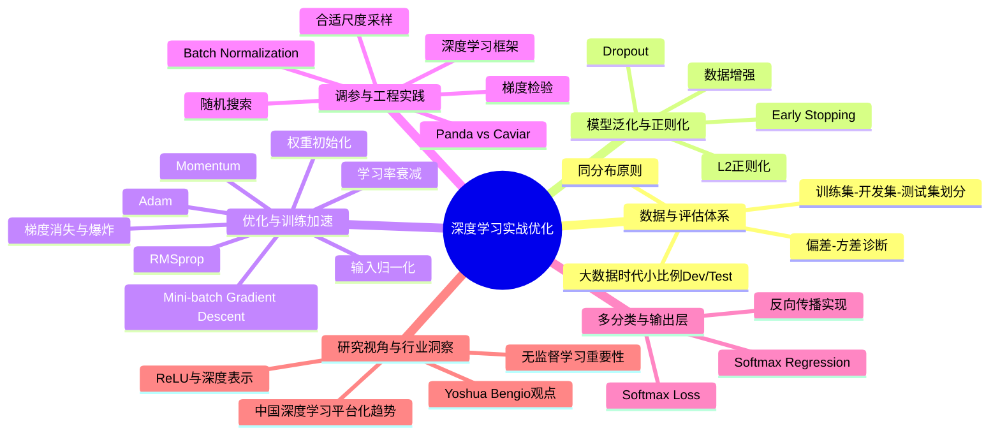

# improving-deep-neural-networks-hyperparameter-tuning-regularization-and-optimization

# 1. 🧠 课程思维导图 (Mind Map)



---

# 2. 📌 核心精要 (Executive Summary)

- 这部分课程的核心，是建立一套**可诊断、可调参、可加速、可验证**的深度学习工程方法论，而不是只会“把网络跑起来”。  
- 课程给出了一个实战闭环：先通过**Train/Dev/Test**与**Bias-Variance**定位问题，再针对性采用**更大网络、更多数据、正则化、优化器、归一化**等手段改进模型。  
- 在现代深度学习中，很多经典难题的解决依赖工程技巧：如**Mini-batch Gradient Descent**、**Momentum**、**RMSprop**、**Adam**、**Batch Normalization**、**He/Xavier 初始化**。  
- 调参不应凭直觉蛮试，而要遵循**随机搜索 Random Search**、**对数尺度采样 Log Scale Sampling**、**粗到细搜索 Coarse-to-fine Search**等策略。  
- 课程还强调：深度学习不仅是算法，更是实验科学；理解**为什么有效**、以及如何用**Gradient Checking**等工具验证实现正确性，是高水平实践者的标志。

---

# 3. 📖 详细知识模块 (Detailed Notes)

## 模块一：深度学习项目的实验闭环与数据划分

## 1.1 为什么深度学习是一个高度迭代的实验过程

### What
深度学习应用不是一次性设计完成，而是围绕以下问题不断迭代：
- 网络有多少层
- 每层多少隐藏单元
- 学习率 **学习率 (Learning Rate)**
- 激活函数 **激活函数 (Activation Function)**
- 正则化方式
- 优化器选择

### Why
课程强调：**跨领域直觉往往不可迁移**。  
一个在 **自然语言处理 (NLP, Natural Language Processing)**、**计算机视觉 (CV, Computer Vision)**、**语音识别 (Speech Recognition)**、**广告/搜索/安全/物流** 中表现好的配置，换到别的领域可能完全失效。

影响最佳超参数的因素包括：
- 数据量大小
- 输入特征维度
- GPU/CPU 配置
- 计算资源结构
- 数据分布差异

### How
标准实验循环：
1. 提出网络结构与超参数假设
2. 编码实现
3. 运行实验
4. 在 **开发集 (Development Set / Dev Set / Hold-out Cross Validation Set)** 上评估
5. 根据结果调整模型
6. 持续迭代

**核心结论：**  
深度学习进展速度，很大程度上取决于你**多快完成一轮实验闭环**。

---

## 1.2 Train / Dev / Test 的职责与划分原则

### What
- **训练集 (Training Set)**：用于拟合参数
- **开发集 (Development Set, Dev Set)**：用于模型选择、超参数调优
- **测试集 (Test Set)**：用于给最终模型提供**无偏估计 (Unbiased Estimate)**

### Why
如果没有良好的数据划分，就无法：
- 高效比较不同模型
- 可靠诊断偏差/方差问题
- 正确估计最终泛化性能

### How

#### 传统比例 vs 大数据时代比例
早期机器学习常见划分：
- **70 / 30**
- **60 / 20 / 20**

当总样本量只有：
- **100**
- **1,000**
- **10,000**

这些比例是合理经验法则。

但在大数据时代，如果有：
- **1,000,000（100万）** 样本

则可以采用：
- **98% Train / 1% Dev / 1% Test**

因为：
- Dev 只需大到足以比较几个候选模型
- Test 只需大到足以稳定评估最终模型

课程给出的更极端案例还包括：
- **99.5% Train / 0.25% Dev / 0.25% Test**
- **0.4% Dev / 0.1% Test**

**核心结论：**  
**Dev/Test 的绝对数量比相对比例更重要。**

---

## 1.3 Dev/Test 同分布原则与“训练集分布不一致”问题

### What
现代深度学习里，常见情况是：
- 训练集分布与 Dev/Test 分布不完全一致
- 但 **Dev 和 Test 必须尽量来自同一分布**

### Why
因为你会不断针对 Dev 优化模型，如果 Dev 和 Test 分布不一致：
- 你在 Dev 上的改进不一定能迁移到 Test
- 模型选择会失真

### How
课程中的猫图像案例：
- 训练集：从互联网抓取的高清、专业拍摄猫图
- Dev/Test：用户手机上传的模糊、低分辨率、随手拍猫图

此时合理策略是：
- 允许训练集来自更广泛来源，以扩大训练数据量
- **确保 Dev/Test 与真实应用场景一致且同分布**

---

## 1.4 是否可以没有 Test Set

### What
在某些场景中，可以只保留：
- Train
- Dev

而没有单独 Test。

### Why
Test 的唯一使命是给出最终性能的**无偏估计**。  
如果业务上不需要这个“严格无偏”的最终报告，就可以省略。

### How
实际情况中，很多团队口头上说自己只有：
- Train
- Test

但实际上他们不断在这个“Test”上调模型。  
此时这个集合实际上扮演的是：
- **开发集 (Dev Set)**

**关键提醒：**  
如果团队反复在“Test”上调参，那它已经不是严格意义上的 Test，而是 Dev。

---

## 模块二：偏差-方差 (Bias-Variance) 诊断框架

## 2.1 偏差与方差的定义

### What
- **偏差 (Bias)**：模型连训练集都拟合不好，表现为**欠拟合 (Underfitting)**
- **方差 (Variance)**：模型训练集表现好，但开发集表现差，表现为**过拟合 (Overfitting)**

### Why
深度学习项目中，解决问题的前提不是“盲目尝试”，而是先判断到底是：
- 高偏差
- 高方差
- 两者兼有

### How
二维直观图示：
- 拟合直线：**高偏差**
- 拟合极其复杂边界：**高方差**
- 中间平滑曲线：较合适

高维问题中无法直接画决策边界，因此需要看误差指标。

---

## 2.2 用训练误差与开发误差诊断问题

### What
关键指标：
- **训练集误差 (Training Error)**
- **开发集误差 (Dev Error)**

### Why
这两个数能分别反映：
- 是否拟合训练数据 → 偏差
- 是否能泛化到新数据 → 方差

### How

#### 情况1：高方差
- 训练误差：**1%**
- 开发误差：**11%**

说明：
- 训练集拟合得很好
- 开发集性能显著下降
- 结论：**高方差**

#### 情况2：高偏差
- 训练误差：**15%**
- 开发误差：**16%**

若人类误差接近 **0%**，说明：
- 连训练集都没学好
- 泛化差距不大
- 结论：**高偏差**

#### 情况3：高偏差 + 高方差
- 训练误差：**15%**
- 开发误差：**30%**

结论：
- 训练误差高 → 高偏差
- Dev 比训练差很多 → 高方差

#### 情况4：低偏差 + 低方差
- 训练误差：**0.5%**
- 开发误差：**1%**

这是理想状态。

---

## 2.3 Bayes Error 与 Human-level Performance 的前提

### What
上述诊断依赖一个重要假设：
- **人类水平表现 (Human-level Performance)** 接近最优
- **贝叶斯误差 (Bayes Error / Bayesian Optimal Error)** 很低

### Why
如果任务本身非常难，例如图像极其模糊，即使人类也只能做到 **85% 准确率**，那么：
- 训练误差 **15%** 可能并不意味着高偏差

### How
因此，偏差/方差分析成立的常见前提是：
1. Bayes Error 足够低
2. Train/Dev 来自相同分布

若不满足，需要更复杂分析。

---

## 模块三：机器学习的基本改进配方 (Basic Recipe for Machine Learning)

## 3.1 先解决高偏差，再解决高方差

### What
课程提出一个非常重要的方法论：**Basic Recipe**。

### Why
不同问题对应不同对策。  
如果你没先诊断，就可能做无效努力，比如：
- 高偏差时一味收集更多数据，通常帮助不大

### How

#### 若存在高偏差
优先尝试：
1. **更大的网络 (Bigger Network)**
   - 更多隐藏层
   - 更多隐藏单元
2. **训练更久 (Train Longer)**
3. 使用更高级优化算法
4. 尝试更适合问题的网络架构

课程强调：
- **更大网络几乎总有帮助**
- **训练更久通常不会伤害结果**
- 主要代价是计算成本

#### 若存在高方差
优先尝试：
1. **更多数据 (More Data)**
2. **正则化 (Regularization)**
3. 更合适的网络架构

---

## 3.2 深度学习时代“偏差-方差权衡”弱化

### What
经典机器学习常强调 **偏差-方差权衡 (Bias-Variance Tradeoff)**。  
但深度学习时代，这种权衡没有以前那么强。

### Why
因为现在有两类工具可以相对独立地优化问题：
- **更大网络**：主要降低偏差
- **更多数据**：主要降低方差

### How
只要你：
- 能训练足够大的网络
- 有足够数据
- 使用了适当正则化

那么：
- 大网络通常降低偏差，而不显著增加方差
- 更多数据通常降低方差，而不伤害偏差

**核心结论：**  
这正是深度学习在监督学习中如此有效的重要原因之一。

---

## 模块四：正则化 (Regularization) 与泛化控制

## 4.1 L2 正则化 (L2 Regularization)

### What
在线性/逻辑回归中，原始代价函数加上惩罚项：

\[
J(w,b)=\frac{1}{m}\sum_{i=1}^{m}\mathcal{L}(\hat{y}^{(i)},y^{(i)}) + \frac{\lambda}{2m}\|w\|_2^2
\]

其中：
- **正则化参数 (Regularization Parameter)**：\(\lambda\)
- \(\|w\|_2^2 = \sum_j w_j^2 = w^T w\)

在神经网络中，对各层权重矩阵加和：
- 使用的是**Frobenius Norm**：
\[
\|W^{[l]}\|_F^2 = \sum_i\sum_j (W_{ij}^{[l]})^2
\]

### Why
L2 惩罚会抑制参数过大，降低模型复杂度，减少过拟合。

### How
反向传播后的更新变为：
\[
dW^{[l]} \leftarrow dW^{[l]} + \frac{\lambda}{m}W^{[l]}
\]

于是参数更新：
\[
W^{[l]} \leftarrow W^{[l]} - \alpha dW^{[l]}
\]

可整理为：
\[
W^{[l]} \leftarrow \left(1-\frac{\alpha\lambda}{m}\right)W^{[l]} - \alpha(\text{backprop gradient})
\]

这就是 **权重衰减 (Weight Decay)** 的来源：  
每次更新都把权重乘上一个略小于 1 的系数。

### 关键细节
- 通常**不正则化偏置项 \(b\)**，因为它参数量小、影响弱
- \(\lambda\) 是重要超参数，需在 Dev 上调优
- Python 中 `lambda` 是保留字，编程作业里用 `lambd`

---

## 4.2 L1 正则化 (L1 Regularization)

### What
L1 惩罚项是：
\[
\frac{\lambda}{m}\sum_j |w_j|
\]

### Why
L1 会产生**稀疏参数 (Sparse Parameters)**，即很多权重变成 0。

### How
它有时有利于模型压缩，但课程明确指出：
- 在深度学习中，**L2 比 L1 常用得多**
- L1 对压缩帮助通常有限

---

## 4.3 为什么正则化能降低过拟合

### 解释1：网络“变简单”
如果 \(\lambda\) 很大，权重会被强烈压小：
- 很多隐藏单元影响趋近于 0
- 网络等效上更简单
- 更不容易拟合复杂噪声

### 解释2：激活函数线性化
以 **双曲正切 (tanh)** 为例：
- 当 \(z\) 很小时，tanh 近似线性
- 若正则化让 \(W\) 很小，则 \(z=Wx+b\) 也较小
- 多层网络因此更接近线性模型
- 复杂非线性拟合能力下降，过拟合减少

### 实践提醒
调试梯度下降时，要画的是**包含正则项的新代价函数 J**，否则可能误判“J 没有单调下降”。

---

## 4.4 Dropout 正则化 (Dropout Regularization)

### What
**Dropout** 会在训练时按概率随机“丢弃”部分神经元。

最常见实现：**Inverted Dropout**

### Why
随机移除神经元会迫使网络：
- 不能依赖某个单一特征
- 必须学习更鲁棒、更分散的表示
- 类似于隐式模型集成

### How

#### 训练时
对第 3 层示例：
```python
d3 = np.random.rand(a3.shape[0], a3.shape[1]) < keep_prob
a3 = a3 * d3
a3 = a3 / keep_prob
```

其中：
- **保留概率 (keep_prob)**：保留一个神经元的概率
- 例如 `keep_prob = 0.8`，表示 20% 概率被丢弃

除以 `keep_prob` 的作用：
- 保证激活值的期望不变
- 这就是 **Inverted Dropout**

#### 测试时
- **不使用 Dropout**
- 直接完整前向传播
- 因为测试时不希望输出带随机性

---

## 4.5 Dropout 的直觉解释

### 单神经元视角
某个神经元有多个输入时，如果输入会被随机移除，那么该神经元不能过度依赖任何一个输入。  
结果是：
- 权重更平均分布
- 权重平方和变小
- 类似 **L2 正则化**

课程指出：
- Dropout 可以形式化证明为**一种自适应的 L2 正则化**

---

## 4.6 不同层使用不同 keep_prob

### What
不同层可设置不同保留率。

### Why
参数多的层更容易过拟合，应施加更强正则化。

### How
示例网络中：
- 参数最多的层，可设 `keep_prob = 0.5`
- 其他层可设 `0.7`
- 不想 Dropout 的层设 `1.0`

输入层一般：
- 常设 `1.0`
- 或接近 1，如 `0.9`

### 注意
Dropout 的缺点：
- 每轮被丢弃的网络不同
- 代价函数 **J** 不再稳定、难以监控
- 调试时通常先把 `keep_prob = 1.0`，确认代码正常，再开启 Dropout

---

## 4.7 其他正则化手段

### 1）数据增强 (Data Augmentation)

#### What
通过对原样本做语义保持变换，生成更多“伪样本”。

#### How
图像任务常见操作：
- 水平翻转
- 随机裁剪
- 平移
- 缩放
- 轻微扭曲

OCR 场景：
- 对数字做旋转、弹性扭曲

#### Why
本质是在向模型注入先验：
- “猫水平翻转后仍是猫”
- “数字轻微扭曲后仍是该数字”

---

### 2）早停法 (Early Stopping)

#### What
训练中监控：
- 训练误差/训练代价持续下降
- 开发误差先降后升

当 Dev 性能最优时停止训练。

#### Why
早期训练时权重较小，继续训练权重变大可能过拟合。  
提前停止，相当于限制参数范数。

#### How
优点：
- 一次训练就试探了不同大小的权重范围

缺点：
- 将“优化 J”和“防止过拟合”两个目标耦合在一起
- 不符合课程后面强调的**正交化 (Orthogonalization)** 思想

Andrew Ng 的偏好：
- 更倾向 **L2 正则化 + 充分训练**
- 但承认 Early Stopping 很多人也在用

---

## 模块五：输入归一化、梯度问题与初始化

## 5.1 输入归一化 (Normalizing Inputs)

### What
标准步骤：

1. 去均值：
\[
\mu=\frac{1}{m}\sum_i x^{(i)}
\]
\[
x \leftarrow x-\mu
\]

2. 按方差缩放：
\[
\sigma^2 = \frac{1}{m}\sum_i x^{(i)2}
\]
\[
x \leftarrow x / \sigma
\]

### Why
若各特征尺度差异很大，例如：
- \(x_1 \in [0,1000]\)
- \(x_2 \in [0,1]\)

则代价函数等高线会非常狭长，梯度下降只能小步来回震荡，优化缓慢。

归一化后：
- 等高线更接近圆形
- 梯度下降更直接地指向最优点
- 允许更大步长

### How
注意：
- 用**训练集**估计的 \(\mu,\sigma\) 去变换 Dev/Test
- 不要分别对 Train/Test 单独估计标准化参数

---

## 5.2 梯度消失与梯度爆炸 (Vanishing / Exploding Gradients)

### What
深层网络中，激活值和梯度可能随着层数呈指数级变小或变大。

### Why
课程用线性激活举例：
- 若每层权重近似 \(1.5I\)，经过多层后输出按 \(1.5^L\) 爆炸
- 若每层权重近似 \(0.5I\)，则输出按 \(0.5^L\) 衰减

梯度也有类似现象。

### How
深网络示例提到：
- 现代网络层数可达 **150+**
- 微软曾有 **152 层网络**

在这种深度下，指数级变化会严重破坏训练。

---

## 5.3 深层网络的权重初始化 (Weight Initialization)

### What
初始化目标：让每层的激活值/梯度的方差保持在合理范围。

### Why
如果权重太大：
- 输出与梯度容易爆炸

如果太小：
- 输出与梯度容易消失

### How

#### 对单个神经元
若输入数为 \(n\)，可令：
- 权重方差约为 **1/n**

#### ReLU 激活推荐：He Initialization
\[
W^{[l]} \sim \text{randn} \cdot \sqrt{\frac{2}{n^{[l-1]}}}
\]

#### tanh 激活推荐：Xavier Initialization
\[
W^{[l]} \sim \text{randn} \cdot \sqrt{\frac{1}{n^{[l-1]}}}
\]

### 相关人物与术语
- **He Initialization**：适合 ReLU
- **Xavier Initialization**：适合 tanh
- 课程还提到 **Yoshua Bengio** 团队的一种变体

### 结论
这不是彻底解决梯度问题，但能**显著缓解**。

---

## 模块六：梯度检验 (Gradient Checking)

## 6.1 数值梯度近似

### What
用双边差分 **Two-sided Difference** 检验导数是否实现正确：

\[
g(\theta) \approx \frac{f(\theta+\epsilon)-f(\theta-\epsilon)}{2\epsilon}
\]

### Why
比单边差分更精确。

### How
课程例子：
- \(f(\theta)=\theta^3\)
- \(\theta=1\)
- \(\epsilon=0.01\)

双边差分得到：
- **3.0001**

真实导数：
- \(g(\theta)=3\theta^2=3\)

单边差分之前得到：
- **3.0301**

误差明显更大。

---

## 6.2 神经网络中的 Gradient Checking

### What
将所有参数拼成一个大向量：
- \(\theta\)

把所有梯度也拼成一个向量：
- \(d\theta\)

然后对每个分量做数值近似：
\[
d\theta_{approx}^{(i)}=\frac{J(\theta_1,\dots,\theta_i+\epsilon,\dots)-J(\theta_1,\dots,\theta_i-\epsilon,\dots)}{2\epsilon}
\]

### Why
帮助验证 **Backpropagation** 是否实现正确。

### How
比较两个向量的差异：
\[
\frac{\|d\theta_{approx}-d\theta\|_2}{\|d\theta_{approx}\|_2+\|d\theta\|_2}
\]

经验阈值：
- **≤ 10^-7**：非常好
- **≈ 10^-5**：可再检查
- **≥ 10^-3**：高度怀疑有 bug

推荐：
- \(\epsilon = 10^{-7}\)

---

## 6.3 Gradient Checking 使用注意事项

### 关键实践
1. **只用于调试，不用于训练**
   - 太慢
2. 若失败，检查具体分量
   - 例如只在 \(db\) 某层出错，说明问题可能在偏置梯度
3. 若使用正则化，别忘了正则项也应进入 \(J\)
4. **Dropout 下不适合直接做梯度检验**
   - 因为每次随机丢节点，目标函数不稳定
   - 通常先关闭 Dropout 再检验
5. 可在初始化附近检验一次，再训练若干步后再检验一次

---

## 模块七：Mini-batch 与高级优化算法

## 7.1 Mini-batch Gradient Descent

### What
将大训练集切成多个小批次 **小批量梯度下降 (Mini-batch Gradient Descent)**。

### Why
相比 **批量梯度下降 (Batch Gradient Descent)**：
- 不必处理完整训练集后才更新一次
- 更快开始取得进展
- 更适合大规模数据

### How
课程示例：
- 总样本数：**5,000,000**
- 每个 Mini-batch：**1,000**
- 一共：**5,000 个 mini-batches**

一个 **Epoch**：
- 指完整遍历一次训练集

Batch GD：
- 一次 Epoch 只更新 **1 次**

Mini-batch GD：
- 一次 Epoch 可更新 **5,000 次**

---

## 7.2 Batch / Stochastic / Mini-batch 对比

### 极端1：Batch Gradient Descent
- Mini-batch size = \(m\)
- 稳定，但每步太慢

### 极端2：随机梯度下降 (Stochastic Gradient Descent, SGD)
- Mini-batch size = **1**
- 每步很快，但噪声极大
- 几乎不能稳定收敛，只会在最优附近震荡

### 实践推荐
若训练集较大，常用 mini-batch size：
- **64**
- **128**
- **256**
- **512**
- 有时 **1024**

优先使用 **2 的幂**，因为更适合硬件内存布局。

若数据量很小（例如小于 **2000**）：
- 直接用 Batch GD 即可

### 额外原则
Mini-batch 必须放得进：
- **CPU/GPU memory**

否则性能会“断崖式下降”。

---

## 7.3 指数加权平均 (Exponentially Weighted Average)

### What
递推公式：
\[
V_t = \beta V_{t-1} + (1-\beta)\theta_t
\]

### Why
它能高效计算平滑趋势，只需常数内存。

### How
伦敦气温案例：
- \(\beta=0.9\)：近似平均过去 **10 天**
- \(\beta=0.98\)：近似平均过去 **50 天**
- \(\beta=0.5\)：近似平均过去 **2 天**

经验规律：
\[
\text{平均窗口长度} \approx \frac{1}{1-\beta}
\]

特点：
- \(\beta\) 大：更平滑，但响应更慢
- \(\beta\) 小：更灵敏，但更噪声

---

## 7.4 偏差修正 (Bias Correction)

### What
由于初始 \(V_0=0\)，前期估计偏小。  
修正公式：

\[
V_t^{corrected} = \frac{V_t}{1-\beta^t}
\]

### Why
尤其在 \(\beta\) 很大时（如 **0.98**、**0.999**），早期偏差明显。

### How
课程示例：
- 若第一天气温 **40°F**
- \(\beta=0.98\)
- \(V_1=0.02 \times 40 = 0.8\)

明显太低，因此需要修正。

---

## 7.5 动量法 (Momentum)

### What
**带动量的梯度下降 (Gradient Descent with Momentum)**：

\[
V_{dW}=\beta V_{dW}+(1-\beta)dW
\]
\[
W \leftarrow W - \alpha V_{dW}
\]

### Why
普通梯度下降在某些方向来回震荡。  
Momentum 会平滑这些震荡，使优化沿主方向更快前进。

### How
典型值：
- \(\beta = 0.9\)

物理直觉：
- 梯度像“加速度”
- 动量像“速度”
- 类似小球在碗中滚动，借助惯性向最低点前进

---

## 7.6 RMSprop

### What
**均方根传播 (RMSprop, Root Mean Square Prop)**：

\[
S_{dW}=\beta_2 S_{dW}+(1-\beta_2)dW^2
\]

更新：
\[
W \leftarrow W - \alpha \frac{dW}{\sqrt{S_{dW}}+\epsilon}
\]

### Why
对于梯度大的方向，分母更大，更新更小；  
对于梯度小的方向，更新更大。  
结果是：
- 抑制陡峭方向震荡
- 加快平缓方向前进

### How
常用：
- \(\beta_2\) 默认较大
- \(\epsilon = 10^{-8}\) 仅用于数值稳定

课程特别提到：
- RMSprop 最早广泛传播不是靠论文，而是 **Geoff Hinton** 在 Coursera 课程中介绍后流行起来

---

## 7.7 Adam 优化算法 (Adam Optimization Algorithm)

### What
**Adam = Momentum + RMSprop**  
全称：**Adaptive Moment Estimation**

### Why
它兼具：
- 一阶矩估计（动量）
- 二阶矩估计（自适应缩放）

是目前最稳健、最常用的优化器之一。

### How
核心步骤：

1. 动量项：
\[
V_{dW}=\beta_1 V_{dW}+(1-\beta_1)dW
\]

2. RMSprop 项：
\[
S_{dW}=\beta_2 S_{dW}+(1-\beta_2)dW^2
\]

3. 偏差修正：
\[
V_{dW}^{corr}=\frac{V_{dW}}{1-\beta_1^t},\quad
S_{dW}^{corr}=\frac{S_{dW}}{1-\beta_2^t}
\]

4. 更新：
\[
W \leftarrow W - \alpha \frac{V_{dW}^{corr}}{\sqrt{S_{dW}^{corr}}+\epsilon}
\]

### 默认超参数
- \(\beta_1 = 0.9\)
- \(\beta_2 = 0.999\)
- \(\epsilon = 10^{-8}\)

课程建议：
- 通常主要调 **学习率 \(\alpha\)**
- 其他三个大多保持默认值

---

## 7.8 学习率衰减 (Learning Rate Decay)

### What
训练过程中逐步减小学习率。

### Why
前期可大步快走，后期靠近最优解时小步精调，减少震荡。

### How

#### 常见公式1
\[
\alpha = \frac{1}{1+\text{decay rate} \cdot epoch\_num}\alpha_0
\]

示例：
- \(\alpha_0 = 0.2\)
- decay rate = 1

则：
- epoch1：**0.1**
- epoch2：**0.067**
- epoch3：**0.05**
- epoch4：**0.04**

#### 其他形式
- **指数衰减 (Exponential Decay)**
- \(\alpha \propto 1/\sqrt{t}\)
- **阶梯式下降 (Staircase Decay)**
- **人工手动调整 (Manual Decay)**

课程观点：
- 学习率衰减有帮助
- 但优先级通常低于先把固定学习率调好

---

## 7.9 局部最优 (Local Optima) 与鞍点 (Saddle Points)

### What
深度学习早期常担心陷入局部最优。  
现代认识：高维空间里，更常见的是**鞍点 (Saddle Point)** 和 **平台区 (Plateau)**。

### Why
在高维空间中，一个点要成为局部最优，必须所有方向都向上弯，概率很小。  
更常见的是：
- 某些方向上弯
- 某些方向下弯

于是形成鞍点。

### How
实际训练更大的问题往往是：
- 梯度接近 0 的平台区
- 导致优化进展非常慢

这正是：
- **Momentum**
- **RMSprop**
- **Adam**

等高级优化算法有价值的地方。

---

## 模块八：超参数调优方法论

## 8.1 超参数优先级

### 课程经验排序
最重要：
1. **学习率 \(\alpha\)**

第二梯队：
2. **Momentum 的 \(\beta\)**
3. **Mini-batch size**
4. **隐藏单元数**

第三梯队：
5. **层数**
6. **Learning Rate Decay**

通常不怎么调：
- Adam 的 \(\beta_1=0.9\)
- \(\beta_2=0.999\)
- \(\epsilon=10^{-8}\)

---

## 8.2 随机搜索 (Random Search) 优于网格搜索 (Grid Search)

### What
不要只用规则网格去试超参数，优先用**随机搜索**。

### Why
因为你事先不知道哪些超参数最重要。  
如果某个维度极其重要，而另一个几乎无关，那么网格搜索会浪费大量试验点。

### How
课程举例：
- 若超参数1是学习率 \(\alpha\)
- 超参数2是 Adam 里的 \(\epsilon\)

网格搜索 5×5：
- 只探索了 **5** 个不同 \(\alpha\)

随机搜索 25 次：
- 能探索 **25** 个不同 \(\alpha\)

显然更高效。

---

## 8.3 粗到细搜索 (Coarse-to-fine Search)

### What
先在大范围粗搜，再聚焦到效果好的小区域精搜。

### Why
节省计算资源，提高调参效率。

### How
步骤：
1. 在大空间随机采样
2. 找到表现最好的局部区域
3. 放大该区域，继续更密集采样

---

## 8.4 合适尺度采样 (Appropriate Scale)

### 1）线性尺度适合什么
若超参数取值范围不大，例如：
- 隐藏单元数：**50~100**
- 层数：**2~4**

用均匀采样合理。

### 2）对数尺度适合什么
若是学习率：
- \(0.0001 \sim 1\)

就应该按 **对数尺度 (Log Scale)** 采样，而不是线性均匀采样。

### How
令：
\[
r \sim Uniform[-4,0]
\]
\[
\alpha = 10^r
\]

这样能均衡探索：
- \(10^{-4}\) 到 \(10^{-3}\)
- \(10^{-3}\) 到 \(10^{-2}\)
- \(10^{-2}\) 到 \(10^{-1}\)
- \(10^{-1}\) 到 \(1\)

---

## 8.5 对接近 1 的参数进行采样

### What
对于类似 \(\beta\in[0.9,0.999]\) 的参数，不应在线性尺度上采样。

### Why
因为 \(\frac{1}{1-\beta}\) 对 \(\beta\) 接近 1 极其敏感。  
例如：
- \(0.9\) ≈ 平均 **10**
- \(0.999\) ≈ 平均 **1000**
- \(0.9995\) ≈ 平均 **2000**

### How
应对 \(1-\beta\) 在对数尺度上采样：
\[
1-\beta = 10^r,\quad r\sim Uniform[-3,-1]
\]
\[
\beta = 1 - 10^r
\]

---

## 8.6 Panda vs Caviar：两种调参组织方式

### What
课程给出一个非常生动的比喻：

#### **Panda Approach**
- 一次重点照顾少数模型
- 持续观察学习曲线
- 人工微调超参数

#### **Caviar Approach**
- 并行跑很多模型
- 最后筛选最好的

### Why
选择取决于算力。

### How

#### Panda
适用于：
- 算力有限
- 单个模型训练成本极高

做法：
- 第 0 天启动训练
- 第 1 天观察曲线，微调学习率
- 第 2 天再调 momentum
- 持续 babysit

#### Caviar
适用于：
- 大量并行计算资源
- 可同时训练很多模型

做法：
- 随机采样很多超参数组合
- 并行训练
- 快速筛选最佳者

**核心结论：**  
算力决定调参策略。

---

## 模块九：批量归一化 (Batch Normalization)

## 9.1 Batch Normalization 的定义与步骤

### What
**批量归一化 (Batch Normalization / Batch Norm / BN)**：
对某层的线性输出 \(Z^{[l]}\) 做小批量内标准化，再做可学习缩放和平移。

### Why
目的不是强行让隐藏层必须服从标准正态，而是：
- 让训练更稳定
- 让深层网络更容易优化
- 让超参数更鲁棒

### How
对某层 mini-batch 的 \(z^{(1)}\dots z^{(m)}\)：

1. 计算均值
\[
\mu = \frac{1}{m}\sum_i z^{(i)}
\]

2. 计算方差
\[
\sigma^2 = \frac{1}{m}\sum_i (z^{(i)}-\mu)^2
\]

3. 标准化
\[
z_{norm}^{(i)}=\frac{z^{(i)}-\mu}{\sqrt{\sigma^2+\epsilon}}
\]

4. 缩放与平移
\[
\tilde{z}^{(i)} = \gamma z_{norm}^{(i)} + \beta
\]

其中：
- \(\gamma\)、\(\beta\) 为可学习参数

---

## 9.2 Batch Norm 在网络中的位置

### What
BN 通常放在：
- 线性变换 \(Z\) 之后
- 激活函数 \(A=g(Z)\) 之前

即：
\[
Z \rightarrow BN \rightarrow \tilde{Z} \rightarrow g(\tilde{Z})
\]

### Why
这是实践中最常用、效果最稳妥的版本。

### How
每一层新增参数：
- \(\gamma^{[l]}\)
- \(\beta^{[l]}\)

由于 BN 会把均值减掉，所以原本线性层的偏置 \(b^{[l]}\) 常可省略。

---

## 9.3 为什么 Batch Norm 有效

### 解释1：类似输入归一化
像输入特征归一化一样，BN 让中间层输入尺度更稳定，优化更容易。

### 解释2：减轻协变量偏移 (Covariate Shift)
课程使用“黑猫训练、彩猫测试”的例子解释 **协变量偏移 (Covariate Shift)**。  
在深层网络内部，前层参数变化会导致后层输入分布持续漂移。

BN 的作用：
- 即便前层参数在变
- 后层看到的 \(Z\) 的均值与方差也被控制住
- 后层不必不断适应新的输入分布

这降低了层间耦合，使每层更容易独立学习。

### 解释3：轻微正则化效果
因为均值/方差是用 mini-batch 估计的，本身带噪声。  
于是 BN 会给隐藏层激活引入小噪声，形成轻微正则化效果，类似但弱于 Dropout。

额外结论：
- Mini-batch 越大，统计越稳定，BN 的这种正则化作用越弱

---

## 9.4 测试时的 Batch Norm

### What
训练时 BN 依赖 mini-batch 统计量；  
但测试时可能一次只输入一个样本。

### How
因此测试时不能再用当前 mini-batch 均值/方差，而需要预估全局统计量。  
常用方法：
- 在训练中对每层的 \(\mu,\sigma^2\) 做**指数加权平均**
- 测试时使用这些滑动估计值

### Why
这样单样本推理时仍可进行合理归一化。

---

## 模块十：多分类 Softmax Regression

## 10.1 Softmax 回归 (Softmax Regression)

### What
**Softmax 回归 (Softmax Regression)** 是 Logistic Regression 的多分类推广。

### Why
二分类只需输出一个概率；  
多分类需要输出属于每个类别的概率分布。

### How
课程示例类别：
- class 0：other / none of the above
- class 1：cat
- class 2：dog
- class 3：baby chick

设类别数：
- **\(C=4\)**

输出层有 4 个神经元，输出：
\[
P(y=0|x), P(y=1|x), P(y=2|x), P(y=3|x)
\]

---

## 10.2 Softmax 计算过程

### What
先算线性输出：
\[
z^{[L]} = W^{[L]}a^{[L-1]} + b^{[L]}
\]

再做：
\[
t_i = e^{z_i}
\]
\[
a_i^{[L]} = \frac{t_i}{\sum_j t_j}
\]

这就是 **Softmax Activation Function**。

### Why
指数保证输出非负；归一化保证总和为 1，可解释为概率。

### How
课程示例：
\[
z=[5,2,-1,3]
\]

则：
- \(e^5 \approx 148.4\)
- \(e^2 \approx 7.4\)
- \(e^{-1} \approx 0.4\)
- \(e^3 \approx 20.1\)

总和：
- **176.3**

概率输出：
- **0.842**
- **0.042**
- **0.002**
- **0.114**

可见最大 logit 对应最大概率。

### 补充
“Softmax” 相对于“Hardmax”：
- Hardmax：最大值位置取 1，其余全 0
- Softmax：是更“柔和”的概率版本

---

## 10.3 Softmax 损失函数

### What
对单个样本，损失函数：
\[
\mathcal{L}(\hat{y},y) = -\sum_{j=1}^{C} y_j \log \hat{y}_j
\]

这就是**交叉熵损失 (Cross-Entropy Loss)** 的多分类形式。

### Why
只会惩罚真实类别对应概率太低。

### How
若真实标签为：
\[
y=[0,1,0,0]
\]
预测为：
\[
\hat{y}=[0.3,0.2,0.1,0.4]
\]

则损失为：
\[
-\log(0.2)
\]

即强迫模型提升真实类别（这里是 class 1）的预测概率。

整体代价函数：
\[
J = \frac{1}{m}\sum_{i=1}^m \mathcal{L}(\hat{y}^{(i)}, y^{(i)})
\]

---

## 10.4 Softmax 的反向传播

### What
输出层关键梯度：
\[
dZ^{[L]} = \hat{Y} - Y
\]

### Why
这是 Softmax + Cross-Entropy 组合下非常优雅的结果。

### How
在现代框架中通常无需手写，框架可自动求导。

---

## 模块十一：深度学习框架与 TensorFlow 思维方式

## 11.1 为什么要用深度学习框架

### What
课程提到多个主流框架：
- **Caffe**
- **CNTK**
- **DL4J**
- **Keras**
- **Lasagne**
- **TensorFlow**
- **Torch**

### Why
实现复杂模型（如 CNN、RNN、大规模网络）时，从零手写代价太高。  
框架像线性代数库之于矩阵乘法一样，能显著提高效率。

### 选择框架的三条标准
1. **编程便利性**
2. **运行速度**
3. **是否真正开放 (Truly Open)**

其中“真正开放”不仅是开源，还包括：
- 治理结构是否开放
- 是否会被单一公司未来收紧生态

---

## 11.2 TensorFlow 的核心思想

### What
在 TensorFlow 中，你通常只需定义：
- 参数变量
- 前向计算的代价函数

框架会自动完成：
- 计算图构建
- 自动求导
- 参数更新

### Why
这使得深度学习实现从“手推反向传播”变成“声明式定义目标函数”。

### How
课程示例最小化：
\[
J(w)=w^2-10w+25=(w-5)^2
\]

最优解是：
- **\(w=5\)**

在 TensorFlow 中：
- 定义 `tf.Variable`
- 定义 `tf.keras.optimizers.Adam`
- 用 `tf.GradientTape` 记录计算过程
- 自动求梯度并更新参数

运行 **1000** 次后，\(w\) 会接近 **5**

### 核心思想
TensorFlow 会基于前向传播建立**计算图 (Computation Graph)**，再自动反向传播。

---

## 模块十二：研究者洞察与行业视角

## 12.1 Yoshua Bengio 访谈核心观点

### 个人经历与背景
- 1985 年开始读神经网络论文
- 受 **Geoff Hinton** 等连接主义学派影响
- 做过：
  - **Recurrent Nets**
  - **Speech Recognition**
  - **Graphical Models**
  - 深度学习、词向量、GAN、Attention 等

### 关键观点提炼

#### 1）实验先于理论
> **“We start with experiments, with intuitions, and theory sort of comes later.”**  
可译为：**我们往往先从实验和直觉出发，理论通常随后才跟上。**

#### 2）曾经低估了 ReLU
他承认自己 1990 年代曾误以为：
- 只有平滑非线性才适合 Backprop
- **ReLU** 因为有平坦区、导数常为 0，可能更难训练

但后来发现：
- **ReLU 比 Sigmoid / tanh 更好用**
- 这是一个“大惊喜”

#### 3）分布式表示是深度学习核心
他高度认同连接主义的思想：
- 信息不是“祖母细胞”式单点表示
- 而是由多个神经元激活共同表达

#### 4）词向量 (Word Embeddings) 的动机
来源于：
- 希望用神经网络处理高维联合分布
- 利用分布式表示让相似词共享泛化能力

#### 5）最重视的研究方向
- 长期依赖
- 深层网络训练困难
- 无监督学习
- 去噪自编码器 **Denoising Auto-Encoders**
- **生成对抗网络 (GANs, Generative Adversarial Networks)**
- **Attention**
- 使大脑可实现的类反向传播机制

#### 6）对无监督学习的看法
他认为无监督学习的目标不是“没标签也能学”，而是：
- 自动建立解释世界的内部模型
- 像 2 岁儿童那样仅通过观察与交互理解重力、惯性、液体、固体

#### 7）他最关注的未来问题
- 因果性 **Causality**
- 推理 **Reasoning**
- 顺序信息处理
- 强化学习与深度学习结合
- 更深层次的世界理解

#### 8）给学习者的建议
- 不要只会调框架 API
- 要自己推导、自己实现
- 数学基础重要，尤其：
  - **Probability**
  - **Linear Algebra**
  - **Optimization**
  - **Calculus**

---

## 12.2 林元庆访谈核心观点

### 背景
- 本科偏光学/物理
- 后在宾大读博转入机器学习
- 在 NEC 时参与早期计算机视觉工作
- 提到自己团队在**第一届 ImageNet Challenge** 获胜
- 后看到 **Hinton** 与 **AlexNet** 工作后深受震撼

### 对中国深度学习生态的理解
他强调中国深度学习的关键在于：
- 大规模平台化
- 计算资源、数据、框架、应用场景联动

### 平台化愿景
理想平台提供：
1. 深度学习框架（提到 **PaddlePaddle**）
2. 大规模算力
3. 数据
4. 工业级应用场景

### 关于 AI 产品的“正反馈循环”
核心洞察：
- 初始数据 + 初始算法 → 初始产品
- 产品吸引用户 → 获得更多数据
- 更多数据 → 更好算法
- 更好算法 → 更强产品
- 更强产品 → 更多用户

这是 AI 商业落地中非常关键的**正向循环 (Positive Loop)**。

### 给入门者的建议
- 善用开源框架
- 同时要补机器学习基础：
  - PCA
  - LDA
  - 图模型等传统方法
- 理解基础方法，会让你对深度学习有更深直觉

---

# 4. 🛠️ 实践与应用 (Actionable Points)

## 行动建议 1：建立你的模型诊断表
下次训练模型时，固定记录以下 5 项：
1. Train Error
2. Dev Error
3. 是否同分布
4. 当前主要问题：**高偏差 / 高方差 / 两者都有**
5. 下一步动作只选 1 个：
   - 更大网络
   - 更长训练
   - 更多数据
   - 正则化
   - 调学习率

> 目的：避免“同时改很多东西，最后不知道什么起作用”。

---

## 行动建议 2：默认采用一套高效训练基线
如果你在做中大型深度学习项目，可以先用如下默认配置起步：
- 输入标准化
- Mini-batch size：**64 / 128 / 256**
- 优化器：**Adam**
- Adam 默认参数：  
  - \(\beta_1 = 0.9\)  
  - \(\beta_2 = 0.999\)  
  - \(\epsilon = 10^{-8}\)
- He 初始化（若用 ReLU）
- 必要时加 L2 正则化
- 若网络较深，优先尝试 Batch Norm

> 这样能快速得到一个稳定可用的 baseline。

---

## 行动建议 3：调参时改用“随机搜索 + 对数尺度”
不要手工拍脑袋试学习率。  
直接用：
- \(\alpha = 10^r, r \sim Uniform[-4,0]\)

随机采样若干组学习率，而不是只试：
- 0.001
- 0.01
- 0.1

> 对学习率这类跨数量级的超参数，这种方法通常明显更高效。

---

# 5. 🤔 深度思考与费曼测试 (Reflection)

1. **如果一个模型训练误差 14%，开发误差 15%，而人类误差约 13%，你会把它诊断为高偏差、高方差，还是都不是？为什么？**  
2. **请不用公式，只用直觉解释：为什么 L2 正则化、Dropout、Batch Norm 都能在不同程度上减轻过拟合，但它们的机制并不相同？**  
3. **假设你负责一个猫图像分类 App：训练集来自互联网高清图片，Dev/Test 来自用户手机随手拍图片。请设计一套合理的数据划分、调参和评估方案，并解释每一步背后的原因。**

如果你愿意，我还可以继续把这份笔记整理成：
1. **适合 Obsidian / Notion 的卡片化版本**  
2. **适合考试复习的“高频考点清单”版本**  
3. **适合面试输出的问答版**
