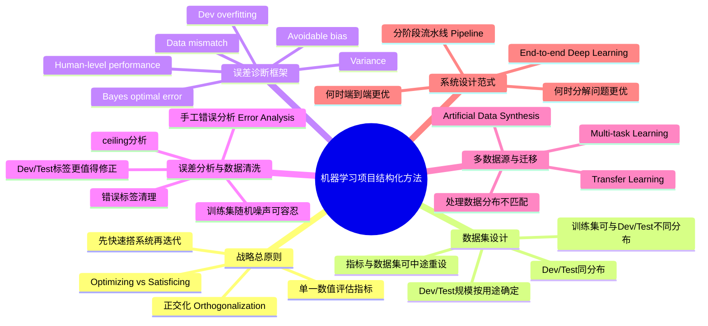

# structuring-machine-learning-projects

# 1. 🧠 课程思维导图 (Mind Map)

---

# 2. 📌 核心精要 (Executive Summary)

- 本课程的核心不是“再试几个超参数”，而是建立一套**系统化诊断机器学习项目瓶颈**的方法：先明确目标，再用指标、数据集和误差分析快速定位问题。  
- **正交化 Orthogonalization** 是全课最重要的思想：每个“调节旋钮”最好只解决一个问题，例如训练集拟合、泛化到 dev、泛化到 test、以及真实业务表现。  
- 当训练集、dev/test、真实世界表现不一致时，应分别从**Avoidable Bias、Variance、Data Mismatch、Dev Overfitting** 四类问题判断，而不是盲目“加数据”“换模型”。  
- 在工程实践中，**单一数值评估指标、同分布的 dev/test、快速构建第一个系统并迭代、手工错误分析**，往往比复杂技巧更能节省数月时间。  
- **Transfer Learning、Multi-task Learning、End-to-end Learning** 都是可选策略，但是否有效取决于数据量、任务相关性、是否有足够的 \(X,Y\) 对，以及问题是否值得拆解成多个子任务。

---

# 3. 📖 详细知识模块 (Detailed Notes)

## 模块一：机器学习项目为什么需要“战略”而不只是“调参”

### 1.1 什么是机器学习战略

#### What
**机器学习战略（Machine Learning Strategy）**，本质上是一套用于判断“下一步最值得做什么”的方法。  
它解决的问题不是“模型怎么写”，而是：

- 数据该不该继续收集？
- 应该扩网络、换优化器，还是做正则化？
- 要先修训练集表现，还是先修 dev 集表现？
- 如果 test 很好但业务效果差，问题出在哪里？

#### Why
深度学习项目里可尝试的方向非常多：

- 收集更多训练数据
- 增加数据多样性
- 训练更久
- 换优化器，如 **Adam**
- 用更大/更小网络
- 使用 **Dropout**
- 使用 **L2 Regularization**
- 改网络架构、激活函数、隐藏单元数

问题在于：  
**如果方向选错，团队可能浪费 6 个月。**

课程中的典型提醒：

- 有团队**花了整整 6 个月收集更多数据**，结果性能几乎没提升。

因此，机器学习战略的核心价值是：  
**用更快的方法识别最可能有效的方向，避免漫长试错。**

#### How
应用时，先问的不是“我还能做什么”，而是：

1. 当前瓶颈到底是训练集拟合差，还是泛化差？
2. 是指标设计错了，还是数据分布错了？
3. 是模型能力不够，还是 dev/test 不能代表业务目标？

---

## 模块二：正交化 Orthogonalization——机器学习调参的最高效原则

## 2.1 定义

#### What
**正交化（Orthogonalization）** 指：  
尽量让每个控制手段只影响一个明确目标，而不是一个操作同时影响多个目标。

课程用两个比喻说明：

- 老式电视机：每个旋钮单独控制宽度、高度、梯形畸变、左右偏移、旋转
- 汽车：方向盘控制转向，油门/刹车控制速度

如果一个旋钮同时影响宽度、高度、偏移，系统几乎无法调好。  
机器学习也是一样。

---

## 2.2 机器学习项目中的四个“层级目标”

一个监督学习系统要成功，通常需要依次满足 4 件事：

1. **训练集表现足够好**
2. **dev 集表现足够好**
3. **test 集表现足够好**
4. **真实世界表现符合业务目标**

这 4 层是不同问题，应该对应不同“旋钮”。

---

## 2.3 不同问题对应的典型旋钮

### A. 训练集表现不好：优先解决可避免偏差

#### 目标
让模型先把训练集拟合好。

#### 常用旋钮
- 更大的网络
- 更好的优化算法，如 **Adam**
- 更长训练时间
- 更优架构设计

#### Why
如果训练集都学不好，说明模型容量或优化存在问题。此时做正则化通常方向不对，因为正则化往往让训练拟合更难。

---

### B. 训练好但 dev 差：优先解决方差

#### 目标
提升从训练集到 dev 集的泛化能力。

#### 常用旋钮
- **Regularization**
  - **L2 Regularization**
  - **Dropout**
- 更多训练数据

#### Why
训练集好而 dev 差，本质是**Variance** 问题，说明模型记住了训练数据，但不能泛化。

---

### C. dev 好但 test 差：可能对 dev 过拟合

#### 目标
减少对 dev 集调优带来的偏差。

#### 常用旋钮
- 更大的 dev set
- 更严格区分 dev 与 test 的角色

#### Why
如果 dev 与 test 同分布，但模型在 dev 好、test 差，往往说明开发过程中反复根据 dev 做了太多决策，导致**Overfitting to Dev Set**。

---

### D. test 好但真实业务差：目标函数或数据定义错了

#### 目标
重新定义“你真正想优化什么”。

#### 常用旋钮
- 改 **dev/test set distribution**
- 改 **cost function**
- 改 **evaluation metric**

#### Why
如果测试分数高但用户不满意，说明：
- dev/test 数据不代表真实场景，或
- 指标没有正确反映业务价值

---

## 2.4 为什么 Andrew Ng 不偏爱 Early Stopping

#### What
**Early Stopping**：训练中提前停止，以抑制过拟合。

#### Why
它的问题不是“不能用”，而是**不够正交**：

- 提前停，会让训练集拟合变差
- 同时又可能改善 dev 表现

也就是说，一个旋钮同时影响：

- 训练集拟合
- dev 泛化

这让问题诊断变模糊。

#### 结论
**Early Stopping 不是坏方法，但不如更正交的控制手段容易分析。**

---

## 模块三：评估体系设计——指标决定团队优化方向

## 3.1 为什么需要单一数值评估指标

### What
**Single-number Evaluation Metric**：把模型优劣压缩成一个实数，便于快速比较多个方案。

### Why
机器学习开发是高频实验循环：

1. 提出想法
2. 实现并训练
3. 在 dev 上评估
4. 选择更好的方案继续迭代

如果使用多个指标，很难快速判断 A 和 B 谁更优。

---

## 3.2 Precision / Recall 与 F1 Score

### What
首次术语：

- **精确率 Precision**：被模型判为正类的样本中，真正为正类的比例
- **召回率 Recall**：所有真实正类中，被模型找出来的比例
- **F1 Score**：Precision 与 Recall 的调和平均数（Harmonic Mean）

公式：

\[
F1 = \frac{2}{\frac{1}{P} + \frac{1}{R}}
\]

### Why
Precision 和 Recall 常常此消彼长。若分别看两个数，难以快速决策。  
F1 将它们合成一个数，更适合工程迭代。

### How
课程案例：

- 分类器 A：Precision = 95%，Recall = 90%
- 分类器 B：Precision = 98%，Recall = 85%

若只看两个指标，不易判断。  
引入 **F1 Score** 后，就能更快选出更优模型。

---

## 3.3 多地区指标如何汇总

### What
若系统服务多个区域，如：

- 美国 US
- 中国 China
- 印度 India
- 其他地区 Other

每个区域误差都可能不同。

### Why
同时跟踪 4 个数字不利于快速迭代。

### How
可以：

- 保留各地区细分指标用于监控
- 再定义一个**平均误差 Average Error** 作为主评估指标

这样团队可以：

- 用单一数值快速决策
- 用细分指标发现局部问题

---

## 3.4 Optimizing Metric 与 Satisficing Metric

### What
当多个目标不容易直接合并时，划分为：

- **优化指标 Optimizing Metric**：希望越好越好
- **满意指标 Satisficing Metric**：只需达到门槛即可

### Why
很多工程问题既关心准确率，也关心速度、内存、误报率等。  
这些目标不适合机械地线性加权。

### How

#### 案例 1：分类准确率 + 运行时间
模型候选：

- A：Accuracy 90%，80ms
- B：Accuracy 92%，95ms
- C：Accuracy 95%，1500ms

策略：

- **Optimizing Metric**：Accuracy
- **Satisficing Metric**：运行时间 ≤ 100ms

结果：  
B 最优，因为满足 100ms 门槛且准确率最高。

---

#### 案例 2：唤醒词检测 Wake Word Detection
目标：

- 说了 “Alexa / OK Google / Hey Siri / 你好百度” 时要能唤醒
- 没说时不要乱唤醒

策略：

- **Optimizing Metric**：Accuracy
- **Satisficing Metric**：False Positives ≤ 每 24 小时 1 次

### 核心方法论
如果有 \(N\) 个指标：

- 选 1 个为**优化指标**
- 其余 \(N-1\) 个为**满意指标**

这能在多目标问题中快速确定“最佳模型”。

---

## 模块四：训练集 / Dev / Test 集设计——真正决定团队是否会“瞄错靶”

## 4.1 Dev Set 和 Test Set 必须来自同一分布

### What
**Dev Set** 用于开发迭代选模型，**Test Set** 用于最终无偏评估。  
它们应来自**同一分布（Same Distribution）**。

### Why
课程用“射靶”类比：

- **dev set + metric = 靶心**
- 团队会花几个月不断朝 dev 靶心优化

如果 test 分布不同，就相当于：

- 你让团队瞄一个靶
- 几个月后突然换了另一个靶

这会极大浪费时间。

### How

#### 反例：按地区拆分 dev/test
猫分类器覆盖 8 个地区：

- US, UK, Europe, South America, India, China, Asia, Australia

错误做法：
- 4 个地区做 dev
- 另 4 个地区做 test

问题：  
dev/test 分布不同。

正确做法：
- 把所有地区数据混合后随机划分
- 保证 dev/test 都代表未来实际分布

---

### 真实案例：贷款审批团队浪费 3 个月

#### 案例
- 开发集来自**中等收入邮编地区**
- 后来测试集换成**低收入邮编地区**

结果：
- 团队用了**约 3 个月**优化错误目标
- 上线前才发现模型在真正目标场景下表现不好

#### 结论
**dev/test 设计错误，足以让团队白白浪费数月。**

---

## 4.2 深度学习时代，dev/test 不必按 70/30 划分

### What
传统经验：

- Train/Test = 70/30
- Train/Dev/Test = 60/20/20

### Why
在小数据时代这合理；但在大数据时代不再适用。  
深度学习非常“吃数据”，应尽量把更多数据留给训练。

### How

#### 案例
若有 **1,000,000** 个样本：

- Train：98%
- Dev：1%
- Test：1%

则：

- dev = 10,000 样本
- test = 10,000 样本

这通常已足够。

### 原则
- **Dev 集大小**：只要足以支持模型选择
- **Test 集大小**：只要足以给最终性能提供高置信度估计
- 不需要机械地占 20% 或 30%

---

## 4.3 没有 test set 可以吗

### 结论
有时可以只有 **train + dev**，没有 test。  
但这意味着：

- 你接受没有最终无偏评估
- 你必须诚实承认：那不是 test，而是 dev

### 课程立场
- 不常规推荐
- 如果 dev 足够大且项目更看重快速迭代，而不是严谨最终评估，也可接受

---

## 4.4 什么时候应该修改 dev/test 或 metric

### What
如果你发现当前指标或数据集**不能正确反映你真正关心的业务效果**，就该改。

### Why
开发目标错了，比模型差更危险。

---

### 案例 1：猫分类器把色情图片放进来了

- 模型 A：3% error
- 模型 B：5% error

按普通分类错误率看，A 更好。  
但 A 会放过大量**色情图片**，B 不会。

因此真实业务排序是：

- **B 优于 A**

说明原指标错误。

#### 改法
对色情图片赋更高权重：

\[
\text{Weighted Error} = \frac{1}{\sum_i w^{(i)}} \sum_i w^{(i)} \cdot \mathbb{1}(\hat y^{(i)} \neq y^{(i)})
\]

其中：

- 非色情：\(w(i)=1\)
- 色情：\(w(i)=10\) 或 \(100\)

#### 含义
评价体系要体现业务代价，而不是只看“平均错多少”。

---

### 案例 2：dev/test 是高质量图片，但用户上传的是真实手机图

- dev/test：互联网下载的高质量、构图好图片
- 真实用户：模糊、构图差、表情怪、截取不完整

结果：
- A 在 dev/test 更好
- B 在真实应用更好

#### 结论
当 dev/test 不能代表真实场景时，应修改 dev/test 分布，而不是继续优化旧分布。

---

### 关键原则
即使最初没有完美指标，也应该**尽快设定一个可用指标与 dev 集**，先提升团队迭代速度。  
后续若发现不合理，再修改。

---

## 模块五：Human-level Performance——为什么“和人比”能指导建模方向

## 5.1 为什么人类水平很重要

### What
**Human-level Performance**：人类在某任务上的表现水平。

### Why
它重要有两层原因：

1. 深度学习已经在很多任务上接近或达到人类表现
2. 对于人类擅长的任务，人类表现常可作为 **Bayes Optimal Error** 的近似上界

此外，当模型尚未超过人类时，你还能使用三种很有价值的工具：

- 让人类继续标注更多数据
- 进行**手工错误分析 Manual Error Analysis**
- 更容易做 **Bias/Variance** 判断

一旦超过人类，这些工具的效力会下降。

---

## 5.2 Bayes Optimal Error 与 Avoidable Bias

### What
- **Bayes Optimal Error**：理论上任何函数都无法突破的最优错误率下界
- **Avoidable Bias**：当前训练误差与 Bayes error 之间的差距，即“还能避免的偏差”

公式化理解：

- **Avoidable Bias ≈ Training Error - Bayes Error**
- **Variance ≈ Dev Error - Training Error**

> 课程中实际采用“Human-level error 作为 Bayes error 的近似”

---

## 5.3 同样的训练误差，为什么有时该降 Bias，有时该降 Variance

### 案例 A
- Human-level error = 1%
- Training error = 8%
- Dev error = 10%

则：

- Avoidable Bias ≈ 7%
- Variance ≈ 2%

结论：  
应优先降 **Bias**。

---

### 案例 B
- Human-level error = 7.5%
- Training error = 8%
- Dev error = 10%

则：

- Avoidable Bias ≈ 0.5%
- Variance ≈ 2%

结论：  
应优先降 **Variance**。

### 核心洞察
**同样是 8% train / 10% dev，策略完全取决于“可达到的最好水平”大概是多少。**

---

## 5.4 Human-level Performance 应该怎么定义

### 医疗影像案例

- 普通人：3% error
- 一般医生：1%
- 资深医生：0.7%
- 资深医生团队共识：0.5%

### 问题
人类水平应定义为哪个？

### 课程答案
如果目的是**估计 Bayes error**，应取最强人类系统：

- **0.5%**

因为既然“资深医生团队”能做到 0.5%，则 Bayes error 一定 ≤ 0.5%。

### 但要看用途
- 若是写论文或说明“可部署”，超过一般医生可能已足够
- 若是做 **Bias/Variance 诊断**，则应尽量接近 Bayes error，用最优人类表现

---

## 5.5 接近/超过人类后，为什么进步会变慢

### Why
原因主要有两类：

1. **人类表现通常已接近 Bayes 最优**
   - 剩余提升空间变小
2. 超过人类后，很多工具不再好用
   - 人类标注不再是强参照
   - 错误分析不再容易
   - 无法用“人会做对但模型做错”来指导改进

### 案例
已知：

- 团队人类：0.5%
- 单人：1%
- 算法：0.3% training error，0.4% dev error

此时很难判断：

- 是已经接近 Bayes 最优？
- 还是仍有 Bias？
- 还是 Variance 更重要？

结论：  
**超过人类后，方向判断显著变难。**

---

## 5.6 哪些任务更容易超过人类

课程提到更容易超过人类的往往是**结构化数据 Structured Data**任务，例如：

- 在线广告点击率预估
- 商品推荐
- 物流到达时间预测
- 贷款偿还预测

这些任务常具备：

- 大规模结构化历史数据
- 人类本就不擅长直接从海量统计模式中做最优判断

而较难超过人类的常是**自然感知 Natural Perception**任务：

- 图像识别
- 语音识别
- 自然语言理解
- 某些医学图像诊断

---

## 模块六：如何系统提升模型性能——Bias / Variance / Data Mismatch 总框架

## 6.1 经典二分：Bias 与 Variance

### 核心诊断量
- **Avoidable Bias** = Training Error - Human-level Error（近似）
- **Variance** = Dev Error - Training Error

### 典型应对策略

#### 降 Bias
- 更大模型
- 训练更久
- 更好优化器：**Momentum / RMSprop / Adam**
- 更优网络结构
- 更优超参数

#### 降 Variance
- 更多训练数据
- 正则化
  - **L2**
  - **Dropout**
  - **Data Augmentation**

---

## 6.2 当训练集与 dev/test 分布不一致时，经典 Bias/Variance 分析会失真

### Why
如果：

- Training data：网页高质量猫图
- Dev/Test：手机用户上传图

那么从 train error 到 dev error 的差距，同时混合了两种变化：

1. 模型没见过 dev 样本 → 泛化问题
2. dev 样本分布不同 → 数据分布问题

因此不能直接把 train-dev gap 视为 Variance。

---

## 6.3 引入 Training-Dev Set

### What
**Training-Dev Set**：  
从训练集分布中划出一部分数据，但**不参与训练**，仅用于诊断。

它与训练集同分布，但模型没见过。

### Why
它能把“泛化误差”和“分布差异误差”拆开。

---

## 6.4 四类问题的诊断公式

需要关注：

- Human-level Error
- Training Error
- Training-Dev Error
- Dev Error
- Test Error（用于检查是否过拟合 dev）

### 含义分解
- **Avoidable Bias** ≈ Training Error - Human-level Error
- **Variance** ≈ Training-Dev Error - Training Error
- **Data Mismatch** ≈ Dev Error - Training-Dev Error
- **Dev Overfitting** ≈ Test Error - Dev Error

---

## 6.5 案例分析

### 案例 1
- Human-level ≈ 0%
- Training = 1%
- Training-Dev = 9%
- Dev = 10%

结论：
- Variance 很大
- Data mismatch 不大

---

### 案例 2
- Training = 1%
- Training-Dev = 1.5%
- Dev = 10%

结论：
- Variance 很小
- **Data mismatch 很大**

---

### 案例 3
- Training = 10%
- Training-Dev = 11%
- Dev = 12%

结论：
- 高 Bias
- Variance、Data mismatch 都不算主要问题

---

### 案例 4
- Training = 10%
- Training-Dev = 11%
- Dev = 20%

结论：
- 高 Bias
- 同时有严重 **Data mismatch**

---

## 模块七：错误分析 Error Analysis——最快的工程提效手段之一

## 7.1 什么是错误分析

### What
**错误分析（Error Analysis）**：手工检查模型出错的样本，统计不同错误来源占比，以决定下一步优先做什么。

### Why
它的价值不在于“修正单个样本”，而在于：

- 估算某方向的**性能上限 ceiling**
- 帮团队做优先级排序
- 避免几个月投入到错误方向

---

## 7.2 Ceiling Analysis：先估计上限，再决定做不做

### 猫分类案例

模型在 dev 集：

- Accuracy = 90%
- Error = 10%

队友提出：  
“是不是很多狗被错分成猫？要不要做一个专门解决狗的问题的项目？”

### 正确做法
随机看 **100 个误分类 dev 样本**，统计其中有多少是狗。

#### 情况 A
- 100 个错误中，5 个是狗
- 即 5%

则即使完全解决“狗问题”，总体错误率最多从：

- 10% 降到 9.5%

结论：  
可能不值得投入数月。

#### 情况 B
- 100 个错误中，50 个是狗
- 即 50%

则错误率理论上可从：

- 10% 降到 5%

结论：  
非常值得优先做。

---

## 7.3 如何做多类别错误分析

### 方法
建立表格，行是误分类样本，列是错误类别。

示例类别：

- Dogs
- Great Cats（狮子、豹、猎豹等大型猫科）
- Blurry
- Instagram / Snapchat Filters
- Incorrect Label
- Comments

### 示例结果
课程举例统计：

- Dogs：8%
- Great Cats：43%
- Blurry：61%

### 如何解读
- 狗问题上限只有 8%
- 大型猫科上限可达 43%
- 模糊图问题上限可达 61%

结论：  
优先级应明显偏向 **Blurry** 和 **Great Cats**。

---

## 7.4 错误分析的实践原则

- 一次看 **100 个左右误分类样本** 通常已足够形成方向感
- 可边看边加新类别
- 重点不是“精确到小数点”，而是快速识别大头问题
- 常用于 dev set，而不是 test set

---

## 模块八：清理错误标签 Incorrectly Labeled Data——什么时候值得做

## 8.1 训练集标签错误通常没那么可怕

### What
课程区分两类“错”：

- **Misclassified examples**：模型预测错
- **Incorrectly labeled examples**：数据本身标注错

### Why
深度学习对**随机标签噪声**通常有一定鲁棒性。  
如果训练集标错是近似随机的，且比例不高，常不必优先清理。

### 但有例外
若错误具有**系统性 Systematic Errors**，就危险。

例如：
- 标注员总把白狗标成猫  
模型就会学出系统偏差。

---

## 8.2 Dev/Test 中的标签错误更值得清理

### Why
dev/test 的任务是**正确比较模型优劣**。  
如果标签错，会直接干扰选型。

### 课程建议
在错误分析表中增加一列：

- **Incorrect Label**

统计因标签错误导致的“模型看似犯错”。

---

## 8.3 如何判断值不值得修正 dev/test 标签

### 看三个量
1. Overall dev error
2. 其中因错误标签造成的误差比例
3. 其他真实误差比例

---

### 案例 A
- 总 dev error = 10%
- 其中 6% 的错误来自错误标签  
即：
- 0.06 × 10% = **0.6%**

所以：
- 真实其他误差 = 9.4%

结论：  
错误标签影响不算大，不是最紧急事项。

---

### 案例 B
- 总 dev error = 2%
- 仍有 0.6% 来自错误标签

则：
- 错误标签占全部误差的 **30%**

如果你在比较：

- 模型 A：2.1%
- 模型 B：1.9%

那么 0.6% 的标签噪声已足以干扰判断。  
此时就很值得清理。

---

## 8.4 清理标签时的注意事项

1. **dev 和 test 应使用同样清理流程**
   - 保持同分布
2. **最好也检查模型做对的样本**
   - 否则会偏向模型
3. **不一定要同步清理训练集**
   - 训练集更大，且对随机标签噪声更鲁棒

---

## 模块九：新项目启动方法论——先快速搭一个系统，再迭代

## 9.1 核心原则

### What
**Build your first system quickly, then iterate**  
先快速做一个能跑的初版，再用诊断分析指导下一步。

### Why
在全新问题上，可能有几十个合理方向。  
如果一开始就设计得太复杂，容易过度思考、方向失真。

Andrew Ng 的经验判断：

- 实战中**更多团队的问题是过度设计（overthink）**
- 而不是系统做得过于简单

---

## 9.2 典型工作流

1. 快速定义 **dev/test set + metric**
2. 快速训练一个初版系统
3. 用 **Bias/Variance Analysis**
4. 用 **Error Analysis**
5. 再决定下一步做什么

---

## 9.3 语音识别案例

一个新语音系统可能的方向非常多：

- 抗背景噪音
- 处理口音
- 远场语音 **Far-field Speech Recognition**
- 儿童语音
- 口吃、停顿词（uh / um）
- 输出更流畅的文本

如果没有初版系统，很难判断哪个方向最重要。  
做完初版后，若错误分析发现主要错误来自“说话人离麦克风太远”，就应优先做远场语音识别。

---

## 模块十：训练集与 dev/test 分布不同——深度学习时代的常见现实

## 10.1 为什么允许训练集和 dev/test 分布不同

### What
在深度学习时代，经常会出现：

- **你真正想服务的目标数据很少**
- 但你能找到大量“相似但不同分布”的额外数据

### Why
深度学习很依赖数据量。  
宁可训练集分布不完全一致，也可能比只用少量目标数据更好。

---

## 10.2 图像案例：移动端猫图 vs 网页猫图

已有数据：

- 移动端用户上传图：**10,000**
- 网页爬取高质量猫图：**200,000**

### 错误做法
把 210,000 图全部混合随机划分 train/dev/test。

若 dev = 2,500，test = 2,500，  
由于网页图占绝大多数，期望上 dev 里大约：

- **2,381** 张来自网页
- 只有 **119** 张来自移动端

结果：  
团队会被引导去优化网页高质量图，而不是业务真正关心的移动端图。

---

### 正确做法
- Train：200,000 网页图 + 5,000 移动端图
- Dev：2,500 移动端图
- Test：2,500 移动端图

#### 结论
- **dev/test 必须代表业务目标**
- 训练集可以更宽一些，只要有助于学习

---

## 10.3 语音案例：后视镜语音识别

任务：车载后视镜语音助手

可用数据：

- 其他语音项目积累数据：**500,000 utterances**
- 真正车载后视镜环境数据：**20,000 utterances**

合理做法：

- Train：500k 通用语音 + 10k 车载
- Dev：5k 车载
- Test：5k 车载

这样既利用大数据训练，又让评估对准目标场景。

---

## 模块十一：如何处理 Data Mismatch——没有完美方案，但有实用方法

## 11.1 处理数据不匹配的第一步：手工比较训练集与 dev 集

### What
如果诊断出 **Data Mismatch**，首先要做的是：

- 听一听 / 看一看 dev 样本
- 和 training 样本对比
- 找出两者差别最大的维度

### Why
只有知道“差在什么地方”，才可能有针对性地补训练数据。

---

## 11.2 常见应对策略

### A. 收集更像 dev/test 的训练数据
例如：
- 更多车载噪音语音
- 更多真实街道地址数字朗读

### B. 人工数据合成 Artificial Data Synthesis
通过合成方式，让训练数据更接近目标环境。

---

## 11.3 人工合成数据示例：语音 + 车噪声

### 方法
已有：

- 干净语音
- 一段车内背景噪声

将两者叠加，得到“车内说话”的模拟数据。

课程音频示意：
- 干净语音：“The quick brown fox jumps over the lazy dog.”
- 加入 car noise 后形成车载环境语音

### 优势
可快速制造大量目标场景近似数据。

### 风险
若只有 **1 小时 car noise**，却反复复制到 **10,000 小时** 语音上，  
对人耳听起来可能都像真实车噪，  
但模型可能**过拟合这一小块噪声空间**。

---

## 11.4 人工合成数据示例：自动驾驶中的合成汽车图像

### 方法
使用计算机图形学生成汽车图像，用于训练车辆检测。

### 风险
如果视频游戏里只有 **20 辆独特车型**，即使渲染看上去很真实，模型也可能只学会那 20 种外观，而不是现实世界的车。

### 核心结论
**人工合成有效，但最危险的问题是：你以为自己覆盖了整个空间，其实只覆盖了一个很小子集。**

---

## 模块十二：迁移学习 Transfer Learning——把一个任务学到的知识转给另一个任务

## 12.1 定义与基本流程

### What
**迁移学习（Transfer Learning）**：  
先在任务 A 上训练模型，再把学到的表示迁移到任务 B。

### 基本做法
1. 在任务 A 上训练完整网络
2. 删除最后输出层
3. 替换成任务 B 的输出层
4. 用任务 B 数据重新训练
   - 数据少：只训练最后一层或最后几层
   - 数据多：可全网微调

首次术语：
- **Pre-training**：在任务 A 上预训练
- **Fine-tuning**：在任务 B 上微调

---

## 12.2 图像案例：物体识别 → 放射影像诊断

### A 任务
- 大规模图片识别（cats/dogs/birds/...）

### B 任务
- 放射影像诊断（Radiology Diagnosis）

### Why
底层特征如：

- 边缘
- 曲线
- 纹理
- 局部结构

在两个任务中可能都有效。

---

## 12.3 语音案例：语音识别 → 唤醒词检测

### A 任务
- 大规模语音识别
- 例如 **10,000 小时** 数据

### B 任务
- 唤醒词检测
- 例如只有 **1 小时** 数据

### Why
语音识别训练过程已学到大量关于人类声音的底层表示，这些知识有助于唤醒词任务。

---

## 12.4 什么时候迁移学习最有效

### 条件
1. 任务 A 与 B 的输入形式相同  
   - 都是图像，或都是真实音频
2. A 的数据量远大于 B  
   - 如 **1,000,000 vs 100**
   - 或 **10,000 小时 vs 1 小时**
3. A 的底层特征对 B 有帮助

### 不适合场景
若 A 数据更少、B 数据更多，则通常意义不大。  
因为对 B 来说，B 自己的数据价值更高。

---

## 模块十三：多任务学习 Multi-task Learning——同时学多个任务

## 13.1 定义

### What
**多任务学习（Multi-task Learning）**：  
一个网络同时输出多个任务结果，各任务共享底层表示。

---

## 13.2 自动驾驶案例

对单张图像，同时预测：

- 是否有 pedestrian
- 是否有 car
- 是否有 stop sign
- 是否有 traffic light

于是标签不再是单一 \(y\)，而是向量：

\[
y^{(i)} \in \mathbb{R}^{4}
\]

例如：

\[
y^{(i)} = [0,1,1,0]^T
\]

表示：

- 无行人
- 有车
- 有 stop sign
- 无 traffic light

---

## 13.3 与 Softmax 的区别

### What
**Softmax** 适用于单标签多分类：每个样本只能属于一个类别。  
而多任务学习这里是：

- 每个类别都独立判断是否存在
- 一张图里可同时有车和 stop sign

因此本质上是多个二分类任务共享同一网络，而不是单个多分类。

---

## 13.4 损失函数

对每个任务使用单独的 **Logistic Loss**，再求和：

\[
J = \frac{1}{m}\sum_{i=1}^{m}\sum_{j=1}^{4}\mathcal{L}(\hat y_j^{(i)}, y_j^{(i)})
\]

若某些标签缺失，只对已标注项求和即可。

---

## 13.5 什么时候多任务学习有效

### 课程给出的三个条件

1. 各任务共享有用的低层特征
2. 各任务数据量相近，或至少对任一任务而言，其余任务合起来能提供大量额外信息
3. 网络足够大，能同时学好全部任务

### 研究结论
Rich Caruana 的发现：  
多任务学习主要在**网络容量不足**时可能伤害性能。  
若网络足够大，通常不会比单独训练更差，且有机会更好。

### 现实判断
**Transfer Learning 比 Multi-task Learning 更常用。**  
多任务学习最典型的成功领域之一是**计算机视觉中的目标检测**。

---

## 模块十四：端到端学习 End-to-end Deep Learning——何时应“一步到位”，何时不该

## 14.1 定义

### What
**端到端深度学习（End-to-end Deep Learning）**：  
用一个模型直接学习从原始输入 \(X\) 到最终输出 \(Y\) 的映射，跳过中间人工设计步骤。

---

## 14.2 语音识别案例

### 传统流水线
1. 手工音频特征，如 **MFCC**
2. 音素（Phoneme）识别
3. 单词识别
4. 文本生成

### 端到端方法
- 输入音频
- 直接输出转录文本

### Why
这样让模型自己学习内部表示，而非强制使用人类预设的音素等结构。

Andrew 的一个重要观点：

- **Phoneme 可能只是语言学家构造出的方便概念**
- 不一定是最适合神经网络的内部表示

---

## 14.3 端到端并不总是最好：人脸识别闸机案例

### 错误的纯端到端想法
直接从“整张摄像头画面”预测“这个人是谁”。

### 更有效的实际方案
1. 先做人脸检测
2. 裁剪出人脸区域
3. 再做人脸识别/比对

### Why
原因有两个：

1. 问题被拆成两个更简单子任务
2. 你往往有更多子任务数据
   - 海量人脸检测数据
   - 海量人脸识别/比对数据
   - 但“闸机原图 → 身份ID”的端到端数据远少得多

#### 课程细节
真正识别时，第二步常不是直接输出身份，而是输入两张图，判断“是不是同一人”，再与员工库比对。  
例如可与 **10,000 员工身份图** 快速比对。

---

## 14.4 机器翻译：端到端成功案例

### Why
机器翻译可获得大量配对数据：

- 英文句子
- 法文句子

因此直接学：

\[
English \rightarrow French
\]

效果很好。

---

## 14.5 儿童手部 X 光估龄：分阶段可能更好

### 非端到端
1. 先分割骨骼
2. 再依据骨骼长度与统计表估年龄

### Why
因为：
- “骨骼分割”相对简单
- “骨骼长度 → 年龄”也可用较少数据统计完成
- 但“原图 → 年龄”的复杂度更高，可能缺少足够数据

---

## 14.6 自动驾驶：为何不是直接图像 → 转向角

### 一个更现实的系统结构
1. 图像/雷达/激光雷达等传感器输入
2. 检测车辆、行人等目标
3. **Motion Planning** 路径规划
4. **Control Algorithm** 控制算法输出方向盘/油门/刹车指令

### 结论
虽然“图像 → 转向角”很酷，也最像端到端，  
但在当前数据与工程条件下，往往**不是最有希望的方案**。

---

## 14.7 端到端学习的优缺点

### 优点
1. **让数据自己说话**
2. 减少人工设计中间模块
3. 避免把人的先验结构强行塞给模型

### 缺点
1. **通常需要海量 \(X,Y\) 数据**
2. 排除了可能有帮助的人工设计模块
3. 当数据不足时，人工结构可能显著提升效果

### 决策原则
最关键的问题是：

> **你是否拥有足够的数据，来学习从 X 到 Y 所需复杂度的函数？**

如果没有，往往应该考虑拆分问题。

---

## 模块十五：课程中的工程哲学与研究者观点（访谈提炼）

## 15.1 Andrej Karpathy 的关键观点

### 1）深度学习吸引力在于“优化器在写代码”
> 人类不再手写全部规则，而是给输入输出规范和大量样本，让优化过程来“写代码”。

这是他认为深度学习像一种**新的编程范式**的原因。

### 2）Human Baseline 很重要
Karpathy 曾为 **ImageNet** 构建人工评测界面，估计人类在 1000 类分类上的表现。  
他认为：

- 若 benchmark 极重要，却没人知道人类基线在哪里，是不完整的

### 3）为什么预训练特征如此震撼
他提到一个重要意外：

- 不只是 ImageNet 识别有效
- **预训练网络还能迁移到大量其他视觉任务**
- 仅通过 **fine-tuning** 就能“横扫”多个任务

### 4）学习建议：一定要下钻到底层
他的强烈建议：

- 不要一开始就只会调高层框架
- 先自己实现底层模块，真正理解反向传播和卷积网络

他提到自己写过 **ConvNetJS** 来学习 CNN。  
核心思想是：

> **如果你不了解底层，你就很难有效调试和改进模型。**

---

## 15.2 Ruslan Salakhutdinov 的关键观点

### 1）很多突破来自敢于碰“看起来不该成功”的难题
他回忆早期神经网络研究时，优化社区常认为：

- 深网络是高度非凸
- “不可能优化好”

但研究者仍不断尝试，最终推进了领域发展。

### 2）算力变化改变了方法选择
他指出一个重要历史视角：

- 早年 **Restricted Boltzmann Machines (RBM)**、无监督预训练之所以重要，部分原因是计算太慢
- 后来 **GPU** 出现后，直接 **Backpropagation** 反而更有效

这说明：
**方法优劣往往与时代的算力条件强相关。**

### 3）无监督学习仍是重要前沿
他认为目前深度学习大量成功来自监督学习，  
但现实里未标注数据极多，如何有效利用它仍是重大机会。

### 4）给入门者的建议
- 不要害怕尝试新东西
- 不要只会用高层框架
- 最好亲手实现一次 CNN 的反向传播

---

# 4. 🛠️ 实践与应用 (Actionable Points)

## 行动建议 1：为你的当前项目补上一张“误差诊断表”
立即记录以下 5 个数字：

- **Human-level Error**（若可估）
- **Training Error**
- **Training-Dev Error**
- **Dev Error**
- **Test Error**

然后分别判断：

- **Avoidable Bias**
- **Variance**
- **Data Mismatch**
- **Dev Overfitting**

> 这一步能直接避免“明明该做正则化，却跑去扩数据”这类低效操作。

---

## 行动建议 2：对当前模型做一次 100 样本级错误分析
从 dev set 中抽取 **100 个误分类样本**，做一个表格，至少统计：

- 类别混淆来源
- 模糊/噪声
- 数据分布差异
- 错误标签
- 其他新发现类别

并计算每类错误占比。  
优先做占比最高、且你有手段解决的问题。

> 不要先投入一个月做方案，再判断值不值得；先算 ceiling。

---

## 行动建议 3：检查你的 dev/test 是否真的代表业务目标
问自己 3 个问题：

1. dev/test 是否来自**同一分布**？
2. 这个分布是否等于我上线后真实面对的分布？
3. 当前 metric 排出的模型优先级，是否符合业务直觉？

如果任一答案是否定的，优先重设：

- **evaluation metric**
- **dev/test distribution**

而不是继续优化模型。

---

# 5. 🤔 深度思考与费曼测试 (Reflection)

1. **如果一个模型训练误差很低、dev 误差很高，但训练集与 dev 集来自不同分布，你为什么不能直接下结论说“这是高方差问题”？请用 Training-Dev Set 的作用完整解释。**

2. **请用“正交化 Orthogonalization”的思想，重新设计一个你熟悉的机器学习项目调参流程：哪些旋钮用于降 Bias，哪些用于降 Variance，哪些用于修正业务目标错位？为什么 Early Stopping 在这个框架里不够理想？**

3. **端到端学习 End-to-end Deep Learning 为什么在机器翻译中更容易成功，却在人脸闸机识别、儿童骨龄估计、自动驾驶控制中未必是最佳方案？请从“数据量”“任务复杂度”“子任务可分解性”三个角度解释。**

如果你愿意，我下一步可以继续把这份笔记进一步整理成：

1. **考试/面试版速记提纲**  
2. **Anki 闪卡问答版**  
3. **一页纸 Bias/Variance/Data Mismatch 决策清单**
