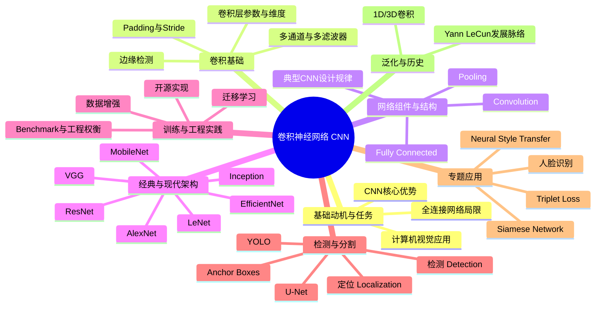

# convolutional-neural-networks

# 1. 🧠 课程思维导图 (Mind Map)

---

# 2. 📌 核心精要 (Executive Summary)

- **卷积神经网络（Convolutional Neural Network, CNN）** 的本质，是用**局部连接（Sparsity of Connections）**与**参数共享（Parameter Sharing）**取代全连接，从而在处理高维图像时显著减少参数量、计算量与过拟合风险。  
- 课程从**卷积、边缘检测、填充（Padding）、步幅（Stride）、多通道卷积**出发，系统构建了 CNN 的核心组件：**卷积层、池化层（Pooling Layer）、全连接层（Fully Connected Layer）**。  
- 在架构层面，课程梳理了从 **LeNet / AlexNet / VGG** 到 **ResNet / Inception / MobileNet / EfficientNet** 的演进逻辑：从“能用”到“更深、更宽、更高效、更适配移动端”。  
- 在应用层面，课程覆盖了**目标定位与检测（YOLO、NMS、Anchor Boxes）**、**语义分割（U-Net）**、**人脸识别（Siamese Network, Triplet Loss）**、**神经风格迁移（Neural Style Transfer）**。  
- 实践上最重要的结论是：**优先复用成熟架构与预训练权重，配合迁移学习与数据增强，而不是从零设计和训练一切。**

---

# 3. 📖 详细知识模块 (Detailed Notes)

---

## 模块一：计算机视觉为何需要 CNN

### 1.1 计算机视觉的典型任务

#### What：是什么
课程聚焦三类核心任务：

- **图像分类（Image Classification / Image Recognition）**
  - 输入一张图，输出类别，例如“是不是猫”。

- **目标检测（Object Detection）**
  - 不仅判断有没有目标，还要给出目标位置，如自动驾驶中框出周围车辆。

- **神经风格迁移（Neural Style Transfer）**
  - 将一张图的**内容（Content）**与另一张图的**风格（Style）**结合，生成新图像。

#### Why：为什么重要
- 自动驾驶需要识别**车、人、障碍物的位置**
- 人脸识别可用于**解锁手机、门禁**
- 图像推荐系统可筛选**最吸引人、最相关**的图片
- 风格迁移催生**新的数字艺术形式**

#### How：如何理解
课程给出的典型示例：
- 输入 **64×64×3** 图像做分类
- 在自动驾驶场景中为多辆车同时画框
- 用内容图 + 毕加索（Picasso）风格图生成艺术图

---

### 1.2 全连接网络在视觉任务中的瓶颈

#### What：是什么
如果把图像直接展平成向量输入**全连接网络（Fully Connected Network）**，参数规模会爆炸。

#### Why：为什么会爆炸
- 一张 **64×64×3** 图像，输入维度是：
  - \(64 \times 64 \times 3 = 12288\)

- 一张 **1000×1000×3** 图像，输入维度是：
  - \(1000 \times 1000 \times 3 = 3,000,000\)

若第一层只有 **1000 个隐藏单元**，则参数矩阵大小约为：
- \(1000 \times 3,000,000 = 3 \text{ billion}\)
- 即 **30亿参数**

#### 后果
- 需要极大量数据才不至于**过拟合（Overfitting）**
- 训练的**算力与内存开销**极不现实
- 无法有效利用图像的**局部结构**

#### How：CNN 的切入点
CNN 通过卷积操作：
- 只看局部区域
- 同一组参数在全图共享
- 使大图像处理成为可能

---

## 模块二：卷积（Convolution）与边缘检测

---

### 2.1 卷积的基本定义

#### What：是什么
**卷积（Convolution）** 是 CNN 的核心运算。  
它用一个小矩阵——**滤波器/卷积核（Filter / Kernel）**——在输入上滑动，做逐元素乘法再求和，生成输出特征图。

#### How：6×6 与 3×3 的例子
- 输入：**6×6 灰度图**
- 卷积核：**3×3**
- 输出：**4×4**

输出尺寸公式（无 padding、stride=1）：
\[
n - f + 1
\]
即：
\[
6 - 3 + 1 = 4
\]

---

### 2.2 边缘检测（Edge Detection）

#### What：是什么
边缘检测是卷积最直观的应用之一。  
早期 CNN 层通常学到边缘，再往后学纹理、部件、物体整体。

#### 垂直边缘检测核
课程使用的垂直边缘核：
\[
\begin{bmatrix}
1 & 1 & 1 \\
0 & 0 & 0 \\
-1 & -1 & -1
\end{bmatrix}
\]

> 直觉：**左亮右暗**时，响应为正或大；反之为负。

#### 示例
一个左半边为 10、右半边为 0 的 6×6 图像，经该核卷积后，中间产生强响应 **30**，表示检测到明显垂直边缘。

若颜色反转（左暗右亮），则会得到 **-30**。  
因此该卷积核不仅检测边缘，还区分：
- **亮 → 暗**
- **暗 → 亮**

如果不关心方向，可取**绝对值（Absolute Value）**。

---

### 2.3 水平边缘与经典滤波器

#### 水平边缘核
\[
\begin{bmatrix}
1 & 0 & -1 \\
1 & 0 & -1 \\
1 & 0 & -1
\end{bmatrix}
\]
或旋转后的形式，用于检测**上亮下暗**结构。

#### 经典滤波器
- **Sobel Filter**
\[
\begin{bmatrix}
1 & 2 & 1 \\
0 & 0 & 0 \\
-1 & -2 & -1
\end{bmatrix}
\]

- **Scharr Filter**
\[
\begin{bmatrix}
3 & 10 & 3 \\
0 & 0 & 0 \\
-3 & -10 & -3
\end{bmatrix}
\]

#### Why：为什么它们重要
这些核是人工设计的先验知识，能更鲁棒地检测边缘。

#### 更深层的结论
深度学习的真正突破是：  
**不再手工选这 9 个数，而是把它们当参数，让反向传播（Backpropagation）自动学习。**

于是网络不仅能学：
- 垂直边缘
- 水平边缘
- 45° 边缘
- 任意角度边缘
- 甚至“人类尚未命名”的低层特征

---

### 2.4 Padding 与 Stride

---

#### Padding（填充）

##### What
在输入边缘补零，通常称为**零填充（Zero Padding）**。

##### Why
解决两个问题：
1. 每卷积一次尺寸变小，深层网络会迅速塌缩
2. 边缘像素被使用次数少，信息利用不足

##### 公式
输入 \(n \times n\)，卷积核 \(f \times f\)，padding 为 \(p\) 时：
\[
n + 2p - f + 1
\]

##### 两种常见卷积方式
- **Valid Convolution**
  - 不填充，\(p=0\)
- **Same Convolution**
  - 让输出尺寸与输入一致

若要 same convolution，则：
\[
p = \frac{f-1}{2}
\]
这要求 **f 通常为奇数**。

##### Why 过滤器常用奇数尺寸
- 便于对称填充
- 有“中心像素”
- 常见尺寸：**3×3、5×5、7×7、1×1**

---

#### Stride（步幅）

##### What
卷积核每次滑动的步长。

##### Why
步幅越大，输出尺寸越小，计算越省。

##### 公式
输入 \(n \times n\)，卷积核 \(f \times f\)，padding 为 \(p\)，stride 为 \(s\)：
\[
\left\lfloor \frac{n + 2p - f}{s} + 1 \right\rfloor
\]

##### 示例
- 输入：**7×7**
- 卷积核：**3×3**
- stride：**2**
- 输出：
\[
\frac{7-3}{2}+1 = 3
\]
即 **3×3**

---

### 2.5 卷积 vs 互相关（Cross-Correlation）

#### What
严格数学上，卷积要先把卷积核做水平+垂直翻转。  
而深度学习中通常**不翻转**，严格来说更接近**互相关（Cross-Correlation）**。

#### Why 仍然叫卷积
- 深度学习社区约定俗成
- 不影响训练结果
- 省去翻转步骤，代码更简单

---

## 模块三：多通道卷积、卷积层与池化层

---

### 3.1 多通道卷积（Convolutions over Volume）

#### What
RGB 图像是 **高 × 宽 × 通道数（Height × Width × Channels）** 的三维张量。

例如：
- 输入：**6×6×3**
- 卷积核：**3×3×3**

#### Why
卷积核必须跨越所有输入通道，才能联合利用颜色信息。

#### How
- 一个 **3×3×3** 卷积核含 **27 个参数**
- 对应输入的一个 **3×3×3 patch**
- 逐元素相乘再求和，得到一个数
- 滑动后生成一个 **4×4×1** 特征图

如果使用多个卷积核：
- 2 个核 → 输出 **4×4×2**
- 10 个核 → 输出 **4×4×10**

#### 核心结论
**输出通道数 = 卷积核个数**

---

### 3.2 一层卷积神经网络（One Layer of a CNN）

#### What
一层 CNN = 卷积 + 偏置 + 非线性激活（如 ReLU）

#### 形式类比
普通神经网络：
\[
Z^{[1]} = W^{[1]}A^{[0]} + b^{[1]}
\]
\[
A^{[1]} = g(Z^{[1]})
\]

CNN 中：
- 卷积核充当 \(W\)
- 每个 filter 有一个 bias
- 经过 **ReLU（Rectified Linear Unit）** 输出激活

#### 参数量示例
若一层有 **10 个 3×3×3 filter**：
- 每个 filter 参数数：
  - \(3 \times 3 \times 3 = 27\)
- 加上 1 个 bias
  - 共 **28**
- 总参数：
  - \(28 \times 10 = 280\)

#### Why 这非常重要
无论输入图像是：
- **1000×1000**
- 还是 **5000×5000**

这一层参数始终只有 **280**。  
这正是 CNN 不易过拟合、易扩展到大图像的关键。

---

### 3.3 卷积层的维度与记号

若第 \(l\) 层：
- filter size：**\(f^{[l]}\)**
- padding：**\(p^{[l]}\)**
- stride：**\(s^{[l]}\)**

输入维度：
- \(n_H^{[l-1]} \times n_W^{[l-1]} \times n_C^{[l-1]}\)

输出维度：
\[
n_H^{[l]} = \left\lfloor \frac{n_H^{[l-1]} + 2p^{[l]} - f^{[l]}}{s^{[l]}} + 1 \right\rfloor
\]
\[
n_W^{[l]} = \left\lfloor \frac{n_W^{[l-1]} + 2p^{[l]} - f^{[l]}}{s^{[l]}} + 1 \right\rfloor
\]
\[
n_C^{[l]} = \text{该层 filter 数量}
\]

参数张量：
\[
W^{[l]}: f^{[l]} \times f^{[l]} \times n_C^{[l-1]} \times n_C^{[l]}
\]

bias：
\[
b^{[l]}: 1 \times 1 \times 1 \times n_C^{[l]}
\]

---

### 3.4 池化层（Pooling Layer）

#### What
池化层通过聚合局部区域，降低特征图尺寸，提高鲁棒性。

#### 最大池化（Max Pooling）
示例：
- 输入：**4×4**
- 使用 \(f=2, s=2\)
- 输出：**2×2**
- 每个输出是对应区域最大值

#### 平均池化（Average Pooling）
- 输出对应区域的平均值
- 现代 CNN 中使用较少
- 例外：深层常用**全局平均池化（Global Average Pooling）**

#### Why
课程给出的直觉：
- 若某个特征在一个局部区域**任一点**被检测到
- Max pooling 会把它保留下来

#### 重要性质
- 池化层有**超参数**，但**没有可学习参数**
- 最常见设置：
  - **\(f=2, s=2\)**：高宽减半
  - **\(f=3, s=2\)**：也较常见

---

## 模块四：CNN 的典型结构规律

---

### 4.1 一个简单 CNN 例子

输入：**39×39×3**

1. Conv1：
   - \(f=3, s=1, p=0\), 10 个 filter
   - 输出：**37×37×10**

2. Conv2：
   - \(f=5, s=2, p=0\), 20 个 filter
   - 输出：**17×17×20**

3. Conv3：
   - \(f=5, s=2, p=0\), 40 个 filter
   - 输出：**7×7×40**

4. Flatten：
   - \(7 \times 7 \times 40 = 1960\)

5. Logistic Regression / Softmax

---

### 4.2 设计规律

#### 核心模式
随着网络加深，通常：
- **高宽（Height/Width）逐渐减小**
- **通道数（Channels）逐渐增加**

例如：
- 39 → 37 → 17 → 7
- 3 → 10 → 20 → 40

#### 常见层次组合
- Conv → Pool
- Conv → Conv → Pool
- 多组卷积后接少量全连接层
- 末端接 Softmax

---

### 4.3 为什么卷积有效

#### 1）参数共享（Parameter Sharing）
同一个边缘检测器在图像左上角有用，在右下角通常也有用。  
因此无需在每个位置学习一套独立参数。

#### 2）稀疏连接（Sparsity of Connections）
某个输出像素只依赖输入中的局部 patch，而不是整张图。

#### 3）平移不变性（Translation Invariance）
物体平移几个像素后，仍应被识别成同一类；卷积结构天然支持这种性质。

---

## 模块五：经典与现代 CNN 架构演进

---

### 5.1 LeNet-5

#### 背景
- 作者：**Yann LeCun**
- 时间：**1998**
- 用于手写数字识别
- 输入：**32×32×1**
- 参数量约：**6 万**

#### 结构
- Conv：6 个 **5×5**
- Average Pooling
- Conv：16 个 **5×5**
- Average Pooling
- Flatten：\(5 \times 5 \times 16 = 400\)
- FC：120
- FC：84
- 输出层：10 类

#### 特点
- 使用 **Sigmoid / Tanh**，非 ReLU
- 早期论文里还有较复杂的**不完全连接**设计
- 池化后还加了非线性

#### 意义
- CNN 工业化应用的早期代表
- 启发后续几乎所有视觉网络

---

### 5.2 AlexNet

#### 背景
- 作者：**Alex Krizhevsky, Ilya Sutskever, Geoffrey Hinton**
- ImageNet 竞赛成名
- 参数量约：**6000 万**

#### 结构概要
- 输入：**227×227×3**  
  （论文常写 224，但课程指出尺寸算起来实际更像 227）
- Conv：**96 个 11×11，stride 4**
- Max Pool
- Conv：**5×5 same**
- Max Pool
- 多层 **3×3 same**
- Max Pool
- Flatten：\(6 \times 6 \times 256 = 9216\)
- 多层 FC
- Softmax：**1000 类**

#### Why 重要
- 首次大规模证明深度学习在计算机视觉中可显著优于传统方法
- 推动视觉界全面拥抱深度学习

#### 关键改进
- 使用 **ReLU**
- 使用 **GPU**
- 大规模数据：**ImageNet**

#### 额外细节
- 曾使用 **Local Response Normalization (LRN)**
- 还用了双 GPU 训练
- 这些技巧后来不一定保留

---

### 5.3 VGG-16

#### 核心思想
**极度统一、极度简洁**
- 所有卷积层基本用：
  - **3×3，stride 1，same padding**
- 所有池化层基本用：
  - **2×2，stride 2**

#### 结构趋势
- 通道数按阶段翻倍：
  - 64 → 128 → 256 → 512 → 512

#### 参数量
- 约 **1.38 亿（138 million）**

#### Why 重要
- 架构规则清晰
- 设计范式影响巨大
- 常被用作特征提取 backbone

#### 缺点
- 参数量非常大
- 全连接层尤其重

---

### 5.4 ResNet（Residual Network）

#### What
通过**残差块（Residual Block）**引入**跳连（Skip Connection / Shortcut）**。

基本形式：
\[
a^{[l+2]} = g(z^{[l+2]} + a^{[l]})
\]

#### Why
深层网络难训练，会出现：
- 梯度消失/爆炸
- 网络越深，训练误差反而上升

残差连接让网络更容易学习**恒等映射（Identity Mapping）**。  
即使新加的层学不到有用东西，也能近似“什么都不做”，不伤害性能。

#### 直觉
若 \(W^{[l+2]} \approx 0, b^{[l+2]} \approx 0\)，  
则：
\[
a^{[l+2]} \approx a^{[l]}
\]
网络至少不比浅层差。

#### 重要数据
- ResNet 训练出**152 层**深网络
- 课程提到后来有人尝试**1000+ 层**

---

### 5.5 Inception Network

#### What
不要预先只选一种卷积核尺寸，而是**并行尝试多种路径**：
- 1×1 Conv
- 3×3 Conv
- 5×5 Conv
- Pooling

最后把结果**拼接（Concatenate）**。

#### Why
不同尺寸卷积核适合捕捉不同尺度特征。  
与其人工赌一个，不如都做，让网络自己学组合。

#### 计算难点
直接做 **5×5** 代价大。  
课程中给出例子：

输入：**28×28×192**  
直接做 **5×5 Conv，32 个 filter** 的乘法量：
- 约 **1.2 亿（120 million）**

解决方案：先用 **1×1 Conv** 降维到 16 通道，再做 5×5：
- 第一层：**2.4 million**
- 第二层：**10.0 million**
- 总计：**12.4 million**

即计算量约降为原来的 **1/10**

#### 关键方法
- **1×1 Convolution / Network in Network**
- 作为**瓶颈层（Bottleneck Layer）**降低通道数

#### 命名趣闻
论文引用了网络梗图：
> **“We need to go deeper.”**

---

### 5.6 1×1 卷积（Networks in Networks）

#### What
对每个空间位置上的所有通道做一次小型全连接映射。

若输入为 **6×6×32**，使用一个 **1×1×32** filter：
- 每个位置会把 32 个通道聚合成 1 个值

若使用多个 1×1 filter：
- 可改变输出通道数

#### Why
- 降维、节省计算
- 增加非线性表达能力
- 构成 Inception 的核心组件

---

### 5.7 MobileNet

#### 背景
目标：在**移动端/低算力设备**部署 CNN。

---

#### MobileNet v1：Depthwise Separable Convolution

##### 核心分解
把标准卷积分成两步：
1. **Depthwise Convolution**
2. **Pointwise Convolution（1×1）**

##### 课程示例
输入：
- **6×6×3**

标准卷积：
- filter：**3×3×3**
- 5 个 filter
- 输出：**4×4×5**
- 乘法数：**2160**

Depthwise Separable：
- Depthwise：**432**
- Pointwise：**240**
- 总计：**672**

比例：
\[
672 / 2160 \approx 0.31
\]

即只需原计算量的 **31%** 左右。  
在典型大网络中，课程指出通常可粗略理解为**约 1/9 到 1/10** 成本。

##### 一般结论
其计算成本相对普通卷积的比例近似：
\[
\frac{1}{n_C'} + \frac{1}{f^2}
\]

---

#### MobileNet v2：Bottleneck + Residual

##### 结构
- **Expansion**
- **Depthwise Conv**
- **Projection（Pointwise Conv）**
- **Residual Connection**

##### Why
- Expansion 提升中间表达能力
- Projection 降低输出激活存储开销
- Residual 提高训练效果

##### 课程信息
- v1 典型块重复 **13 次**
- v2 的 bottleneck block 典型重复 **17 次**
- 常见 expansion factor：**6 倍**

---

### 5.8 EfficientNet

#### What
不是发明一种全新层，而是研究如何更系统地扩展网络。

扩展三个维度：
- **分辨率（Resolution, r）**
- **深度（Depth, d）**
- **宽度（Width, w）**

#### Why
不同设备资源不同：
- 算力更高 → 可用更大模型
- 受限设备 → 需更小模型

#### 核心思想
用**复合缩放（Compound Scaling）**一起调整 \(r,d,w\)，  
而不是只单独放大一个维度。

#### 作者
- **Mingxing Tan**
- **Quoc Le**

---

## 模块六：CNN 的工程实践方法论

---

### 6.1 使用开源实现（Open-Source Implementation）

#### 核心原则
**不要轻易从论文“纯手搓”复现。**

#### Why
很多论文效果依赖大量隐性细节：
- 学习率衰减策略
- 正则化
- 初始化
- 数据增强
- 训练 schedule

#### 建议工作流
1. 选一个成熟架构
2. 去 **GitHub** 找开源实现
3. 下载代码和预训练权重
4. 在此基础上改造

#### 课程观点
哪怕顶尖大学的深度学习博士生，也不一定能仅靠论文稳定复现完整系统。

---

### 6.2 迁移学习（Transfer Learning）

#### What
使用在大数据集上训练好的模型作为初始化，再迁移到自己的任务。

#### 典型来源数据集
- **ImageNet**
- **MS COCO**
- **Pascal**

#### 课程案例
任务：识别自家两只猫：
- **Tigger**
- **Misty**
- 以及 **Neither**

因为自己的数据很少，所以做法是：
1. 下载 ImageNet 上预训练的 CNN
2. 去掉原 1000 类 softmax
3. 换成自己的 3 类输出层
4. 先冻结前面大部分层，只训练最后层

#### 不同数据规模下的策略
- **数据很少**
  - 冻结大部分层
  - 只训练最后的 softmax/分类头
- **数据较多**
  - 少冻结一些层
  - 微调（Fine-tune）后几层
- **数据很多**
  - 用预训练权重做初始化
  - 全网络继续训练

#### 实用技巧
若前几层完全冻结，可预先计算中间特征并缓存到磁盘，减少重复计算。

#### 课程结论
在视觉任务中，**除非你有特别大的数据集，否则几乎总应优先考虑迁移学习**。

---

### 6.3 数据增强（Data Augmentation）

#### What
通过人为变换训练图像，扩充数据分布。

#### 常用方法
1. **水平翻转（Mirroring）**
2. **随机裁剪（Random Cropping）**
3. **颜色偏移（Color Shifting）**
   - 对 RGB 加减扰动
4. 还可尝试：
   - Rotation
   - Shearing
   - Local warping

#### Why
计算机视觉通常“永远缺数据”。  
更多有效变体通常能提升泛化。

#### 颜色增强的高级版本
- **PCA Color Augmentation**
- 在 AlexNet 论文中提到

#### 工程实现建议
用并行 pipeline：
- 线程 A：从磁盘读取数据
- 线程 B：实时做增强
- 线程 C/GPU：训练模型

---

### 6.4 计算机视觉领域的研究与工程现状

#### 课程观察
视觉领域通常处于“**数据相对不足 + 任务复杂**”的区间，因此会比一些别的领域更依赖：
- 手工架构设计
- 复杂超参数
- 各种工程技巧

#### 两类知识来源
一个视觉系统的效果来自两部分：
1. **标注数据**
2. **人工设计（Hand-Engineering）**

#### Benchmark 文化
视觉领域非常重视：
- 标准数据集
- 排行榜
- 比赛成绩

这有好处：
- 推动社区找到有效结构

也有代价：
- 有些论文技巧更偏向“刷榜”，未必适合生产

#### 两个典型“刷榜”技巧
1. **模型集成（Ensembling）**
   - 训练多个网络，平均输出
   - 可能提升 **1%~2%**
   - 但推理速度变慢 **3~15 倍甚至更多**

2. **测试时多裁剪（Multi-crop at Test Time）**
   - 如 **10-crop**
   - 对同一图片取多个 crop，再平均预测
   - 提升 benchmark，但生产中少用

#### 课程建议
做实际系统时：
- 优先考虑**速度、内存、部署成本**
- 少迷信论文中的“比赛技巧”

---

## 模块七：定位、检测与 YOLO

---

### 7.1 分类 + 定位（Classification with Localization）

#### What
除类别外，还输出目标框：
- \(b_x, b_y\)：中心点
- \(b_h, b_w\)：高宽

图像左上角设为 **(0,0)**，右下角为 **(1,1)**。

#### 标签设计
目标标签可写成：
\[
y = [p_c, b_x, b_y, b_h, b_w, c_1, c_2, c_3]
\]

其中：
- **\(p_c\)**：是否存在目标
- \(c_1,c_2,c_3\)：类别 one-hot

若图中没有目标：
\[
p_c = 0
\]
其余项是 **don't care**

#### Loss 设计
- 若 \(p_c=1\)，回归框 + 分类都计算损失
- 若 \(p_c=0\)，只关心 \(p_c\) 的预测

---

### 7.2 Landmark Detection

#### What
网络不只输出矩形框，也可以输出关键点坐标。

#### 例子
- 人脸四个眼角
- 64 个面部关键点
- 人体姿态关键点：肩、肘、腕、胸口等

#### 应用
- 表情识别
- AR 特效 / Snapchat 滤镜
- 姿态估计

#### 关键要求
同一个 landmark 编号在不同图中语义必须一致。

---

### 7.3 滑动窗口检测（Sliding Windows Detection）

#### What
先训练一个分类器：
- 输入“紧裁剪”的目标图（如车）
- 输出是否为车

然后在整张图上：
- 用不同大小窗口滑动
- 每个窗口都送入分类器判断

#### Why 不够好
- 计算量巨大
- 步幅大 → 定位粗糙
- 步幅小 → 计算不可接受

---

### 7.4 卷积化滑动窗口（Convolutional Implementation of Sliding Windows）

#### 核心思想
把全连接层改写成卷积层后，可以一次前向传播处理整张图，复用重叠区域的计算。

#### 课程示例
原始网络输入：
- **14×14×3**

若测试图像是：
- **16×16×3**

原始滑窗需分别跑 4 次  
卷积化后只需**一次前向传播**，输出 **2×2×4**，对应 4 个窗口结果。

#### Why 重要
极大降低了滑窗检测成本。

---

### 7.5 YOLO（You Only Look Once）

#### What
将图片划分为网格，每个网格直接输出：
- 是否有目标
- 边界框
- 类别

#### 课程示例
- 输入图像：**100×100**
- 划分为 **3×3** 网格（实际常用 **19×19**）
- 每个网格输出 8 维向量：
\[
[p_c,b_x,b_y,b_h,b_w,c_1,c_2,c_3]
\]
- 总输出：**3×3×8**

#### 目标归属规则
看目标框中心点落在哪个网格，就由哪个网格负责预测。

#### Why 优势大
- 单次前向传播完成检测
- 边界框回归更精确
- 速度快，适合实时检测

---

### 7.6 Intersection over Union（IoU）

#### What
评价预测框与真实框重合度：
\[
IoU = \frac{\text{Intersection}}{\text{Union}}
\]

#### 常见阈值
若 **IoU ≥ 0.5**，通常认为检测正确。

#### 用途
- 评估定位效果
- 非极大值抑制（NMS）

---

### 7.7 非极大值抑制（Non-Max Suppression, NMS）

#### What
解决同一目标被多次检测的问题。

#### 步骤
1. 去掉低置信度框（如 \(p_c \le 0.6\)）
2. 选出置信度最高框，加入输出
3. 删除所有与它 IoU 很高的其他框
4. 重复直到没有候选框

#### Why
同一个车附近多个网格都可能“举手说我看到了车”，NMS 用来保留最优那个。

---

### 7.8 Anchor Boxes

#### What
每个网格不只预测一个框，而是预测多个预定义形状的框。

#### Why
解决一个网格中可能有多个目标的问题，或让网络对不同形状目标更好地专门化。

#### 课程示例
使用 **2 个 anchor boxes** 时：
- 每个网格输出两组 8 维向量
- 总输出从 **3×3×8** 变成 **3×3×2×8**
- 也可写成 **3×3×16**

#### 目标分配规则
每个目标分配给：
1. 含其中心点的网格
2. 与其形状 IoU 最高的 anchor box

#### 更深层价值
不仅解决冲突，也能让不同分支分别擅长：
- 高瘦目标（如行人）
- 宽胖目标（如汽车）

#### 选 anchor 的方法
- 手工选几种代表形状
- 更高级：用 **K-means** 聚类目标框形状

---

### 7.9 YOLO 总流程

#### 训练
1. 将图像划分网格
2. 为每个网格、每个 anchor box 构造标签
3. 训练 CNN 输出整个张量

#### 推理
1. 网络输出所有候选框
2. 去掉低分框
3. 按类别分别执行 NMS
4. 得到最终检测框

---

### 7.10 Region Proposal 系列（R-CNN 家族，选学）

#### 核心思路
先用某种算法提议少量可能含目标的区域，再分类这些区域。

#### 发展脉络
- **R-CNN**
- **Fast R-CNN**
- **Faster R-CNN**

#### 课程态度
这是非常重要的历史路线，但课程更看好端到端、单阶段、更统一的检测思路，如 YOLO。

---

## 模块八：语义分割（Semantic Segmentation）与 U-Net

---

### 8.1 语义分割是什么

#### What
不是只给边界框，而是给每个像素一个类别标签。

#### 例子
自动驾驶中：
- 哪些像素是**可行驶路面**
- 哪些是**车**
- 哪些是**建筑**

医疗图像中：
- 肺、心脏、锁骨分割
- 脑肿瘤分割

#### 应用价值
- 自动驾驶路径规划
- 医学诊断与术前规划

---

### 8.2 转置卷积（Transpose Convolution）

#### What
把小尺寸特征图“放大”成更大尺寸。

#### 课程示例
- 输入：**2×2**
- 卷积核：**3×3**
- padding：**1**
- stride：**2**
- 输出：**4×4**

#### Why
语义分割需要输出与输入同分辨率的像素级标签，因此网络后半段要逐步上采样。

---

### 8.3 U-Net 架构

#### What
U-Net 是一种编码器—解码器结构：
- 左边：下采样，提取高层特征
- 右边：上采样，恢复空间分辨率

并通过**跳连（Skip Connection）**将左边高分辨率特征复制到右边对应层。

#### Why
仅靠深层特征，语义信息强但空间分辨率差；  
仅靠浅层特征，定位精细但语义弱。  
U-Net 通过跳连把两者结合。

#### How
1. 多层普通卷积 + 池化，尺寸下降
2. 多层转置卷积，尺寸上升
3. 左右对应层特征拼接
4. 最后用 **1×1 卷积** 输出每像素类别分布

#### 输出
若输入为 \(h \times w \times 3\)，输出为：
\[
h \times w \times n_{classes}
\]

每个像素对应一个类别向量。

---

## 模块九：人脸识别（Face Recognition）

---

### 9.1 人脸验证 vs 人脸识别

#### Face Verification
输入：
- 一张人脸图
- 一个身份声明

输出：
- 这是不是这个人？

是**1:1** 问题。

#### Face Recognition
输入：
- 一张人脸图
- 一个数据库

输出：
- 这是数据库中的哪一个人？

是**1:K** 问题，明显更难。

#### 课程举例
如果验证系统准确率是 **99%**，  
当数据库里有 **100 人** 时，识别任务的误差会被放大，不够用。  
所以先解决高精度验证，再做识别。

---

### 9.2 One-Shot Learning（单样本学习）

#### What
很多人脸识别场景中，每个人只有一张登记照。

#### Why
普通分类器不适合：
- 数据太少
- 新人加入就要改输出类别并重训

#### 解决思路
学习一个相似度函数：
\[
d(image_1, image_2)
\]
- 同一人：距离小
- 不同人：距离大

这就是单样本学习的核心。

---

### 9.3 Siamese Network（孪生网络）

#### What
两张图片分别通过**同一个网络（共享参数）**得到编码：
\[
f(x_1), f(x_2)
\]

再计算：
\[
d(x_1,x_2)=\|f(x_1)-f(x_2)\|^2
\]

#### Why
网络不直接预测“是谁”，而是学会“像不像同一个人”。

#### 应用
- 验证：直接比较两张图
- 识别：与数据库中每个人逐一比较，找最近者

---

### 9.4 Triplet Loss（三元组损失）

#### What
每次训练用三个样本：
- **Anchor (A)**
- **Positive (P)**：同一个人
- **Negative (N)**：不同人

目标：
\[
\|f(A)-f(P)\|^2 + \alpha \le \|f(A)-f(N)\|^2
\]

其中 \(\alpha\) 是**margin（间隔）**

#### Loss
\[
L(A,P,N)=\max\left(\|f(A)-f(P)\|^2-\|f(A)-f(N)\|^2+\alpha, 0\right)
\]

#### Why
强制网络把同一人的编码拉近，把不同人的编码推远。

#### 关键训练技巧
随机选 triplet 太容易，很多样本天然满足约束。  
必须选**hard triplets**，即：
- 正样本不那么像
- 负样本又有点像

这样训练才有效。

#### 参考系统
- **FaceNet**
- 作者：**Florian Schroff, Dmitry Kalenichenko, James Philbin**

#### 数据规模
课程指出大规模商业系统常用：
- **100 万+**
- **1000 万+**
- 甚至 **1 亿+** 张图片训练

---

### 9.5 作为二分类训练

#### What
除了 Triplet Loss，也可以把验证建模为二分类：

输入：
- 两张图

输出：
- 是否同一人（0/1）

#### 特征构造
可对两个编码做逐元素差值后，再接 logistic regression。

课程给出一种形式：
\[
\sum_{k=1}^{128} w_k |f(x_i)_k - f(x_j)_k| + b
\]

也提到可用 **chi-square** 类相似度形式。

#### 工程技巧
数据库侧的编码可**预计算**，避免每次重复前向传播。

---

## 模块十：神经风格迁移（Neural Style Transfer）

---

### 10.1 问题定义

#### 输入
- **内容图（Content Image, C）**
- **风格图（Style Image, S）**

#### 输出
- **生成图（Generated Image, G）**

#### 目标
让生成图：
- 内容像 \(C\)
- 风格像 \(S\)

---

### 10.2 CNN 各层在学什么

#### 核心观察
浅层倾向学习：
- 边缘
- 颜色
- 简单纹理

深层倾向学习：
- 更复杂纹理
- 部件
- 物体整体（如狗、花、键盘、鸟腿）

课程引用了 **Zeiler & Fergus** 的可视化结果，展示不同层激活最大化时对应的图像 patch。

#### Why 对风格迁移重要
- “内容”更像深层语义结构
- “风格”更像跨通道纹理相关性

---

### 10.3 总体目标函数

\[
J(G)=\alpha J_{content}(C,G)+\beta J_{style}(S,G)
\]

然后：
1. 随机初始化 \(G\)
2. 对像素值做梯度下降
3. 最终得到既像内容图又像风格图的生成图

---

### 10.4 内容代价（Content Cost）

#### What
比较内容图和生成图在某个中间层的激活是否相似。

若选第 \(l\) 层：
\[
J_{content}(C,G)=\|a^{[l]}(C)-a^{[l]}(G)\|^2
\]

#### Why
中间层的激活能表示图像的语义内容，而不拘泥于原始像素。

---

### 10.5 风格代价（Style Cost）

#### 核心思想
风格由某层不同通道之间的**相关性（Correlation）**表示。

#### Style Matrix / Gram Matrix
对第 \(l\) 层，定义：
\[
G^{[l]}_{kk'} = \sum_i \sum_j a^{[l]}_{ijk} a^{[l]}_{ijk'}
\]

即通道 \(k\) 与 \(k'\) 在空间上的共同激活程度。

#### Why
如果两个通道经常同时激活，说明某类纹理、颜色、局部模式经常一起出现，这正是“风格”的体现。

#### 单层风格代价
比较风格图和生成图的 Gram Matrix：
\[
J_{style}^{[l]}(S,G)=\|G^{[l]}(S)-G^{[l]}(G)\|_F^2
\]

#### 多层风格代价
\[
J_{style}(S,G)=\sum_l \lambda^{[l]}J_{style}^{[l]}(S,G)
\]

通过多个层共同约束风格，效果更自然。

---

## 模块十一：1D 与 3D 卷积泛化

---

### 11.1 1D 卷积

#### 应用示例
- **心电图（ECG / EKG）**
- 序列型信号

#### 例子
- 输入：**14**
- 卷积核：**5**
- 输出：**10**

若有多通道、多过滤器，也完全类似 2D 卷积。

#### Why
同一个局部模式（如心跳波形）可能出现在时间轴不同位置，卷积可共享检测器。

---

### 11.2 3D 卷积

#### 应用示例
- **CT 扫描**
- 视频数据（时间也可看作第三维）

#### 例子
- 输入：**14×14×14**
- 卷积核：**5×5×5**
- 输出：**10×10×10**

若有多个 filter，则输出再增加通道数。

#### Why
适合体数据、医学影像、时空特征建模。

---

## 模块十二：Yann LeCun 访谈中的历史脉络与方法论

---

### 12.1 Yann LeCun 的学术起点

#### 关键经历
- 少年时期在法国，对**智能机器、人类智能起源、科技、太空**感兴趣
- 喜欢电影：
  - **《2001: A Space Odyssey》**
- 1980 年前后接触到关于 **Perceptron** 的文献

#### 学术触发点
他在一本哲学/认知发展相关书中看到：
- **Noam Chomsky**
- **Jean Piaget**
- **Seymour Papert**

由此开始追踪感知机文献，并意识到：
- 多层网络训练是核心未解问题

---

### 12.2 反向传播与卷积网络的早期发展

#### 历史脉络
- 1985 年在法国 workshop 遇到 **Terry Sejnowski**
- 不久与 **Geoff Hinton** 建立联系
- 参与多层网络训练思想的早期探索

#### 他提到的关键前身
- **Fukushima 的 Neocognitron**
- **Boltzmann Machines**
- **Backpropagation**

---

### 12.3 LeNet 与 Bell Labs 时代

#### 关键事实
- 在多伦多大学期间，先做出共享权重网络的实验
- 1988 年加入 **AT&T Bell Labs**
- 使用 **USPS 数据集**
  - 约 **5000 个训练样本**
- 很快训练出早期 **LeNet**

#### 他回忆的一句评价
**Jeff Dean（课程字幕里是 Jeffrey Ton，显然是转写误差，实际应是其他人，原意为同行评价）**大意：
> **“你报告里真正重要的信息是：如果把该做的合理事情都做好，它真的能工作。”**

#### 产业落地
- 支票识别
- ATM / 银行自动化
- 卷积网络专用芯片探索

---

### 12.4 为什么 CNN 当年没有立刻“统治视觉”

#### 原因
- 90 年代没有今天的互联网与开源生态
- 软件/硬件平台割裂
- 没有 Python / MATLAB / PyTorch / TensorFlow
- 复现成本极高
- 神经网络在 90 年代中后期经历“寒冬”

---

### 12.5 ImageNet 2012 的转折点

#### 关键事件
- 2012 年后，AlexNet 在 ImageNet 上大幅领先
- 在 **ECCV Florence** 的 workshop 上，**Alex Krizhevsky** 报告引发视觉界震动
- 很多视觉研究者当时并不真正了解卷积网络

#### LeCun 的评价
这是让视觉界集体转向深度学习的标志性时刻。

---

### 12.6 对进入 AI 领域者的建议

#### 原话核心
> **“Make yourself useful.”**  
> **“让自己变得有用。”**

#### 具体建议
- 为开源项目做贡献
- 复现一篇重要论文
- 把实现整理成可用的开源包
- 用可见、可分享的成果进入社区

#### Why
- 比“只学不做”更容易被看见
- 有助于申请理想工作或 PhD 项目

---

# 4. 🛠️ 实践与应用 (Actionable Points)

### 行动建议 1：做视觉任务时，优先“迁移学习 + 开源实现”
- 不要从零设计和训练完整 CNN
- 先选成熟 backbone：
  - **ResNet / MobileNet / EfficientNet / U-Net**
- 去 GitHub 找实现与预训练权重
- 小数据集场景先冻结大部分层，只训练最后几层

---

### 行动建议 2：任何目标检测项目，先按这条流程搭建最小闭环
1. 明确类别集合
2. 先做 **classification + localization**
3. 再做 **YOLO 风格网格输出**
4. 加入 **IoU + NMS**
5. 如目标形状多样，再加 **Anchor Boxes**

这样能避免一开始把检测系统做得过于复杂。

---

### 行动建议 3：如果你的数据少，立刻引入数据增强
最先做三件事：
- 水平翻转
- 随机裁剪
- 颜色扰动

这是视觉项目中**最便宜且通常有效**的泛化增益手段。

---

# 5. 🤔 深度思考与费曼测试 (Reflection)

1. **为什么 CNN 相比全连接网络更适合图像？请用“参数共享（Parameter Sharing）”和“稀疏连接（Sparsity of Connections）”两个概念，向一个完全不懂深度学习的人解释。**

2. **如果你要为一个移动端图像分类系统选架构，你会如何在 ResNet、Inception、MobileNet、EfficientNet 之间做选择？请从“精度、参数量、计算量、部署环境”四个角度说明。**

3. **请不用公式，完整讲清楚 YOLO 的工作流程：从网格划分、边界框预测、Anchor Boxes、IoU，到 Non-Max Suppression，如何一步步从一张图得到最终检测结果。**

如果你愿意，我还可以继续把这份笔记进一步加工成：

- **Anki 闪卡版**
- **面试问答版**
- **考试速记版**
- **Notion 模块化版**
- **适合打印的精简讲义版**
