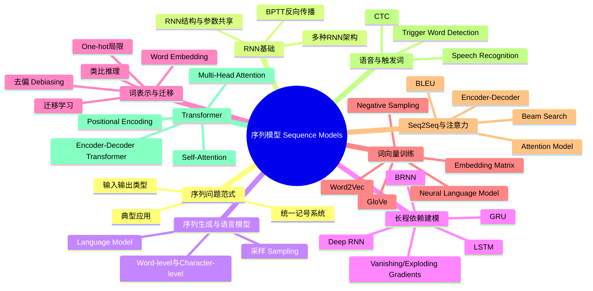

# sequence-models

# 1. 🧠 课程思维导图 (Mind Map)

---

# 2. 📌 核心精要 (Executive Summary)

- **序列模型（Sequence Models）**的核心价值，是处理“输入、输出都具有顺序结构”的问题，包括语音识别、机器翻译、命名实体识别、语言生成与语音唤醒等。  
- **循环神经网络（Recurrent Neural Network, RNN）**通过参数共享和时间递归建模序列，但基础 RNN 存在**长程依赖难以学习**的问题，因此引出了 **GRU、LSTM、双向RNN（BRNN）和深层RNN**。  
- 在自然语言处理中，**词嵌入（Word Embedding）**替代 one-hot，使模型具备“语义相似性”和“迁移学习”能力；其代表方法包括 **Word2Vec、Negative Sampling、GloVe**。  
- 在序列到序列任务中，**Encoder-Decoder + Beam Search + Attention** 是关键组合：前者负责建模映射，Beam Search 负责近似寻找最优输出，Attention 则显著提升长句翻译效果。  
- **Transformer** 进一步抛弃 RNN 的顺序瓶颈，以 **Self-Attention + Multi-Head Attention + Positional Encoding** 为核心，成为现代 NLP 的主流架构。

---

# 3. 📖 详细知识模块 (Detailed Notes)

---

## 模块一：序列模型的本质与问题类型

### 1.1 什么是序列模型（Sequence Models）

#### What
**序列模型（Sequence Models）**是用于处理“元素之间存在顺序依赖”的数据模型。数据可以随时间展开，也可以只是位置相关，但通常用时间步 \(t\) 表示。

#### Why
传统前馈神经网络（Feedforward Neural Network）不擅长处理：
- **输入长度可变**
- **输出长度可变**
- **前后位置需要共享模式**
- **上下文依赖强**

序列模型通过“按位置递推处理”和“参数共享”解决这些问题。

#### How：典型应用场景
课程中给出的主要任务：

- **语音识别（Speech Recognition）**
  - 输入 \(X\)：音频片段
  - 输出 \(Y\)：文本转录
  - 特征：输入输出都是序列

- **音乐生成（Music Generation）**
  - 输入 \(X\)：空、风格ID或起始音符
  - 输出 \(Y\)：音符序列
  - 特征：只输出是序列

- **情感分类（Sentiment Classification）**
  - 输入 \(X\)：一句评论
  - 输出 \(Y\)：星级/类别
  - 特征：输入是序列，输出是单标签

- **DNA 序列分析（DNA Sequence Analysis）**
  - DNA 由 **A/C/G/T** 组成
  - 可用于识别蛋白质编码区域

- **机器翻译（Machine Translation）**
  - 输入输出都是序列，且**长度可不同**

- **视频行为识别（Video Activity Recognition）**
  - 输入：视频帧序列
  - 输出：动作类别或动作序列

- **命名实体识别（Named Entity Recognition, NER）**
  - 输入：句子
  - 输出：每个词是否属于人名/地点/组织等

---

### 1.2 序列任务的结构类型

#### 核心分类

1. **Many-to-Many（等长）**
   - 输入序列 → 输出序列
   - 例：NER

2. **Many-to-One**
   - 输入序列 → 单个输出
   - 例：情感分类

3. **One-to-Many**
   - 单个输入 → 输出序列
   - 例：音乐生成、图像描述

4. **Many-to-Many（不等长）**
   - 输入序列 → 输出序列，长度不同
   - 例：机器翻译

5. **One-to-One**
   - 普通神经网络问题
   - 不一定需要 RNN

---

## 模块二：序列数据表示与统一记号

### 2.1 基础记号系统（Notation）

#### What
课程采用统一符号描述序列任务：

- **\(x^{\langle t \rangle}\)**：输入序列第 \(t\) 个元素
- **\(y^{\langle t \rangle}\)**：输出序列第 \(t\) 个元素
- **\(T_x\)**：输入序列长度
- **\(T_y\)**：输出序列长度

对第 \(i\) 个样本：
- **\(x^{(i)\langle t \rangle}\)**：第 \(i\) 个样本的第 \(t\) 个输入
- **\(T_x^{(i)}\)**：第 \(i\) 个样本的输入长度

#### Why
序列样本长度通常不一致，必须显式区分：
- 样本索引 \(i\)
- 时间/位置索引 \(t\)

#### How：NER 示例
句子：

> Harry Potter and Hermione Granger invented a new spell

若任务是识别人名，则：
- 每个输入词对应一个输出标签
- 这是典型的 **Many-to-Many 等长任务**

---

### 2.2 词汇表（Vocabulary / Dictionary）与 One-hot

#### What
自然语言任务中，先构建**词汇表（Vocabulary）**，每个词对应唯一索引。

示例词典规模：
- 教学示例：**10,000**
- 商业系统常见：**30,000–50,000**
- 也常见：**100,000**
- 大型互联网公司：**1,000,000+**

#### Why
神经网络不能直接输入单词字符串，必须向量化。

#### How
若单词 **Harry** 在词表中索引为 **4075**，则其 one-hot 表示为：
- 维度：10,000
- 第 4075 位为 1，其余为 0

课程还引入：
- **未知词（Unknown Word, UNK）**：处理词表外单词

#### 局限
**One-hot** 的问题：
- 词之间彼此正交，无法表达语义相似度
- 参数维度高
- 不利于从“orange juice”泛化到“apple juice”

---

## 模块三：RNN 基础——为什么需要循环结构

### 3.1 传统神经网络为什么不适合序列

#### Why
若直接把句子中所有词拼接输入前馈网络，会遇到：

- **长度不固定**
- **参数过多**
- **不同位置不共享知识**

例如：
- 模型若学到“Harry 在位置1时像人名”
- 并不会自动推广到“Harry 在位置5时也像人名”

这与卷积神经网络中的**权重共享（Weight Sharing）**思想类似：  
我们希望序列中不同位置能共享同一模式识别能力。

---

### 3.2 RNN（Recurrent Neural Network）核心结构

#### What
**RNN** 在每个时间步读取一个输入 \(x^{\langle t \rangle}\)，并结合前一时刻隐藏状态 \(a^{\langle t-1 \rangle}\)，生成新的隐藏状态 \(a^{\langle t \rangle}\) 和输出 \(\hat{y}^{\langle t \rangle}\)。

#### Why
这样模型可以：
- 利用历史信息
- 用固定参数处理任意长度序列
- 在不同位置共享规则

#### How：前向传播公式

隐藏状态更新：
\[
a^{\langle t \rangle} = g(W_{aa}a^{\langle t-1 \rangle} + W_{ax}x^{\langle t \rangle} + b_a)
\]

输出预测：
\[
\hat{y}^{\langle t \rangle} = g(W_{ya}a^{\langle t \rangle} + b_y)
\]

其中：
- **\(W_{ax}\)**：输入到隐藏层
- **\(W_{aa}\)**：隐藏到隐藏
- **\(W_{ya}\)**：隐藏到输出
- **\(a^{\langle 0 \rangle}\)** 常初始化为**全零向量**

课程还把两个矩阵合并写法：
\[
a^{\langle t \rangle} = g(W_a[a^{\langle t-1 \rangle}, x^{\langle t \rangle}] + b_a)
\]

#### 参数共享的意义
同一组参数在所有时间步重复使用：
- 降低参数量
- 强化模式复用
- 支持可变长序列

---

### 3.3 RNN 的局限

#### Why
基础单向 RNN 在预测第 \(t\) 个输出时，只能利用过去信息，无法看到未来。

#### 示例
句子：
- “He said **Teddy Roosevelt** was a great president.”
- “He said **teddy bears** are on sale.”

要判断 **Teddy** 是否是人名，只看前3个词不够，必须看后文。

#### 结论
基础单向 RNN 的短板：
- 无法利用未来上下文
- 难以捕捉长距离依赖

---

## 模块四：RNN 的训练——时间反向传播

### 4.1 BPTT（Backpropagation Through Time）

#### What
**时间反向传播（Backpropagation Through Time, BPTT）**是 RNN 的训练方式，本质上是把 RNN 在时间上展开后做标准反向传播。

#### Why
RNN 的参数在所有时间步共享，因此损失对参数的梯度必须累积来自所有时间步的信息。

#### How
单步损失（如二分类）可定义为交叉熵：
\[
L^{\langle t \rangle}(\hat{y}^{\langle t \rangle}, y^{\langle t \rangle})
\]

整体损失：
\[
L = \sum_t L^{\langle t \rangle}
\]

然后：
- 前向传播：从左到右
- 反向传播：从右到左

这就是 **“through time”** 的来源。

---

## 模块五：RNN 架构全景

### 5.1 多种架构模式

#### Many-to-One
- 例：情感分类
- 读完整句后输出一个标签

#### One-to-Many
- 例：音乐生成
- 一个起始信号生成整段序列

#### Many-to-Many（同步）
- 例：NER
- 每个输入位置输出一个标签

#### Many-to-Many（Encoder-Decoder）
- 例：机器翻译
- 先编码整个输入，再逐步解码输出

---

### 5.2 语言模型（Language Model）

#### What
**语言模型（Language Model）**用于估计一个句子的概率：
\[
P(y^{\langle 1 \rangle}, y^{\langle 2 \rangle}, ..., y^{\langle T \rangle})
\]

#### Why
语言模型是：
- **语音识别**
- **机器翻译**
的核心组件之一

例如判断：
- “the apple and **pair** salad”
- “the apple and **pear** salad”

课程给出示例概率：
- 第一种：**3.2 × 10^{-13}**
- 第二种：**5.7 × 10^{-10}**

后者更大，且大约高出 **\(10^3\)** 倍，因此更合理。

#### How：RNN 语言模型训练
给定句子：
> cats average 15 hours of sleep a day

加入：
- **句末标记（End Of Sentence, EOS）**
- 必要时可忽略或保留标点

训练方式：
- 第一步：输入全零，预测第一个词
- 第二步：输入真实第一个词，预测第二个词
- 第三步：输入真实第二个词，预测第三个词

即：
\[
x^{\langle t \rangle} = y^{\langle t-1 \rangle}
\]

#### 句子概率计算
\[
P(y_1, y_2, y_3) = P(y_1)\cdot P(y_2|y_1)\cdot P(y_3|y_1,y_2)
\]

---

### 5.3 序列采样（Sampling Novel Sequences）

#### What
训练好语言模型后，可以从模型分布中**采样新句子**。

#### How
每一步：
1. 用 Softmax 输出全词表概率
2. 按概率随机采样一个词
3. 把采样结果作为下一步输入
4. 直到生成 EOS 或达到固定长度

#### 示例方法
课程提到可用：
- `np.random.choice`

#### Word-level vs Character-level

**词级模型（Word-level）**
- 优点：序列短，易建模长距离依赖
- 缺点：有 **UNK**

**字符级模型（Character-level）**
- 词表仅包含字符、空格、标点、数字等
- 优点：几乎没有 OOV/UNK 问题
- 缺点：
  - 序列更长
  - 训练更慢
  - 长程依赖更难

课程指出：
- 词级模型仍更常用
- 字符级模型适合特殊领域或高 OOV 场景

---

## 模块六：长程依赖、梯度消失与改进结构

### 6.1 梯度消失与梯度爆炸

#### What
RNN 在长序列上相当于“非常深的网络”，因此会出现：
- **梯度消失（Vanishing Gradients）**
- **梯度爆炸（Exploding Gradients）**

#### Why
远距离依赖的信息需要跨很多时间步传播，梯度在链式乘法中可能：
- 指数衰减
- 指数放大

#### 示例
句子：
> The cat, which already ate a lot of food, ... was full.

模型需要记住很前面的主语 **cat** 是单数，后面用 **was** 而不是 **were**。

#### How：应对方式
- **梯度爆炸**：使用**梯度裁剪（Gradient Clipping）**
- **梯度消失**：需要改进结构，如 **GRU / LSTM**

---

### 6.2 GRU（Gated Recurrent Unit）

#### What
**门控循环单元（GRU）**通过门机制控制“记忆是否更新”，缓解长程依赖问题。

#### Why
基础 RNN 每步都重写隐藏状态，难以长期保留关键信息。  
GRU 允许模型：
- 某些时刻**写入**
- 大部分时刻**保持不变**

#### How：核心变量
- **记忆单元（Cell / Memory Cell）**：\(c^{\langle t \rangle}\)
- 在 GRU 中常有：
  \[
  a^{\langle t \rangle} = c^{\langle t \rangle}
  \]

候选记忆：
\[
\tilde{c}^{\langle t \rangle} = \tanh(W_c[c^{\langle t-1 \rangle}, x^{\langle t \rangle}] + b_c)
\]

更新门：
\[
\Gamma_u = \sigma(W_u[c^{\langle t-1 \rangle}, x^{\langle t \rangle}] + b_u)
\]

状态更新：
\[
c^{\langle t \rangle} = \Gamma_u * \tilde{c}^{\langle t \rangle} + (1-\Gamma_u)*c^{\langle t-1 \rangle}
\]

其中 `*` 为**逐元素乘法（Element-wise Multiplication）**。

#### 直觉
- \(\Gamma_u \approx 1\)：更新记忆
- \(\Gamma_u \approx 0\)：保持旧记忆

课程还介绍了更完整版本：
- **相关门 / 重置门（relevance/reset-like gate）** \(\Gamma_r\)

#### 优点
- 结构较 LSTM 更简单
- 训练更快
- 在很多任务上表现接近 LSTM

---

### 6.3 LSTM（Long Short-Term Memory）

#### What
**长短期记忆网络（LSTM）**是比 GRU 更强、更灵活的门控循环结构。

#### Why
通过更细致的门控，LSTM 允许模型：
- 保留旧信息
- 加入新信息
- 控制对外输出什么

这让长距离依赖更容易学习。

#### How：核心组成
- **候选记忆**
- **更新门（Update Gate）**
- **遗忘门（Forget Gate）**
- **输出门（Output Gate）**

核心公式：

候选记忆：
\[
\tilde{c}^{\langle t \rangle} = \tanh(W_c[a^{\langle t-1 \rangle}, x^{\langle t \rangle}] + b_c)
\]

更新门：
\[
\Gamma_u = \sigma(W_u[a^{\langle t-1 \rangle}, x^{\langle t \rangle}] + b_u)
\]

遗忘门：
\[
\Gamma_f = \sigma(W_f[a^{\langle t-1 \rangle}, x^{\langle t \rangle}] + b_f)
\]

输出门：
\[
\Gamma_o = \sigma(W_o[a^{\langle t-1 \rangle}, x^{\langle t \rangle}] + b_o)
\]

记忆更新：
\[
c^{\langle t \rangle} = \Gamma_u * \tilde{c}^{\langle t \rangle} + \Gamma_f * c^{\langle t-1 \rangle}
\]

隐藏状态：
\[
a^{\langle t \rangle} = \Gamma_o * \tanh(c^{\langle t \rangle})
\]

#### 关键理解
LSTM 中：
- \(c^{\langle t \rangle}\) 与 \(a^{\langle t \rangle}\) **不再相同**
- 顶部“记忆通道”让信息能较稳定跨时刻传播

#### 扩展
- **窥孔连接（Peephole Connections）**：门还可直接看 \(c^{\langle t-1 \rangle}\)

#### 选择建议
课程观点：
- **LSTM**：历史上更成熟，通常是默认首选
- **GRU**：更简单、更快，越来越受欢迎

---

### 6.4 BRNN（Bidirectional RNN）

#### What
**双向循环神经网络（Bidirectional RNN, BRNN）**同时从左到右和从右到左处理序列。

#### Why
很多任务中，当前位置的判断依赖前后文。

#### How
包含两条链：
- 前向隐藏状态 \(\overrightarrow{a}^{\langle t \rangle}\)
- 后向隐藏状态 \(\overleftarrow{a}^{\langle t \rangle}\)

预测时结合两者：
\[
\hat{y}^{\langle t \rangle} = g(W_y[\overrightarrow{a}^{\langle t \rangle}, \overleftarrow{a}^{\langle t \rangle}] + b_y)
\]

#### 场景
- NLP 中整句已知时非常有效
- 例如 NER、文本标注

#### 局限
实时语音识别中不方便，因为要等完整序列到齐。

---

### 6.5 Deep RNN

#### What
**深层循环神经网络（Deep RNN）**是在时间维之外，再沿层维堆叠多个 RNN 层。

#### Why
提升模型表达复杂模式的能力。

#### How
记号：
- \(a^{[l]\langle t \rangle}\)：第 \(l\) 层、第 \(t\) 时刻隐藏状态

其输入既来自：
- 同层前一时刻
- 下层同一时刻

#### 经验
课程指出：
- RNN 不像 CNN 那样常堆到上百层
- **3层 RNN 已经算深**
- 更常见的是“少量循环层 + 深前馈输出层”

---

## 模块七：词嵌入（Word Embedding）——从离散词到语义空间

### 7.1 One-hot 的根本问题

#### Why
one-hot 将每个词视为完全独立：
- `apple` 与 `orange` 的距离
- `king` 与 `orange` 的距离

几乎一样，无法表达语义相近性。

---

### 7.2 词嵌入的核心思想

#### What
**词嵌入（Word Embedding）**是把每个词映射到一个低维、稠密、可学习的实数向量。

#### Why
让语义相近的词在向量空间中更接近，便于泛化。

#### How
课程用一组假想语义特征举例：
- Gender
- Royal
- Age
- Food

例如：
- man / woman 在 gender 维度相反
- king / queen 在 royal 维度很高
- apple / orange 在 food 维度很高且彼此相似

真实训练得到的维度通常**不容易人工解释**，但仍有效。

#### 典型维度
课程多次用：
- **300维 embedding**
作为示例

---

### 7.3 Embedding 的迁移学习价值

#### What
先在大规模无标注语料上学词向量，再迁移到小规模标注任务。

#### Why
很多 NLP 标注数据很少，但无标注文本很多。

#### How：课程示例
训练集中：
- “Sally Johnson is an orange farmer”

测试中可能出现：
- “Robert Lin is an apple farmer”
- “Robert Lin is a durian cultivator”

只要 embedding 学到了：
- orange ≈ apple ≈ durian
- farmer ≈ cultivator

则小数据下也能泛化识别人名。

#### 数据规模对比
- 预训练 embedding 可用 **10亿（1 billion）** 甚至 **1000亿（100 billion）** 词语料
- 下游标注任务可能只有 **100,000** 词甚至更少

#### 常见有效任务
课程提到 embedding 对以下任务很有帮助：
- **命名实体识别**
- **文本摘要（Text Summarization）**
- **指代消解（Co-reference Resolution）**
- **句法分析（Parsing）**

相对而言，对以下任务帮助可能较小：
- **语言模型**
- **机器翻译**
尤其当这些任务本身就有大量专属训练数据时

---

### 7.4 类比推理（Analogies）

#### What
词嵌入能支持：
- man : woman :: king : queen

#### Why
某些语义关系在向量空间中表现为“近似平行差向量”。

#### How
寻找词 \(w\) 使：
\[
e_w \approx e_{king} - e_{man} + e_{woman}
\]

通常使用**余弦相似度（Cosine Similarity）**：
\[
\text{similarity}(u,v)=\frac{u^Tv}{||u||_2||v||_2}
\]

#### 课程举例
- man : woman :: boy : girl
- Ottawa : Canada :: Nairobi : Kenya
- big : bigger :: tall : taller
- Yen : Japan :: Ruble : Russia

课程指出，研究中这类精确类比命中率常见约：
- **30%–75%**

---

## 模块八：词向量训练方法论

### 8.1 Embedding Matrix

#### What
词向量学习本质上是在学一个**嵌入矩阵（Embedding Matrix）**：
\[
E \in \mathbb{R}^{300 \times 10000}
\]

第 \(j\) 列即词表第 \(j\) 个词的 embedding。

#### How
若 orange 索引为 6257，则：
\[
e_{6257} = E \cdot o_{6257}
\]
其中 \(o_{6257}\) 为对应 one-hot。

---

### 8.2 用神经语言模型学习 embedding

#### What
可通过“根据上下文预测下一个词”的神经网络来学习 embedding。

#### How
示例输入：
> I want a glass of orange

预测下一个词：
> juice

步骤：
1. 每个词 one-hot
2. 乘 embedding matrix 得到词向量
3. 拼接上下文词向量
4. 送入隐藏层和 Softmax
5. 预测目标词

#### Why
如果 orange 与 apple 出现在类似上下文中，模型会倾向学习相似向量。

---

### 8.3 Word2Vec：Skip-Gram

#### What
**Word2Vec** 中的 **Skip-Gram**：给定一个上下文词，预测窗口内某个目标词。

#### How
句子：
> I want a glass of orange juice to go along with my cereal

随机选 context = `orange`  
再在附近窗口（如 ±10）中随机选 target：
- juice
- glass
- my

训练模型预测：
\[
P(t|c)
\]

#### 模型形式
输入 context 的 embedding \(e_c\)，接 Softmax：
\[
P(t|c)=\frac{e^{\theta_t^Te_c}}{\sum_{j=1}^{10000} e^{\theta_j^Te_c}}
\]

#### Why
比语言模型更简单，但仍能学到有效词向量。

#### 问题
Softmax 分母要对整个词表求和，计算昂贵。

---

### 8.4 Hierarchical Softmax

#### What
用树形二分类结构代替全量 Softmax。

#### Why
复杂度从与词表大小线性相关，变为近似：
\[
O(\log |V|)
\]

#### How
逐层判断：
- 在前 5000 词还是后 5000 词
- 再继续二分

常见技巧：
- 高频词放树的上层
- 低频词放更深处

---

### 8.5 Negative Sampling

#### What
**负采样（Negative Sampling）**把多分类问题转为多个二分类问题。

#### Why
显著降低训练成本，是 Word2Vec 成功关键之一。

#### How
对一个正样本：
- (orange, juice) → 1

再固定 context = orange，随机采若干负样本：
- (orange, king) → 0
- (orange, book) → 0
- (orange, the) → 0
- (orange, of) → 0

于是训练目标变成：
> 给定词对 \((c,t)\)，判断它是不是“真实邻近词对”

概率模型：
\[
P(y=1|c,t)=\sigma(\theta_t^T e_c)
\]

#### 训练样本比例
课程建议：
- 小数据集：**k = 5–20**
- 大数据集：**k = 2–5**

#### 负样本分布
不是均匀采样，也不是直接按词频采样，而是：
\[
P(w_i)\propto f(w_i)^{3/4}
\]

这是业界经典经验技巧。

---

### 8.6 GloVe（Global Vectors）

#### What
**GloVe** 直接利用全局共现统计学习词向量。

#### Why
不显式做局部预测任务，而是拟合：
> 两个词共现越频繁，其向量内积应越大

#### How
定义：
- \(X_{ij}\)：词 \(i\) 与词 \(j\) 共现次数

目标最小化：
\[
\sum_{i=1}^{10000}\sum_{j=1}^{10000} f(X_{ij})(\theta_i^Te_j-\log X_{ij})^2
\]

其中：
- \(f(X_{ij})\)：权重函数
- 当 \(X_{ij}=0\) 时，通常不计入损失

#### 特点
- 形式简单
- 使用全局统计
- \(\theta\) 与 \(e\) 角色对称，训练后可取平均

---

## 模块九：情感分类与去偏

### 9.1 用 embedding 做情感分类

#### 方法一：平均词向量 + Softmax

##### How
句子：
> The dessert is excellent

处理流程：
1. 查每个词的 embedding
2. 求和/平均
3. 输入 Softmax 输出 1–5 星

##### 优点
- 简单
- 支持变长输入

##### 缺点
- **忽略词序**

例如：
> Completely lacking in good taste, good service, and good ambiance.

虽然是**一星差评**，但出现了多次 `good`，平均法容易误判。

---

#### 方法二：RNN 情感分类

##### How
把每个词 embedding 依次输入 RNN/LSTM，最终隐藏状态预测情感。

##### 优点
- 保留词序
- 能处理 “not good”“lacking in good taste” 等组合语义

---

### 9.2 去偏（Debiasing Word Embeddings）

#### What
词向量会学习语料中的社会偏见，如：
- 性别偏见
- 种族偏见
- 社会经济地位偏见

#### 课程给出的不良例子
- man : computer programmer :: woman : homemaker
- father : doctor :: mother : nurse

#### Why
若不处理，模型会放大现实中的偏见，影响：
- 招聘
- 贷款
- 教育
- 司法

#### How：三步法

##### 1）识别偏置方向（Bias Direction）
例如性别方向可由下列差向量平均得到：
- he - she
- male - female
- grandfather - grandmother

课程说明原论文实际可用 **SVD（Singular Value Decomposition）** 提取。

##### 2）中和（Neutralization）
对不应带性别属性的词，如：
- doctor
- babysitter

将其向量投影到**去除性别方向的子空间**。

##### 3）均衡（Equalization）
对天然成对的词：
- grandmother / grandfather
- boy / girl
- sister / brother

调整它们，使其在“中性词”看来距离相等，防止一边更靠近某些刻板角色。

---

## 模块十：Seq2Seq、Beam Search 与机器翻译

### 10.1 Encoder-Decoder

#### What
**序列到序列（Sequence-to-Sequence, Seq2Seq）**模型由：
- **编码器（Encoder）**
- **解码器（Decoder）**

组成。

#### Why
适用于输入输出长度不同的问题，如机器翻译。

#### How
编码器读入整句法语，压缩成一个向量；解码器再据此逐词生成英语句子。

#### 应用扩展
同类思想也用于：
- **图像描述（Image Captioning）**
  - CNN（如 AlexNet）提取图像编码
  - RNN 解码成文字

课程提到：
- AlexNet 去掉最后分类层后可得到 **4096维** 图像特征

---

### 10.2 条件语言模型（Conditional Language Model）

#### What
机器翻译本质上是在建模：
\[
P(y|x)
\]
而不是普通语言模型的 \(P(y)\)。

#### Why
我们不是无条件生成英文，而是“在法文条件下生成英文”。

---

### 10.3 为什么不能用贪心搜索（Greedy Search）

#### What
贪心法每一步都选当前最优词。

#### Why
局部最优不等于全局最优。

#### 课程例子
- “Jane is visiting Africa in September.”
- “Jane is going to be visiting Africa in September.”

某一步 `going` 可能比 `visiting` 更常见，但全句更差。

---

### 10.4 Beam Search

#### What
**束搜索（Beam Search）**是一种近似搜索算法，用于找高概率输出序列。

#### 核心超参数
- **Beam Width \(B\)**：保留的候选数

课程演示示例：
- **\(B=3\)**

#### How
第1步：
- 选择概率最高的 3 个首词

第2步：
- 对每个候选首词，扩展所有可能第2词
- 共 \(3 \times 10000\) 种
- 保留前 3 个完整二词序列

继续迭代，直到生成 EOS。

#### Why
比贪心更接近全局最优，但不保证最优。

#### 工程经验
课程给出：
- \(B=1\)：就是 greedy search
- 生产中常见：**\(B \approx 10\)**
- **100** 算很大
- 论文研究有时会用 **1000–3000**

---

### 10.5 Beam Search 的长度归一化

#### 问题
直接最大化：
\[
P(y|x)=\prod_t P(y^{\langle t \rangle}|x,y^{<t})
\]
会天然偏向短句，因为乘的项更少。

#### 解决
实际中最大化对数概率：
\[
\sum_t \log P(y^{\langle t \rangle}|x,y^{<t})
\]

并进一步做长度归一化：
\[
\frac{1}{T_y^\alpha}\sum_t \log P(...)
\]

其中：
- **\(\alpha\)** 是超参数
- 课程举例常用：**\(\alpha=0.7\)**

---

### 10.6 Beam Search 的误差分析

#### What
要分清错误来自：
- **搜索算法 Beam Search**
- **模型本身 RNN / Seq2Seq**

#### How
对开发集上的坏翻译，比较：
- \(P(y^*|x)\)：人工正确翻译概率
- \(P(\hat{y}|x)\)：模型输出翻译概率

##### 若
\[
P(y^*|x) > P(\hat{y}|x)
\]
说明：
- 好答案其实分数更高
- 但 Beam Search 没找到
- **问题在搜索**

##### 若
\[
P(y^*|x) \le P(\hat{y}|x)
\]
说明：
- 模型认为坏答案更好
- **问题在模型**

#### 价值
这是一种非常实用的工程诊断框架。

---

### 10.7 BLEU（Bilingual Evaluation Understudy）

#### What
**BLEU** 是机器翻译常用自动评估指标，适合“一个输入有多种合理输出”的场景。

#### Why
人工评估太慢，需要可重复、单值的自动指标。

#### How
比较机器翻译结果与一个或多个参考翻译的 **n-gram 重叠**。

##### 核心机制
- 计算 unigram、bigram、trigram、4-gram 的**修正精确率**
- 使用 **brevity penalty** 防止模型输出过短句子骗高分

#### 示例直觉
若 MT 输出：
> the the the the the the the

普通 precision 很高，因为 `the` 的确在参考句里；  
但 BLEU 会做**截断计数（Clipped Count）**，不让一个词无限刷分。

#### 最终形式
通常综合：
- \(P_1, P_2, P_3, P_4\)
- 再乘以 brevity penalty

---

## 模块十一：Attention——解决长句翻译瓶颈

### 11.1 为什么 Seq2Seq 需要 Attention

#### Why
传统 Encoder-Decoder 把整句压成一个固定向量：
- 短句还行
- 长句性能明显下降

课程直觉图显示：
- 基础 Seq2Seq 在长句上 BLEU 明显下滑
- Attention 可以缓解这一问题

---

### 11.2 Attention 的核心思想

#### What
解码每个输出词时，不再只依赖“整句压缩向量”，而是**动态关注输入中相关部分**。

#### 直觉
人工翻译不是先把整句背下来再翻，而是边看边翻。

#### How
先用 **BRNN** 编码输入，得到每个位置的特征 \(a^{\langle t' \rangle}\)。

生成第 \(t\) 个输出词时，计算对每个输入位置的注意力权重：
\[
\alpha^{\langle t,t' \rangle}
\]

上下文向量：
\[
c^{\langle t \rangle}=\sum_{t'} \alpha^{\langle t,t' \rangle} a^{\langle t' \rangle}
\]

---

### 11.3 注意力权重如何算

#### How
先计算对齐分数：
\[
e^{\langle t,t' \rangle}
\]
它由一个小神经网络得到，输入通常是：
- 上一步解码隐藏状态 \(s^{\langle t-1 \rangle}\)
- 编码器在位置 \(t'\) 的特征 \(a^{\langle t' \rangle}\)

然后用 Softmax 归一化：
\[
\alpha^{\langle t,t' \rangle} = \frac{\exp(e^{\langle t,t' \rangle})}{\sum_{t''}\exp(e^{\langle t,t'' \rangle})}
\]

#### Why
这样模型能学会：
- 生成 “Africa” 时重点看 `l'Afrique`
- 生成 “September” 时重点看 `septembre`

#### 代价
复杂度约为：
\[
O(T_xT_y)
\]
即输入输出长度乘积。

---

## 模块十二：语音识别与触发词检测

### 12.1 语音识别（Speech Recognition）

#### What
输入音频 \(X\)，输出文本 \(Y\)。

#### 表示方式
- 原始波形（waveform）
- 更常用预处理：**语谱图（Spectrogram）**

#### Why
语谱图更接近人耳处理频率信息的方式。

---

### 12.2 端到端语音识别

#### 发展趋势
早期系统高度依赖：
- **音素（Phoneme）**

深度学习推动下，越来越多系统转向：
- **端到端（End-to-End）**
- 直接从音频到文本

#### 数据规模
课程给出经验级别：
- 学术界：**300 小时** 数据可研究
- **3000 小时** 已算不错
- 商业系统：**10,000+ 小时**
- 有时甚至：**100,000+ 小时**

---

### 12.3 CTC（Connectionist Temporal Classification）

#### What
**CTC** 适合“输入步数远大于输出字符数”的场景。

#### Why
例如 10 秒音频、100Hz 特征率：
- 输入步数约 **1000**
- 输出文本字符远少于 1000

#### How
允许网络输出：
- 重复字符
- 特殊空白符 **blank**

例如输出：
- `ttt__h_eee___ qqq...`

再经过规则：
- 合并连续重复字符
- 删除 blank

得到目标文本。

---

### 12.4 Trigger Word Detection

#### What
**触发词检测（Trigger Word Detection）**即检测唤醒词：
- Alexa
- Hey Siri
- Okay Google

#### How
将音频特征输入 RNN，输出每个时间点是否“刚刚听到触发词”。

标签设计：
- 大部分时间为 0
- 在触发词结束后若干时间步置为 1

#### Why
把单个正样本标签扩成一小段 1，可缓解类别不平衡。

---

## 模块十三：Transformer——现代序列建模核心

### 13.1 Transformer 的动机

#### Why
RNN/LSTM 虽能建模序列，但本质仍是**串行处理**：
- 第 \(t\) 步必须等第 \(t-1\) 步
- 计算无法充分并行
- 长距离依赖路径仍较长

**Transformer** 用注意力机制替代循环，使整句可并行处理。

---

### 13.2 Self-Attention

#### What
**自注意力（Self-Attention）**为序列中每个词生成“结合上下文后的新表示”。

#### 关键对象
每个词通过线性变换得到：
- **Query（Q）**
- **Key（K）**
- **Value（V）**

#### How：单词 `l'Afrique` 的表示
设其是第3个词，目标是算 \(A^3\)。

先有：
\[
Q_3=W^Qx_3,\quad K_3=W^Kx_3,\quad V_3=W^Vx_3
\]

再对所有词计算与第3词 query 的相关性：
\[
Q_3^TK_1,\ Q_3^TK_2,\ ...,\ Q_3^TK_5
\]

归一化成权重后，加权求和所有 value：
\[
A^3 = \sum_j \alpha_{3j}V_j
\]

#### Why
这使 `l'Afrique` 的表示不只是“固定词向量”，而是结合了上下文，如：
- 与 `visite` 的关联
- 与 `septembre` 的关联

#### 公式
课程给出标准形式：
\[
\text{Attention}(Q,K,V)=\text{softmax}\left(\frac{QK^T}{\sqrt{d_k}}\right)V
\]

又称：
- **Scaled Dot-Product Attention**

---

### 13.3 Multi-Head Attention

#### What
**多头注意力（Multi-Head Attention）**就是并行执行多组 self-attention。

#### Why
不同“头（Head）”可以关注不同关系：
- 在哪里发生
- 谁在做
- 什么时候发生
- 动作与对象关系

#### How
每个头有不同参数：
- \(W_i^Q, W_i^K, W_i^V\)

每个头输出一组表示，然后拼接：
\[
\text{MultiHead}(Q,K,V)=\text{Concat}(head_1,...,head_h)W^O
\]

其中：
- **\(h\)**：头数

#### 直觉
一个头可能关注：
- `visite` 与 `Afrique`
另一个头可能关注：
- `septembre` 与时间关系
再一个头可能关注：
- `Jane` 与主语关系

---

### 13.4 Transformer Encoder-Decoder

#### 编码器（Encoder）
每层包含：
1. Multi-Head Self-Attention
2. Feed-Forward Network
3. 残差连接（Residual Connection）
4. Add & Norm

通常堆叠多层，课程提到：
- 常见 **6 层**

#### 解码器（Decoder）
每层包含：
1. Masked Multi-Head Self-Attention
2. 与编码器输出做 Cross-Attention
3. Feed-Forward Network
4. 残差连接 + Add & Norm

#### Why
- 编码器：理解源句
- 解码器：利用已有输出 + 编码结果生成下一个词

---

### 13.5 Positional Encoding

#### Why
Self-Attention 本身不含顺序信息，必须显式加入位置信息。

#### How
使用正弦/余弦位置编码：
\[
PE(pos,2i)=\sin\left(\frac{pos}{10000^{2i/d}}\right)
\]
\[
PE(pos,2i+1)=\cos\left(\frac{pos}{10000^{2i/d}}\right)
\]

其中：
- \(pos\)：位置
- \(i\)：维度索引
- \(d\)：embedding 维度

#### 作用
为不同位置生成不同向量，并直接加到词向量上。

---

### 13.6 Masked Attention

#### What
训练解码器时，为防止“偷看未来词”，对未来位置做 mask。

#### Why
保证训练方式与推理时一致：
- 只能利用前面已经生成的词

---

### 13.7 Transformer 的本质优势

#### 核心结论
- **并行计算能力强**
- **长程依赖建模路径短**
- **注意力可直接建立任意词对之间联系**
- 已成为现代 NLP 主流基础架构

课程提到：
- Transformer 之后衍生出 **BERT、DistilBERT** 等大量模型

---

# 4. 🛠️ 实践与应用 (Actionable Points)

### 1. 为你的序列任务先做“任务结构分类”
在开始建模前，先明确你的问题属于哪类：
- Many-to-One：文本分类
- Many-to-Many：序列标注
- Encoder-Decoder：翻译/摘要/生成

**行动建议**：任何新任务先写出：
- 输入是否为序列？
- 输出是否为序列？
- \(T_x\) 与 \(T_y\) 是否相等？

这会直接决定你该优先尝试：
- RNN / BRNN
- Seq2Seq
- Attention / Transformer

---

### 2. NLP 小数据任务优先使用预训练词向量或预训练模型
如果你手头标注数据不大，直接从头训练文本模型通常效果有限。

**行动建议**：
- 优先使用 **pretrained embeddings** 或现代预训练 Transformer
- 若任务简单，可先做：
  - Embedding + 平均池化 + Softmax
- 若需要考虑词序，再升级为：
  - BiLSTM / Transformer Encoder

---

### 3. 对生成任务必须分开评估“模型问题”与“搜索问题”
做机器翻译、摘要、文本生成时，输出差不一定是模型差，也可能是 Beam Search 不够好。

**行动建议**：
- 对开发集错误样本，比较：
  - \(P(y^*|x)\)
  - \(P(\hat y|x)\)
- 若真实答案分更高但没搜到，优先调搜索
- 若模型本身给坏答案更高分，优先调模型/数据/目标函数

---

# 5. 🤔 深度思考与费曼测试 (Reflection)

### 1. 为什么说 **Word Embedding** 相比 **One-hot** 的真正价值，不只是“降维”，而是“引入语义结构”？
请你不用课程原话，自己解释：
- one-hot 为什么无法让模型理解 apple 和 orange 的相似性？
- embedding 为什么能支持迁移学习？

---

### 2. 如果一个机器翻译系统输出很差，你如何判断问题主要来自 **Beam Search** 还是来自 **Seq2Seq 模型本身**？
请你完整描述：
- 要比较哪两个概率？
- 各种结果分别意味着什么？
- 这对后续工程优化方向有什么指导意义？

---

### 3. 请用自己的话解释 **Self-Attention** 中的 **Q / K / V（Query / Key / Value）**：
- 它们分别在做什么？
- 为什么一个词的新表示不是它自己的 Value，而是“所有词的 Value 的加权和”？
- Multi-Head Attention 比单头多了什么能力？

---

如果你愿意，我下一步可以继续把这份笔记再加工成：

1. **适合 Anki 的问答卡片版**  
2. **适合考前复习的超高密度提纲版**  
3. **每个知识点配公式与代码接口的工程版笔记**
