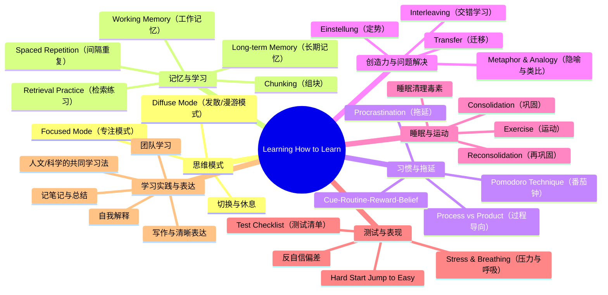

# learning-how-to-learn-powerful-mental-tools-to-help-you-master-tough-subjects

# 《Learning How to Learn》课程学习笔记

## 1. 🧠 课程思维导图 (Mind Map)

---

## 2. 📌 核心精要 (Executive Summary)

这门课的核心价值在于：它把“学习”从一种模糊的天赋活动，变成了一套可以训练、验证和优化的脑科学技能体系。课程强调大脑存在**专注模式（Focused Mode）**与**发散模式（Diffuse Mode）**两种互补状态，真正高效的学习不是持续硬扛，而是合理切换、重复巩固与休息整合。  
它还系统解释了**工作记忆、长期记忆、组块（Chunking）、检索练习、间隔重复、交错学习**等关键机制，说明为什么“看懂了”不等于“会了”。  
在方法层面，课程给出了可立即执行的策略：**番茄钟、主动回忆、用隐喻理解抽象概念、用测试代替被动复读、用睡眠和运动增强学习**。  
最后，它提醒我们：学习是一项长期工程，**拖延、焦虑、幻觉式自信、定势思维**都会损害学习质量，而真正的进步来自持续实践、反馈和反思。

---

## 3. 📖 详细知识模块 (Detailed Notes)

# 一、学习的大脑机制：专注模式与发散模式

## 1.1 两种思维模式：Focused Mode vs Diffuse Mode

### 定义（What）
- **专注模式（Focused Mode）**：当你把注意力集中在某个明确问题、任务或概念上时，大脑进入的紧密、精细、目标导向的思维状态。
- **发散模式（Diffuse Mode）**：当你放松、走神、散步、洗澡、睡觉、运动时，大脑进入的更宽松、更广域、跨联想的思维状态。

### 底层原理（Why）
- 两种模式对应不同的神经活动方式。
- **专注模式**擅长沿着熟悉路径思考，完成细节推理、计算、规则应用。
- **发散模式**擅长建立新连接、形成新视角、突破卡壳问题。
- 神经科学上，它们并不能被认为是同时高强度并存的状态，更像硬币两面，通常一次只在一面。

### 应用场景与示例（How）
- **专注模式适合：**
  - 解数学题、做精确推导、记忆规则、理解细节。
- **发散模式适合：**
  - 卡题时“放一放”、散步、洗澡、睡觉、运动后突然灵感涌现。
- 经典案例：
  - **Salvador Dalí** 用钥匙即将掉落时的瞬间把自己从浅睡/发散状态拉回，捕捉灵感。
  - **Thomas Edison** 用手里的球掉落声唤醒自己，从发散状态带回新想法。
- **核心结论：**学习不是一直“盯死”，而是**专注输入 + 发散整合**的循环。

---

## 1.2 为什么“努力思考”不等于“高效学习”

### 定义（What）
- 许多学习者以为只要一直盯着题目，就一定能想出来。

### 底层原理（Why）
- 如果问题超出当前熟悉路径，持续专注往往只会强化原有路径，而不容易跳到新路径。
- 发散模式可以把看似无关的信息重新组合，帮助你“从旁边绕进去”。

### 应用场景（How）
- 遇到难题：
  1. 先集中思考一段时间；
  2. 暂时离开；
  3. 做别的事；
  4. 回来再看。
- 这正是很多数学家、科学家、艺术家的真实工作方式。

---

# 二、学习的基本单位：记忆、组块与长期结构

## 2.1 工作记忆（Working Memory）与长期记忆（Long-term Memory）

### 定义（What）
- **工作记忆（Working Memory）**：你当前意识中“正在处理”的信息。
- **长期记忆（Long-term Memory）**：稳定保存知识、概念、技能与经验的记忆系统。

### 底层原理（Why）
- 工作记忆容量极小，课程中强调大约只有**4个组块（chunks）**左右。
- 长期记忆容量巨大，像仓库一样，但需要反复访问和巩固才能稳定提取。

### 应用场景与示例（How）
- 背电话号码时，靠工作记忆临时重复。
- 公式、概念、技能一旦进入长期记忆，就更容易被提取并用于问题解决。
- **关键判断：**
  - 你“能看懂”，不代表已经进入长期记忆；
  - 你“能自己做出来”，才说明真正建立了记忆连接。

---

## 2.2 什么是组块（Chunking）

### 定义（What）
- **组块（Chunk）**：通过意义和使用把多个信息单元打包成一个更大的、有意义的认知单元。

### 底层原理（Why）
- 大脑倾向于把经常一起出现、一起使用的内容连接成稳定的神经网络。
- 组块能显著节省工作记忆空间，让你用更少的认知资源处理更多信息。

### 应用场景与示例（How）
- 字母 **P-O-P** 变成一个词 **pop**，就是一个组块。
- 数学里，一个复杂解题步骤链条，熟练后会被压缩成一个“整体动作”。
- 音乐、运动、语言学习都依赖组块。
- **例子：**
  - 学钢琴时，从逐个音到完整乐句；
  - 学篮球时，从单个动作到整套战术；
  - 学语言时，从单词到语块、句型。

### 关键结论
- **Practice makes permanent（练习使之永久）**
- 组块不是“知道了”就算，而是要通过反复使用，把神经连接真正“焊牢”。

---

## 2.3 如何形成组块：三步法

### 1）专注输入
- 排除干扰，完整注意一个概念或技能。

### 2）理解基本思想
- 不是机械记住步骤，而是理解“为什么这样做”。
- 理解像“胶水”，把细节绑定在一起。

### 3）练习与获得语境
- 在不同题目、不同情境中使用它，理解它**什么时候用、什么时候不用**。

### 应用示例
- 学数学：
  - 先看例题；
  - 理解每一步的目的；
  - 关上书自己做一遍；
  - 再做变式题，建立语境。
- 学历史、化学、语言、编程也同样适用。

---

# 三、最重要的学习方法：主动回忆、检索练习、间隔重复

## 3.1 检索练习（Retrieval Practice）

### 定义（What）
- **检索练习（Retrieval Practice）**：不看答案，直接从脑中回忆知识。

### 底层原理（Why）
- 回忆本身会强化记忆痕迹。
- 这不是“测试完才知道会不会”，而是“测试的过程本身就是学习”。

### 应用场景与示例（How）
- 看完一页书后合上书，用自己的话说出核心内容。
- 做完题后，不看答案重做。
- 用闪卡（flashcards）自测。

### 关键结论
- 课程明确指出：**检索练习比反复阅读更有效**，而且能增强理解，不只是记忆。

---

## 3.2 间隔重复（Spaced Repetition）

### 定义（What）
- **间隔重复（Spaced Repetition）**：在不同时间点重复学习，而不是在同一晚疯狂重复。

### 底层原理（Why）
- 大脑需要时间让连接稳定下来。
- 如果把 20 次重复全塞进一个晚上，效果远不如分散在几天里。

### 应用场景与示例（How）
- 新词汇、公式、定义：今天学一次，明天复习，再过两天复习。
- 可使用 **Anki** 等间隔重复软件。
- 课程还提到可以结合 AI 工具（如 GPT、NotebookLM、CLOD）生成个性化闪卡，但关键不在工具本身，而在其是否遵循**间隔重复算法**。

### 关键结论
- **间隔重复的本质是：在你快忘时再拉你一把。**
- 这会产生一种心理学上的**理想困难（Desirable Difficulty）**：有点难，才真正记得牢。

---

## 3.3 记忆的“幻觉”与自我欺骗：Illusions of Competence

### 定义（What）
- **能力幻觉（Illusions of Competence）**：你以为自己学会了，其实只是“看起来熟悉”。

### 底层原理（Why）
- 反复看笔记、划重点、对着答案点头，会带来“熟悉感”，让你误以为自己掌握了。
- 但真正掌握必须能脱离材料独立提取与运用。

### 应用场景与示例（How）
- 不要只做：
  - 反复阅读
  - 过度划线
  - 看答案后觉得“我懂了”
- 要做：
  - 合上书回忆
  - 练习题自做
  - 小测验
  - 让别人听你讲一遍

### 关键结论
- **“我看过”不等于“我会了”。**
- **错题和失败是宝贵的，因为它们能戳破幻觉。**

---

# 四、拖延症：不是意志力问题，而是习惯系统问题

## 4.1 拖延（Procrastination）的本质

### 定义（What）
- **拖延（Procrastination）**：面对不舒服任务时，把注意力转移到更舒服的事上。

### 底层原理（Why）
- 大脑会对“不喜欢的任务”产生轻微痛感或不适感。
- 于是你会本能地寻找短期愉悦来缓解不适。
- 拖延会形成恶性循环：越拖越痛苦，越痛苦越拖。

### 应用场景与示例（How）
- 你准备做作业，却突然刷视频、查资料、回消息、清桌面。
- 其实短期内你“舒服了”，但长期会导致：
  - 基础不牢
  - 考试崩盘
  - 焦虑加重
  - 学习时间被压缩到最后一刻

---

## 4.2 番茄钟（Pomodoro Technique）

### 定义（What）
- **番茄钟（Pomodoro Technique）**：25 分钟专注工作 + 2~5 分钟回忆/休息的循环。

### 底层原理（Why）
- 25 分钟通常足够短，让启动不那么痛苦。
- 工作后的“回忆 + 安静休息”能帮助记忆巩固、让思维进入更有利的发散状态。

### 应用场景与示例（How）
1. 设定 25 分钟，不受干扰地专注。
2. 结束后用 2~5 分钟回忆刚学内容。
3. 再用 2~3 分钟安静休息，别刷手机。
4. 重复循环。

### 关键结论
- 番茄钟不是单纯计时器，而是一个**“专注—回忆—休息”三段式学习系统**。

---

## 4.3 过程导向（Process） vs 结果导向（Product）

### 定义（What）
- **Process（过程）**：你要执行的行动流程，例如“今天做 1 个番茄钟”。
- **Product（结果）**：你想完成的最终成果，例如“写完作业”“交完报告”。

### 底层原理（Why）
- 结果导向容易触发焦虑和逃避。
- 过程导向更适合利用习惯系统，让你“先动起来”。

### 应用场景与示例（How）
- 不要想着“我要把整篇论文写完”。
- 改成：
  - “我只写 25 分钟”
  - “我只完成第一段”
  - “我只整理这 3 道题”
- 这样大脑更容易启动。

---

## 4.4 拖延的四要素：Cue-Routine-Reward-Belief

### 1）Cue（线索/触发）
- 触发拖延的常见因素：
  - 时间
  - 地点
  - 情绪
  - 别人的消息/打扰

### 2）Routine（惯常反应）
- 一看到线索就自动切换到刷网、聊天、吃零食、发呆。

### 3）Reward（奖励）
- 拖延之所以上瘾，是因为它立刻给你舒适感。

### 4）Belief（信念）
- 你相信“我就是拖延的人”“我改不了”，拖延就更难改。

### 应用建议
- 改变线索：关手机、断网、换环境。
- 设计替代回报：完成后奖励自己小休息、小点心、小娱乐。
- 改信念：把拖延视为**可训练的习惯**，不是人格缺陷。

---

## 4.5 对抗拖延的实用策略

- **提前一晚写任务清单**
  - 让潜意识“预处理”第二天任务。
- **把大任务拆成小块**
  - “写论文”改成“写前两页”“找3篇文献”。
- **每天固定时间处理最难任务**
  - 例如早晨先做最讨厌的一件事（Eat your frogs first）。
- **设置结束时间**
  - 例如 5 点停止工作，防止疲劳耗尽。
- **建立奖励机制**
  - 完成后允许自己享受某种小奖励。

---

# 五、睡眠与运动：学习的隐藏加速器

## 5.1 睡眠为什么重要

### 定义（What）
- 睡眠不仅是休息，更是大脑清理、整理和巩固信息的阶段。

### 底层原理（Why）
- 醒着时，大脑会产生代谢废物和“毒素”。
- 睡眠时脑细胞会缩小，细胞间隙变大，帮助液体流动并清除废物。
- 睡眠还会：
  - 巩固记忆
  - 强化重要内容
  - 弱化不重要内容
  - 帮助解决难题

### 应用场景与示例（How）
- 考试前睡眠不足，会像“脑子里有毒”。
- 临睡前复习更容易梦到相关内容。
- 小睡（nap）也可能帮助整合学习材料。

### 重要引述
- Shakespeare 的《麦克白》里把睡眠比作“缝合散乱思绪的针线”，非常贴切。

---

## 5.2 运动（Exercise）对学习的作用

### 定义（What）
- 运动不是学习的对立面，而是学习能力的重要增强器。

### 底层原理（Why）
- 运动能帮助新神经元存活。
- 运动还能改善注意力、情绪和长期记忆。

### 应用场景与示例（How）
- 散步、跑步、骑车、做操都可以成为“发散模式工作时间”。
- 课程和访谈中多位专家都强调：**运动让大脑更有机会在后台处理问题**。
- 课程批评学校削减体育和课间休息的做法，因为那恰恰是大脑需要的。

---

# 六、创造力与问题解决：隐喻、类比、定势、迁移、交错学习

## 6.1 隐喻（Metaphor）与类比（Analogy）

### 定义（What）
- **隐喻（Metaphor）**：用一个熟悉事物来理解另一个抽象事物。
- **类比（Analogy）**：指出两个系统在结构或功能上的相似之处。

### 底层原理（Why）
- 抽象概念很难直接抓住，隐喻会把它们“挂”到已有神经结构上。
- 这能增强理解、记忆和迁移。

### 应用场景与示例（How）
- 电流像水流，电压像压力。
- 原子像：
  - 学校
  - 水果
  - 太阳系
  - 云团
- 写作中常见的具体化技巧：
  - 用物体代替抽象概念
  - 用故事代替定义
- 课程还提到可借助 **Generative AI（生成式人工智能）** 创造多种不同隐喻，帮助理解复杂内容。

### 关键结论
- 隐喻不是装饰，而是**理解工具**。
- 但所有隐喻都有局限，不能把模型当现实本身。

---

## 6.2 定势（Einstellung）

### 定义（What）
- **Einstellung**：已经形成的思维模式，反而阻碍你找到更好的解法。

### 底层原理（Why）
- 你越习惯某种解题路径，就越容易被它“锁死”。
- 这在数学、科学、体育里尤其常见。

### 应用场景与示例（How）
- 一个问题明明可以换方法，但你总沿着原来的老路硬撞。
- 解决方式：
  - 暂停
  - 切换视角
  - 向前看大图
  - 交错练习
  - 听别人解释

---

## 6.3 迁移（Transfer）与交错学习（Interleaving）

### 定义（What）
- **Transfer（迁移）**：一个领域学到的知识迁移到另一个领域。
- **Interleaving（交错学习）**：在不同类型的问题、方法或学科间切换练习。

### 底层原理（Why）
- 单一重复能形成稳定组块，但不一定有弹性。
- 交错学习会迫使大脑决定“何时用什么方法”，从而真正提升灵活性。

### 应用场景与示例（How）
- 数学里交替做不同题型。
- 复习时不要连续刷同一类题，而是混合题型。
- 跨学科学习：物理中的思考方式可迁移到商业、编程、语言等。

### 关键结论
- **组块让你会做，交错学习让你知道何时用。**
- **迁移与交错**是从“熟练”走向“专家”的关键。

---

# 七、记忆系统：如何把知识变得更稳、更快、更可用

## 7.1 视觉与空间记忆

### 定义（What）
- 大脑对“位置、空间、画面、场景”的记忆能力极强。

### 底层原理（Why）
- 视觉-空间系统在进化中非常重要：找路、找食物、识别环境。
- 因此它特别适合被用来帮助记忆抽象信息。

### 应用场景与示例（How）
- 把公式变成图像：
  - 例如 **F = ma** 想象成“飞行的骡子（flying mule）”。
- 越荒诞、越生动、越有感官细节，越容易记住。
- 可以加上：
  - 视觉
  - 声音
  - 气味
  - 触感

---

## 7.2 记忆宫殿（Memory Palace）

### 定义（What）
- **记忆宫殿（Memory Palace）**：把熟悉地点当作记忆的“空间存储框架”。

### 底层原理（Why）
- 空间位置是大脑非常擅长保存的结构。
- 将信息放在熟悉地点的不同位置，能显著提高提取效率。

### 应用场景与示例（How）
- 用家里、上学路线、常去餐馆作为“宫殿”。
- 把要记的内容“放”进各个位置：
  - 门口放牛奶
  - 沙发上放面包
  - 桌角放鸡蛋
- 课程提到：某些研究显示，经过一两次练习，能记住 **40–50 个项目中的 95% 以上**。

---

## 7.3 记忆的三个辅助原则

### 1）意义分组
- 把无关内容编成有意义的缩写、词组、故事。
- 例：
  - 记忆植物首字母组合
  - 医学里常用的首字母口诀

### 2）多模态编码
- 说出来、写下来、画出来、读出来、看图像。
- 多通道输入更牢。

### 3）分散重复
- 记忆不要一口气堆满，要多天多次回看。

---

## 7.4 长期记忆不是静态仓库，而是活的系统

### 定义（What）
- 记忆不是固定存档，而是会被再激活、再巩固、再修改。

### 底层原理（Why）
- **Consolidation（巩固）**：把新信息从短时状态转入长期状态。
- **Reconsolidation（再巩固）**：回忆旧记忆时，记忆会变得可修改。

### 应用场景与示例（How）
- 课程提到著名失忆患者 **H.M.**：
  - 海马体（Hippocampus）双侧切除后，无法形成新记忆。
  - 说明海马体对事实和事件记忆至关重要。
- 这也解释了为什么：
  - 刚学的东西需要反复回顾；
  - 只靠一次性“背住”很不稳定。

---

# 八、测试、焦虑与表现：不是考场临时发挥，而是整个学习系统的结果

## 8.1 测试本身就是学习

### 定义（What）
- 测试不是学习结束后的附属品，而是学习的一部分。

### 底层原理（Why）
- 测试迫使你提取信息，强化记忆和理解。
- 一小时测试的学习价值，往往高于一小时被动阅读。

### 应用场景与示例（How）
- 用小测验代替“自我感觉良好”。
- 用测试清单检查准备是否充分。

---

## 8.2 测试清单（Richard Felder Checklist）

### 核心问题
- 是否认真理解了教材？
- 是否与同学讨论、核对答案？
- 是否在不看答案时自己设法做题？
- 是否主动问老师/助教？
- 是否理解所有作业解答？
- 是否复习过 study guide 并能独立完成其中内容？
- 是否睡眠充足？

### 核心结论
- 如果你前面所有都做了，但**没睡好**，仍可能前功尽弃。

---

## 8.3 考试策略：Hard Start, Jump to Easy

### 定义（What）
- 先碰最难题，再快速转去容易题。

### 底层原理（Why）
- 难题启动后交给发散模式后台处理；
- 简单题让你维持信心和进度；
- 回来再做难题时，答案常更清晰。

### 应用场景与示例（How）
1. 快速浏览试卷。
2. 先做最难但先试 1–2 分钟。
3. 一卡住就切走。
4. 去做容易题。
5. 再回到难题。

### 关键结论
- 这能减少 **Einstellung**，也能避免整场考试被一个题拖死。

---

## 8.4 压力管理：呼吸与认知重评

### 定义（What）
- 考试焦虑时，身体会释放压力激素（如 cortisol）。

### 底层原理（Why）
- 同样的生理症状，可以被解释成“恐惧”，也可以解释成“兴奋和准备就绪”。

### 应用场景与示例（How）
- 把“我完了”改成“我被激活了，可以发挥”。
- 使用腹式呼吸：
  - 手放腹部
  - 缓慢深呼吸
  - 让腹部鼓起而不是只抬胸

### 重要提示
- 呼吸训练要在考试前提前练，不要临场才开始。

---

# 九、写作与人文学习：清晰、对象化、先写后改

## 9.1 写作中的 Focused vs Diffuse

### 定义（What）
- **写作时的发散模式**：负责生成内容、联想、表达。
- **写作时的专注模式**：负责编辑、挑错、修辞和结构。

### 底层原理（Why）
- 如果你在写作时就开启“编辑脑”，会压制生成。
- 先产出，后修订，效率更高。

### 应用场景与示例（How）
- 关闭屏幕、盖上毛巾，防止边写边改。
- 使用 **writeordie.com** 一类工具逼自己不断输出。
- 先写出“丑稿”，再统一修改。

---

## 9.2 好写作的关键：具体、对象化、少抽象

### 定义（What）
- 写作不只是在写观点，更是在选择**对象（objects）**来承载观点。

### 底层原理（Why）
- 抽象词太多会让内容模糊，读者和作者都会迷失。
- 具体事物能让思想落地。

### 应用场景与示例（How）
- 把“营养”写成苹果、橙子、面包、汉堡。
- 在科学写作中，把分子、实验器材、试管、烧瓶写出来。
- 使用**主动动词**、**短句**、**人名**，让文字更可见、更有动作感。

### 重要原则
- **清晰优先于炫耀。**
- “先清楚，再令人印象深刻。”

---

## 9.3 人文学习的特点：接受歧义，重视观点碰撞

### 定义（What）
- 人文学科并不总是追求唯一标准答案，更多是对问题、争议、解释的理解。

### 底层原理（Why）
- 历史、文学、哲学、宗教研究中，很多问题本来就没有终局答案。
- 关键是识别争论点、比较证据、理解立场。

### 应用场景与示例（How）
- 阅读时先“注意到”而不是立刻下结论。
- 做摘要，梳理别人的观点，再从中找到自己的理解。
- 关注原典中的“修辞闪点”与“冲突点”。

---

# 十、团队学习、独立思考与学习者心态

## 10.1 学习不是孤岛：团队与同伴的重要性

### 定义（What）
- 学习群体可以成为你脑外的“第二发散系统”。

### 底层原理（Why）
- 别人能发现你看不到的漏洞。
- 解释给别人听，本身会加深理解。

### 应用场景与示例（How）
- 和同学做题、互相提问、轮流讲解。
- 但要防止小组变社交局：聊天太多、进度太慢、没人预习，组会就失效。

---

## 10.2 自信、羞耻感与“冒名顶替综合征”（Imposter Syndrome）

### 定义（What）
- **冒名顶替综合征（Imposter Syndrome）**：你明明有能力，却总觉得自己只是“碰巧混进来”。

### 底层原理（Why）
- 很多人在面对高水平环境时都会产生这种内心剧本。
- 这种感觉很常见，知道它“普遍存在”本身就能减弱它。

### 应用场景与示例（How）
- 给这种想法命名：“哦，这是冒名顶替综合征。”
- 然后回到事实：既然你已经走到这里，说明你有能力继续。

---

## 10.3 个人成长：变化可以训练出来

### 定义（What）
- 你不是天生只能成为某一种人，兴趣、能力、习惯、身份都可以演化。

### 底层原理（Why）
- Cajal、Darwin 等人的经历都说明：
  - 早年的不优秀，不代表终身不优秀；
  - 成长常来自长期实践、自我修正与坚持。

### 应用场景与示例（How）
- 不要把失败解释成“我不行”。
- 改成：
  - “我这套方法不行”
  - “我需要换策略”
  - “我需要多练几次”

---

## 4. 🛠️ 实践与应用 (Actionable Points)

1. **立即建立“25 分钟学习 + 3 分钟回忆 + 2 分钟休息”的番茄钟流程。**  
   这比单纯“坐着学很久”更符合大脑工作方式。

2. **把今天要学的一页内容做一次“合上书复述”。**  
   如果不能复述出来，就说明还没真正掌握。

3. **每次学习前先写一个小任务，而不是大目标。**  
   例如把“复习英语”改成“做 10 张闪卡”“讲解 1 个概念”“完成 2 道题”。

---

## 5. 🤔 深度思考与费曼测试 (Reflection)

1. **为什么“看懂了解答”不等于“会做题”？**  
   请用“工作记忆、检索练习、组块”三个概念解释。

2. **请举一个你最近卡住的问题，分别用“专注模式”和“发散模式”描述你该如何处理它。**  
   你会如何安排暂停、散步、睡眠或切换任务？

3. **如果你要把“拖延症”看成一个习惯系统，而不是性格缺陷，你会如何重新设计它的 Cue-Routine-Reward-Belief？**  
   请写出你自己的替代方案。

---

如果你愿意，我还可以继续把这份笔记整理成：
1. **考试速记版**  
2. **Anki 闪卡版**  
3. **一页纸复习提纲版**
