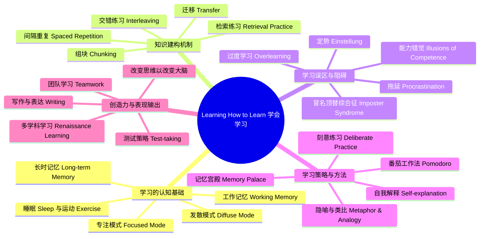

# learning-how-to-learn-powerful-mental-tools-to-help-you-master-tough-subjects

# 1. 🧠 课程思维导图 (Mind Map)

---

# 2. 📌 核心精要 (Executive Summary)

1. **学习不是单纯“更努力”，而是要遵循大脑工作的规律**：在**专注模式（Focused Mode）**与**发散模式（Diffuse Mode）**之间切换，通过**组块（Chunking）**、**检索练习（Retrieval Practice）**、**间隔重复（Spaced Repetition）**来构建真正可调用的知识网络。  
2. **高效学习的关键敌人不是“不会”，而是“错以为自己会”**：反复重读、过度划线、临时抱佛脚会制造**能力错觉（Illusions of Competence）**；真正有效的是闭卷回忆、做题、自我解释、交错练习与及时纠错。  
3. **拖延不是性格缺陷，而是习惯回路问题**：识别线索（Cue）、改写惯例（Routine）、设置奖励（Reward）、建立信念（Belief），配合**番茄工作法（Pomodoro）**与任务清单，可以几乎不靠意志力地减少拖延。  
4. **睡眠、运动、情绪与环境不是附属品，而是学习系统的一部分**：睡眠帮助清除代谢毒素、巩固记忆，运动促进海马体新生神经元存活，情绪与神经调质如**多巴胺（Dopamine）**直接影响动机与学习质量。  
5. **创造力并非天赋专利**：它建立在大量扎实组块之上，再通过发散思维、隐喻、跨领域迁移、团队碰撞与测试中的策略切换，形成真正灵活、可迁移、可输出的能力。

---

# 3. 📖 详细知识模块 (Detailed Notes)

## 模块一：学习的底层认知机制——大脑如何处理新知识

## 1.1 **专注模式（Focused Mode）与发散模式（Diffuse Mode）**

### What：是什么
课程提出人类存在两种基本思维模式：

- **专注模式（Focused Mode）**
  - 当你集中注意力处理熟悉或局部明确的问题时启动
  - 更适合精确推理、公式运算、逐步分析

- **发散模式（Diffuse Mode）**
  - 当你放松、散步、洗澡、发呆、将睡未睡时更容易出现
  - 更适合从全局看问题、建立新连接、产生洞见

### Why：为什么重要
- 新知识往往不在旧神经路径上，单靠专注模式容易在熟悉路径上“打转”
- 发散模式能让大脑跨越已有思维障碍，连接远距离神经通路
- **两种模式不能同时主导意识**，更像硬币两面，只能交替使用

### How：如何应用
- 学难题时先进入专注模式：
  - 阅读定义
  - 看例题
  - 尝试推导
- 卡住后主动切换到发散模式：
  - 散步
  - 洗澡
  - 小睡
  - 做低负荷家务
- 再返回专注模式验证思路

### 经典案例
- **萨尔瓦多·达利（Salvador Dalí）**
  - 坐在椅子上手拿钥匙，半入睡时钥匙落地惊醒自己
  - 用这种方式捕捉发散模式中的灵感
- **托马斯·爱迪生（Thomas Edison）**
  - 手握钢珠入睡，钢珠落地惊醒后记录灵感
- 核心启示：**创造力不是“纯放松”，而是“先专注种下问题，再让发散模式加工”**

---

## 1.2 学习为什么需要时间：神经结构不是立刻长成的

### What
学习本质上是神经连接的建立、加深和重组。

### Why
- 课程用“举重练肌肉”类比学习：
  - 肌肉不是一天练成
  - 神经结构也不是一晚突击能形成
- **Practice makes permanent**：练习不会自动造就完美，但会固化你反复使用的路径

### How
- 每天少量、持续投入，而不是考试前堆积
- 学完后留出“神经砂浆凝固”的时间：
  - 休息
  - 睡眠
  - 隔天复习

### 关键结论
- **临时抱佛脚（Cramming）**会造成知识“堆成一团”，缺少稳定结构
- **分散学习（Distributed Practice）**才会形成可调用的神经脚手架

---

## 1.3 工作记忆（Working Memory）与长时记忆（Long-term Memory）

### What
- **工作记忆（Working Memory）**
  - 当前正在有意识处理的信息
  - 类似“黑板”
  - 主要与**前额叶皮层（Prefrontal Cortex）**有关
- **长时记忆（Long-term Memory）**
  - 类似“仓库”
  - 储存概念、技能、经验、事实

### Why
- 研究过去认为工作记忆可容纳 **7** 个项目
- 现在更普遍认为大约只有 **4 个组块（chunks）**
- 学习困难常不是“你笨”，而是**工作记忆容量太小，装不下过多未组块化信息**

### How
- 把零散细节压缩成组块，减少工作记忆负担
- 将关键知识通过重复与回忆送入长时记忆
- 在解题时调用长时记忆中的组块，让工作记忆腾出空间做推理

### 类比
- 工作记忆像“不太好用的黑板”
- 长时记忆像“超大仓库”，但仓库东西多也会互相埋没，若不反复取用就很难找回

---

## 模块二：知识如何真正进入大脑——组块、理解与迁移

## 2.1 **组块（Chunking）**：掌握复杂知识的核心机制

### What
**组块（Chunk）**是通过**意义（meaning）**或**用途（use）**绑定在一起的信息包。

例如：
- P-O-P 三个字母 → 一个组块 “pop”
- 一个公式推导过程 → 一个可调用的解题模块
- 一段吉他旋律 → 一个动作与听觉结合的组块

### Why
- 组块能把大量细节压缩成一个可调用单元
- 一旦形成组块，你不再需要每次从头想全部步骤
- 专家之所以快，不是因为“天生快”，而是因为有大量已压缩好的组块库

### How：形成组块的三步
#### 第一步：**专注注意力（Focused Attention）**
- 关闭手机
- 不分心
- 给组块形成足够“神经带宽”

#### 第二步：**理解基本思想（Understand the Basic Idea）**
- 不是只看步骤
- 要知道：
  - 为什么这一步成立
  - 为什么下一步要这样走

#### 第三步：**获得情境（Context）**
- 知道：
  - **怎么用**
  - **什么时候用**
  - **什么时候不能用**

### 例子
- **音乐**：先会小节，再连成乐句，再连成整首曲子
- **体育**：先掌握局部动作，再整合成比赛反应
- **数学/科学**：先看 worked-out example（完整示例解），但不能只看步骤，还要理解步骤之间的连接逻辑

### 核心警示
- **理解 ≠ 已经掌握**
- 真正的掌握必须是：**合上书，自己能做出来**

---

## 2.2 组块库（Library of Chunks）与创造力

### What
随着学习深入，大脑积累越来越多组块，形成“心理工具库”。

### Why
- 创造力并非无中生有，而是**已有组块的新组合**
- 棋手、音乐家、科学家之所以有直觉，是因为其大脑中已储存大量高质量模式

### How
- 多练基本类型题
- 在不同情境下调用同一方法
- 将不同学科的组块互相连接

### 案例
- **比尔·盖茨（Bill Gates）**等行业领袖会安排持续一周的阅读期，让大量新鲜观点同时留在脑中，促进新连接
- 棋手、医生、飞行员都依赖大量组块而非逐字逐步计算

### 迁移（Transfer）
- **迁移（Transfer）**：一个领域学会的组块有助于另一个领域
- 课程示例：
  - 物理中的问题解决方式可迁移到商业
  - 语言学习经验可迁移到编程学习

---

## 2.3 **交错练习（Interleaving）**与**定势（Einstellung）**

### What
- **交错练习（Interleaving）**：把不同类型的问题、概念、方法混合练习
- **定势（Einstellung）**：旧有熟练思路反而阻碍你看到更好的解法

### Why
- 单一类型连续练习容易形成“我会了”的错觉
- 真正考试或现实问题的关键不只是“会做”，而是“识别该用哪种方法”
- 过度依赖熟悉套路会形成思维车辙

### How
- 不要整晚只刷一种题型
- 复习时跨章节穿插
- 做题时主动问自己：
  - 为什么是这个方法？
  - 为什么不是另一个方法？

### 延伸洞见
- **托马斯·库恩（Thomas Kuhn）**指出：科学中的范式革命常由年轻人或跨学科者推动
- 原因：他们较少被旧训练形成的**定势（Einstellung）**所束缚

---

## 模块三：高效学习法——真正有效的方法与常见误区

## 3.1 **检索练习（Retrieval Practice）**优于重读

### What
**检索练习（Retrieval Practice）**是指：不看材料，尝试从脑中主动回忆内容。

### Why
- 大量研究显示，检索比重读更能增强记忆与理解
- 心理学家 **Jeffrey Karpicke** 的研究表明：
  - 学生阅读科学文本后，通过回忆再复习，学习更深、更牢
  - 效果优于单纯重复阅读，甚至优于仅画概念图

### How
- 看完一页后，立刻合上书回忆要点
- 学完一个概念后，用自己的话复述
- 刷题前先不看答案，自行尝试
- 用抽认卡（Flashcards）做闭卷提取

### 关键结论
- **回忆本身就是学习**
- 检索过程会在神经系统中建立“钩子”，帮助后续调用

---

## 3.2 **能力错觉（Illusions of Competence）**

### What
你以为自己学会了，其实只是“看着熟”。

### 常见表现
- 一遍遍重读课本
- 大量画线、高亮
- 看答案时觉得“我懂了”
- 只看例题不自己做
- 一直练简单题

### Why
- 材料放在眼前，会制造“知识好像已经在脑中”的错觉
- 高亮动作本身让人误以为在加工知识

### How：如何识别并修正
- 合上书，立即回忆
- 不看答案先做
- 自己解释步骤
- 换环境回忆，摆脱情境依赖
- 让朋友提问你

### 关键建议
- 高亮若使用，应**每段不超过一句**
- 比高亮更有效的是：
  - 页边写总结
  - 口头复述
  - 迷你测验（Mini-testing）

---

## 3.3 **过度学习（Overlearning）**与**刻意练习（Deliberate Practice）**

### What
- **过度学习（Overlearning）**：在已经掌握的内容上继续在同一时段过量重复
- **刻意练习（Deliberate Practice）**：针对自己最薄弱的环节进行有目标练习

### Why
- 过度学习有时有用：
  - 演讲
  - 网球发球
  - 钢琴演奏
  - 容易紧张的人在高压场景中需要自动化
- 但在同一学习时段里反复敲打已会内容，收益会快速下降

### 例子
- 一个典型 **20 分钟 TED 演讲**，专家演讲者可能会准备 **约 70 小时**
  - 其中约 **40 小时** 用于正式准备
- 说明自动化在高压输出中很重要，但不能代替系统学习

### How
- 掌握基本方法后，转向更难的部分
- 不要只练“会的”
- 每次学习刻意留一部分时间给最不舒服的内容

---

## 模块四：拖延（Procrastination）——不是懒，而是可改写的习惯回路

## 4.1 拖延的本质：情绪逃避，而非时间管理失败

### What
拖延通常不是因为任务本身太难，而是因为想到任务就产生轻微不适，于是大脑转去做更舒服的事。

### Why
- 神经研究显示，当人看到不想做的任务时，**痛苦相关脑区**会被激活
- 一旦把注意力转向更愉快的事情，不适会迅速下降
- 于是拖延被大脑学成一种“有效止痛”的习惯

### How
拖延回路四要素：
1. **线索（Cue）**
2. **惯例（Routine）**
3. **奖励（Reward）**
4. **信念（Belief）**

### 常见线索类别
- 地点（Location）
- 时间（Time）
- 当下情绪（How you feel）
- 他人/事件反应（Reactions）

---

## 4.2 用最省意志力的方法改掉拖延

### What
课程强调：**不要靠意志力硬扛，而要改写习惯系统**

### Why
- 意志力消耗神经资源
- 真正高效的方法是改触发链条，不是靠自责

### How：实操策略
#### 1）改写惯例（Routine）
- 想刷手机时，改成先做一个番茄钟
- 一进图书馆先拿出清单，不先打开社交媒体
- 上课前把手机留车里/包底

#### 2）设置奖励（Reward）
- 一个番茄钟后喝咖啡
- 完成当天目标后看剧
- 给自己小型庆祝

#### 3）建立信念（Belief）
- 相信自己可以改变
- 和执行力强、重视学习的人待在一起

### 关键提醒
- **不是彻底改造整个人格，只是覆盖旧反应**
- 一次只改一个切入点最有效

---

## 4.3 **番茄工作法（Pomodoro）**的科学使用

### What
**番茄工作法（Pomodoro Technique）**由 **Francesco Cirillo** 于 **20世纪80年代早期**提出。

标准结构：
- **25分钟专注**
- 结束后 **2–5分钟检索回忆**
- 再 **2–3分钟安静休息（Restful Wakefulness）**

### Why
- 25分钟足够短，降低启动阻力
- 检索回忆强化记忆痕迹
- 安静休息让大脑回放刚学过的模式，促进巩固
- 注意：这段安静休息**不要碰手机**

### How
- 设定计时器 25 分钟
- 关闭干扰
- 结束后回忆刚学的关键点
- 安静坐着、倒杯茶、简单走动即可

### 核心结论
- **Focus → Retrieve → Rest**
- 这不是单纯计时工具，而是一个完整的学习巩固循环

---

## 4.4 过程导向（Process）而非结果导向（Product）

### What
- **结果导向（Product）**：我要完成整篇论文/整套题
- **过程导向（Process）**：我现在只做25分钟

### Why
- 结果会引发焦虑与逃避
- 过程更容易让“习惯脑”接受

### How
- 不想“写完作业”，只想“做一个番茄钟”
- 不想“攻克整章”，只想“先解一道题”
- 用流程取代结果压力

---

## 4.5 计划系统：周计划、前夜日计划、停工时间

### What
课程建议使用**计划手账（Planner Journal）**

### Why
- 把任务写下来，能释放工作记忆空间
- 前一晚写计划，潜意识会在睡眠中参与加工
- 规划“结束工作时间”能避免无限拉长的低效学习

### How
- 每周写关键任务
- 每晚列次日任务
- 数量适中，切成小块
- 设定**停止工作时间**，如 **下午5点**
- 先做最重要且最不喜欢的事：**Eat your frogs first**

### 相关人物
- **Cal Newport** 在学生时代经常坚持 **下午5点停止工作**，后来取得 MIT 博士学位  
- 启示：**高质量专注 + 高质量休息**优于无止境低效苦熬

---

## 模块五：记忆系统——怎样把知识记牢、记活、记得出来

## 5.1 睡眠（Sleep）是记忆巩固的核心环节

### What
睡眠不仅休息身体，还负责：
- 清除脑内代谢毒素
- 巩固记忆
- 强化重要连接
- 弱化无关细节

### Why
- 醒着时大脑会积累毒性代谢物
- 睡眠时脑细胞缩小，细胞间隙增大，液体更容易流动冲洗毒素
- 睡眠还能促进记忆回放与重组

### How
- 考前不要熬夜
- 睡前快速回顾重点材料
- 午睡前看一遍难点，有助于梦中加工

### 引用
莎士比亚《麦克白》中关于睡眠的描述：
> **“Sleep that knits up the raveled sleeve of care...”**  
课程用此比喻说明：睡眠会把白天零散经验重新编织起来。

### 关键提醒
- 缺觉参加考试，就像“油箱进了糖的汽车”
- 长期睡眠不足与**头痛、抑郁、心脏病、糖尿病、早亡风险增加**有关

---

## 5.2 海马体（Hippocampus）、巩固（Consolidation）与再巩固（Reconsolidation）

### What
- **海马体（Hippocampus）**是新事实与事件记忆形成的重要枢纽
- **巩固（Consolidation）**：新记忆逐渐稳定进入皮层
- **再巩固（Reconsolidation）**：回忆旧记忆时，记忆会在新情境中被重新改写

### Why
- 著名病例 **H.M.**
  - 27岁因癫痫手术切除双侧海马体
  - 癫痫好转，但无法形成新的陈述性记忆
  - 说明海马体对新记忆形成至关重要
- 记忆不是静态档案，而是动态、会更新的系统

### How
- 多次间隔复习比一次猛灌更符合巩固规律
- 复习不是复制，而是“在新情境中重建”

---

## 5.3 间隔重复（Spaced Repetition）与抽认卡（Flashcards）

### What
**间隔重复（Spaced Repetition）**：在快忘记前再次提取，逐步拉长复习间隔。

### Why
- 同样重复 **20次**
  - 一晚做完，记得差
  - 分散到几天，记得更牢
- 这会制造心理学所谓的**理想难度（Desirable Difficulty）**

### How
- 使用抽认卡
- 先看问题面，自己回忆
- 想不起来再翻面
- 随掌握程度拉长间隔
- 最好使用带算法的工具

### 工具与数据
- 推荐过的工具/平台：
  - **Anki**
  - **Quizlet**
  - **GPT**
  - **NotebookLM**
  - **Claude / CLOD**（字幕如此呈现）
  - **smarterhumans.ai**
- 课程强调：**关键不是平台，而是是否具备间隔重复算法**

### AI应用原则
- 用AI生成个性化卡片
- 最好能回链到原始上下文（视频/笔记/教材位置）
- 这样不仅记孤立事实，也记概念网络

---

## 5.4 视觉记忆、联想记忆与记忆宫殿（Memory Palace）

### What
人类拥有强大的**视觉-空间记忆系统（Visual-Spatial Memory）**。

### Why
- 进化上，人类更需要记住：
  - 路线
  - 食物位置
  - 地形布局
而不是抽象数字与名字

### How
#### 1）创造鲜明图像
例如记住 **F = ma**
- F → flying
- m → mule
- a → 自定义形象  
把公式变成“会飞的骡子”之类荒诞图景

#### 2）多感官编码
- 看见
- 听见
- 闻到
- 感到

#### 3）记忆宫殿（Memory Palace）
- 找一个熟悉场景：
  - 家
  - 上学路线
  - 常去餐厅
- 把要记的东西放在固定位置上

### 示例
要记“驱赶吸血鬼的四种植物”：
- garlic
- rose
- hawthorn
- mustard  
首字母组成 **GRHM**，可联想成 **Graham cracker**

### 研究与案例
- 记忆宫殿使用者对 **40–50项** 列表，在只进行 **1–2次** 心理漫步后，能记住 **95%以上**
- 美国记忆冠军 **Nelson Dellis**
  - 乱序扑克牌记忆纪录：**40.65秒**
  - 五分钟记忆数字：**339位**
  - 15分钟记名字：**201个**
- 其核心观点：记忆不是天赋，而是系统训练

---

## 模块六：动机、情绪与生理——为什么有时你学不动

## 6.1 神经调质（Neuromodulators）如何影响学习

### What
课程重点提到三种神经调质：

- **乙酰胆碱（Acetylcholine）**
- **多巴胺（Dopamine）**
- **血清素（Serotonin）**

### Why
#### 乙酰胆碱（Acetylcholine）
- 促进专注与突触可塑性
- 对“认真学进去”很重要

#### 多巴胺（Dopamine）
- 与奖赏预测、动机、期待相关
- 不仅为了即时奖励，也为未来收益行动
- 上瘾性药物会劫持该系统

#### 血清素（Serotonin）
- 与社会地位、风险偏好、情绪有关

### How
- 给学习设置可预期奖励，利用多巴胺系统
- 不要把动机只建立在即时快乐上
- 理解“我现在不想学”往往是神经系统在追求近端奖赏

---

## 6.2 杏仁核（Amygdala）与情绪学习

### What
**杏仁核（Amygdala）**参与情绪、注意、记忆、决策整合。

### Why
- 过度焦虑会损害学习
- 适度兴奋则能增强表现

### How
- 测试前重新解释身体反应：
  - 不要说“我害怕”
  - 改说“我兴奋，我准备好了”
- 用腹式呼吸压制战斗/逃跑反应

---

## 6.3 运动（Exercise）不只是健康，而是学习增强器

### What
运动可促进学习与记忆。

### Why
- 成人海马体中仍有新神经元生成
- 运动能增加这些新神经元的存活率
- **Rusty Gage** 等研究表明：
  - 丰富环境与运动都能增强海马体连接与学习能力

### How
- 定期跑步、快走、运动
- 学习中穿插身体活动
- 学校不应削减体育和课间

### 关键观点
**“Exercise is by far more effective than any drug on the market today to help you learn better.”**

---

## 模块七：创造力、类比与生成式AI（Generative AI）

## 7.1 隐喻（Metaphor）与类比（Analogy）是理解工具，不只是修辞

### What
隐喻/类比是把陌生概念连接到熟悉概念上。

### Why
- 大脑善于从已有结构出发理解新内容
- 隐喻可帮助建立“神经挂钩”
- 还能打破**定势（Einstellung）**

### How
- 学每个抽象概念时问：
  - 它像什么？
  - 我能把自己放进这个概念里吗？
- 用具象图景替代理论术语

### 例子
- 电流像水流
- 电压像压力/高度差
- 原子像：
  - 学校
  - 桃子/芒果
  - 太阳系
  - 云团
  - 城市  
每个比喻都有适配点，也有失配点

### 课程观点
- **所有模型都只是某种程度上的隐喻**
- 隐喻不要求完全准确，而要先帮助理解骨架

---

## 7.2 生成式AI（Generative AI）如何辅助理解

### What
课程指出，**生成式AI（Generative AI）**如 ChatGPT 可帮助快速生成多种隐喻。

### Why
- 同一概念可以有多个不同但各自有用的隐喻
- 多隐喻有助于从不同角度理解

### How
- 向AI提问：
  - “请给我一个解释 X 的生活化比喻”
  - “再换一个与我爱好相关的比喻”
- 比较不同隐喻适合解释的部分与局限

### 案例
- Python 中 **main guard** 与 **scope**
  - ChatGPT 生成“城堡守门人”和“城堡房间”的类比

### 应用原则
- AI适合**启发理解**
- 最终仍需用专注模式检验准确性

---

## 模块八：学习中的表达、写作与费曼式输出

## 8.1 自我解释（Self-explanation）与教别人

### What
**自我解释（Self-explanation）**：像在教别人一样，把概念用自己的话写/讲出来。

### Why
- 一旦讲不下去、变含糊，就暴露出理解漏洞
- 这是发现盲点最直接的方法

### How
- 拿白纸写：
  - 这个概念是什么？
  - 为什么这样做？
  - 第三步为什么成立？
- 遇到卡壳再回资料查缺补漏

### 相关人物
- **Richard Feynman**：强调不要自欺，自己最容易被自己骗
- **Scott Young**：把空白纸当作讲义，自我讲解以识别理解断点

---

## 8.2 写作：先生成，再编辑

### What
写作时应区分：
- 生成阶段：偏发散
- 编辑阶段：偏专注

### Why
- 一边写一边编辑，会扼杀创意流
- 写作中的“编辑脑”常制造自我否定

### How
- 先把内容“吐”到纸上
- 再单独编辑
- 可用以下技巧：
  - 关屏打字
  - 屏幕盖毛巾
  - 使用 **Write or Die**
  - 用思维导图（Mind Mapping）生成结构

### 思维导图写作法
- 纸张横放
- 主题写中心
- 四周自由扩展相关想法
- 不急于列提纲

### 典型观点
- **Daphne Gray-Grant**：
  - 写作时要让“发散脑”开车
  - 编辑脑应该先坐后排

---

## 模块九：团队学习、环境与社会支持

## 9.1 团队学习（Teamwork）的价值

### What
学习不是纯个人活动，团队能帮助纠偏、补盲区、激发输出。

### Why
- 单人学习容易陷入自信偏差
- 他人能帮你发现“不合理但你看不出”的错误
- 向别人解释本身会深化理解

### How
- 找认真、目标一致的学习伙伴
- 用小组互问互讲
- 先个人尝试，再讨论
- 避免学习小组沦为社交局

### 访谈提炼
#### Norman Fortenberry
- 在 MIT 学习最重要的经验：
  - **高中过去那种“单打独斗”模式，在大学尤其工程领域是致命的**
  - “Engineering is a team sport.”

#### Richard Felder & Rebecca Brent
- 备考最有效方法之一：
  - 与同学一起解题
  - 互相提问
  - 确保至少有一位比你更强的人

---

## 9.2 丰富环境（Enriched Environment）与创造氛围

### What
环境会显著影响学习与创造。

### Why
- 丰富环境能增强海马体连接
- 与有创造力的人交流能提高自己的创造活性

### How
- 不要把自己长期锁死在封闭单一环境里
- 主动加入高质量学习圈
- 多与能启发你的人交流、讨论、碰撞观点

---

## 模块十：测试与表现——如何在考试中发挥出来

## 10.1 测试本身就是学习

### What
测试不是学习后的附属物，而是极强的学习过程。

### Why
- 同样一小时：
  - 单纯再学一遍
  - 做一小时测试  
后者更能促进长期保留

### How
- 准备考试时多做模拟检索
- 不要只“看懂”
- 把自己放入真实考试环境练习

---

## 10.2 Richard Felder 考试准备清单提炼

### 关键检查项
- 你是否认真理解了教材，而不是只找例题？
- 你是否与同学核对或讨论过作业？
- 你是否在看答案前尝试自己列出解法？
- 你是否对交上去的作业解法真正理解？
- 你是否参加复习课并提出疑问？
- 你是否睡好了？

### 核心结论
- **若最后一个问题“昨晚睡够了吗”答案是否定的，前面的努力可能大打折扣**

---

## 10.3 **Hard Start – Jump to Easy**：考试中的反直觉策略

### What
先看难题，短暂尝试后迅速切到简单题。

### Why
- 先接触难题，把它“装载”到大脑中
- 随后转向简单题时，发散模式会在后台继续处理难题
- 比一路从易到难更能利用大脑并行加工

### How
1. 拿到试卷先快速通览
2. 先碰最难题 1–2 分钟
3. 若卡住立刻跳到简单题
4. 完成简单题后再回来
5. 循环进行

### 优势
- 给每道题都留下“后台加工”的机会
- 避免在一题上陷死
- 若有部分分（partial credit），更能覆盖全卷

---

## 10.4 考场焦虑管理

### What
紧张并不总是坏事，关键在解释方式。

### Why
- 相同的生理唤醒：
  - 解释成“害怕” → 影响发挥
  - 解释成“兴奋、准备迎战” → 提升表现

### How
- 改写自我对话：
  - “我不是慌，我是调动状态”
- 做腹式呼吸：
  - 手放腹部
  - 缓慢深吸
  - 胸腔像桶一样外扩
- 平时就练，而不是只在考试当天练

### 其他建议
- 练习测试环境要接近真实考场
- 复查时可从试卷后面往前看，获得新鲜视角
- 理工题检查单位是否一致
- 若担心最坏结果，提前准备**Plan B**，减轻压力

---

## 模块十一：个体差异、成长心态与自我重塑

## 11.1 小工作记忆不一定是坏事：创造力的另一面

### What
课程提出一个反直觉观点：
- 工作记忆强的人，可能更善于紧抓信息
- 但也可能更容易被旧思路困住
- 工作记忆稍弱、容易走神的人，反而可能更容易产生新连接

### Why
- 这与**定势（Einstellung）**有关
- 注意力控制太紧，新的想法不易进入

### How
- 若你容易走神，不必立刻否定自己
- 你可能需要更安静的环境来进入深度专注
- 一旦完成组块，你在创造性组合上可能反而有优势

---

## 11.2 冒名顶替综合征（Imposter Syndrome）

### What
即使表现不错，也总觉得自己只是侥幸，迟早会被发现“不够格”。

### Why
- 这是极其常见的心理现象，不是你一个人的问题

### How
- 给这种感觉命名
- 认识到优秀的人也常如此
- 不因一时不顺把自己整体否定

### 相关访谈
- **Richard Felder & Rebecca Brent** 明确指出：
  - 这类心理在优秀学生中极常见
  - 一旦知道它有名字，力量就会减弱

---

## 11.3 改变思维会改变大脑

### What
大脑并非固定不变，思维习惯会重塑神经结构。

### Why
- 练习能强化神经连接与髓鞘化
- **Santiago Ramón y Cajal** 认为：
  - 成功更多来自坚持、灵活改错，而非纯粹聪明

### 引申
- **Charles Darwin**、**Cajal** 早期都不是标准意义上的“天才学生”
- 但他们通过持续投入与自主探索取得巨大成就

### How
- 练习正确的思考方式
- 承担自己学习的责任
- 接受别人可能质疑你，但不让其定义你

### 课程精神
- **你不必靠最初的天赋定义终身方向**
- 热爱可以扩展、转移、成长

---

# 4. 🛠️ 实践与应用 (Actionable Points)

## 行动建议 1：立刻建立“25分钟学习闭环”
今天就试一次完整流程：

1. 设定 **25分钟** 计时
2. 关闭手机与网页干扰
3. 专注学一个小目标
4. 结束后 **2–5分钟闭卷回忆**
5. 再 **2–3分钟安静休息**

> 核心不是“学很久”，而是形成 **Focus → Retrieve → Rest** 的高质量循环。

---

## 行动建议 2：把“重读”改成“检索”
从下一次学习开始，规定自己：

- 每看完一页/一节，**必须合上材料回忆**
- 每做完一道例题，**必须自己重做一遍**
- 每天抽 10 分钟做抽认卡或自我口述

> 如果你现在最常做的是“看起来很努力”的重读和划线，这一步会立刻改变学习质量。

---

## 行动建议 3：建立“拖延替代脚本”
写下你最常见的拖延线索，并设计替代动作：

- 线索：一想到写论文就想刷手机
- 替代脚本：  
  - 先开 1 个番茄钟  
  - 只写标题和 3 个要点  
  - 完成后喝咖啡/休息 5 分钟

> 不跟拖延正面硬碰，而是把旧习惯回路改写成新流程。

---

# 5. 🤔 深度思考与费曼测试 (Reflection)

1. **请不用课程原话，向一个完全不了解认知科学的中学生解释：为什么“卡住时先休息”不是偷懒，而是更高效的学习策略？**  
   - 要求你讲清楚：**专注模式（Focused Mode）**、**发散模式（Diffuse Mode）**、以及两者如何配合。

2. **为什么“看懂答案”不等于“自己会做”？**  
   - 请结合以下概念解释：  
     - **组块（Chunking）**  
     - **能力错觉（Illusions of Competence）**  
     - **检索练习（Retrieval Practice）**

3. **请为你当前正在学的一门课，设计一个完整的一周学习方案。**  
   必须包含：
   - 至少 3 次 **间隔重复（Spaced Repetition）**
   - 至少 2 次 **交错练习（Interleaving）**
   - 1 次 **团队讨论**
   - 1 次 **模拟测试**
   - 睡眠与运动安排  
   并解释：为什么这个方案比“考前一天猛学”更符合大脑规律。

如果你愿意，我还可以继续把这份笔记再加工成以下任一种版本：

1. **考试复习版（超浓缩）**
2. **适合 Obsidian/Notion 的卡片笔记版**
3. **Anki 抽认卡版**
4. **按“概念-原理-方法-案例”四列表格版**
