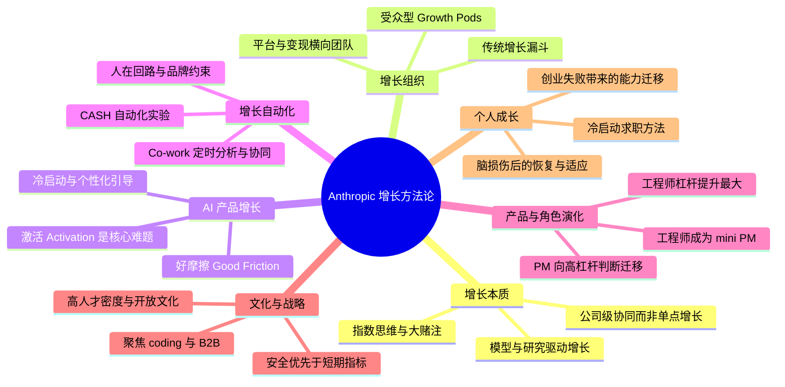

# youtu.be

# 1. 🧠 课程思维导图 (Mind Map)

---

# 2. 📌 核心精要 (Executive Summary)

- **Anthropic 的超高速增长，本质上不是“增长技巧”胜利，而是“模型能力、研究实力、组织聚焦、开放文化”共同作用的结果。**
- 在 AI 产品中，**激活（Activation）** 比传统 SaaS 更关键，因为用户往往不知道模型真正能做什么；因此，**适当增加“好摩擦”** 来识别用户、匹配场景，反而能提升转化与留存。
- Anthropic 的增长团队虽然也做传统的**获客（Acquisition）—激活（Activation）—变现（Monetization）**，但在指数型技术环境中更强调**大赌注（Large Bets）**、快速适应，以及让 Claude 直接参与增长实验自动化。
- AI 正在重塑产品团队分工：**工程师杠杆提升最快，PM 的价值更多转向方向判断、跨团队协调、机会识别与系统级决策**，而不是仅写文档或做流程管理。
- 这家公司最深的护城河之一不是某个功能，而是**使命驱动、人才密度、透明开放、允许公开争论的文化**。

---

# 3. 📖 详细知识模块 (Detailed Notes)

## 模块一：Anthropic 的增长奇迹，究竟发生了什么？

### 1.1 增长数据与行业对比

#### What：关键事实
Anthropic 被描述为**“历史上增长最快的公司之一”**，并给出了一组极具冲击力的数据：

- **2025 年初：10 亿美元 ARR（Annual Recurring Revenue，年度经常性收入）**
- **2025 年中：约 40 亿美元 ARR**
- **2025 年底：约 90 亿美元 ARR**
- **最新公开数字：190 亿美元 ARR**
- 从 **10 亿到 190 亿 ARR，仅用 14 个月**
- 过去几个月收入**翻倍**
- 公司整体收入保持 **10x year-over-year（同比 10 倍）** 的增长趋势
- 更早的节奏：
  - **2023：0 → 1 亿美元**
  - **2024：1 亿 → 10 亿美元**
  - **2025：10 亿 → 约 100 亿美元级别**
- 受访者还指出：**190 亿美元的数字已经过时**，因为那是 **2 月底** 的数字

#### 行业对比
主持人用成熟 SaaS 公司作为参照：

- **Atlassian**
- **Palantir**
- **Snowflake**

这些公司经营 **15–20 年** 后，每家约做到 **45 亿–60 亿美元 ARR**；而 Anthropic **每几个月新增的 ARR，就接近这些公司多年累计规模**。

#### Why：为什么这组数据重要？
这意味着 Anthropic 的增长不是普通意义上的“高增长 SaaS”，而是进入了**指数型技术公司（Exponential Technology Company）**的范畴。传统增长模型默认规模越大、增速越慢；Anthropic 的反常之处在于：

- 规模已经很大
- 增长却尚未明显放缓
- 产品价值仍在快速上升

这也是为什么内部已经不太看**线性图（Linear Charts）**，而更看**对数线性图（Log-linear Charts）**。

#### How：具体应用启示
如果你在分析 AI 公司，不应只问：

- 当前转化率是多少？
- 这个漏斗还能优化几个点？

还要问：

- 产品能力是否在持续指数提升？
- 新能力是否在不断打开**新市场（New Markets）**？
- 团队是否按“未来 2 年产品价值会远高于今天”来配置资源？

---

## 模块二：Anthropic 增长的底层逻辑——不是增长团队单独赢了，而是“模型先赢”

### 2.1 增长的第一性原理：模型能力才是核心驱动

#### What：增长负责人对归因的判断
受访者明确表示：

- Anthropic 首先是一家**模型公司（Model Company）**
- 也是一家**智能公司（Intelligence Company）**
- 增长团队做了很多事，但**不能把公司成功主要归功于增长团队**
- 真正推动成功的“lion’s share（最大份额）”来自：
  - 研究团队（Research Team）
  - 推理团队（Inference）
  - 算力团队（Compute）
  - Claude Code 等产品团队
  - Go-to-market 团队

#### Why：为什么“增长技巧”不是核心？
因为在 AI 时代，产品价值增长速度远高于传统软件：

- 一个普通应用两年后也许只比今天好 **30%–50%**
- 但 Anthropic 判断：**2 年后产品价值可能是今天的 100 倍到 1000 倍**

因此，增长团队面对的不是一个相对稳定的产品，而是一个**持续跃迁的能力系统**。

#### How：管理上的含义
增长团队要做的不是“包装一个固定产品”，而是：

- 迅速理解新模型解锁了什么能力
- 判断这些能力适合哪些用户
- 用更高效的 onboarding（引导）把用户送到正确入口
- 让新的产品价值尽快被用户“感知”

---

### 2.2 指数思维（Exponential Thinking）如何改变增长决策

#### What：Anthropic 的内部思维方式
受访者提到一个有意思的文化现象：

> **“内部线性图已经不酷了。所有东西都看对数线性图。”**

以及一句核心判断：

> **“我们总是在谈指数（the exponential）。”**

#### Why：指数环境下，传统优化会失真
在稳定环境里，增长团队通常会：

- 花 60%–70% 时间在小中型实验
- 花 20%–30% 时间在大赌注

但 Anthropic 倒过来了：

- 更接近 **70/30 或 50/50**
- 更偏向**大赌注（Large Swings）**
- 原因不是不重视微优化，而是：
  - 未来产品价值变化太大
  - 微优化只能吃到今天的局部红利
  - 大赌注更可能匹配未来的新能力、新市场

#### How：判断标准
如果你的产品核心价值是由 AI 驱动，并且 AI 能力持续跃迁，那么策略上应：

- 提高大赌注占比
- 不要只沉迷于短期 1%–2% 的优化
- 把资源配置到可能打开下一阶段增长曲线的产品方向上

如果你的产品只是“带一点 AI 功能”，而 AI 不是核心价值，那么未必适合完全照搬这种打法。

---

## 模块三：增长团队到底做什么？——传统漏斗仍在，但 70% 时间用于“成功灾难”

### 3.1 增长工作的基本面没有消失

#### What：Anthropic 增长团队仍然覆盖传统三类工作

1. **获客 Acquisition**
   - 如何让更多人进来
   - 流量质量与用户意图（Intent）

2. **激活 Activation**
   - 注册流程（Signup Flow）
   - 将用户导向正确产品
   - 让用户成功体验价值

3. **变现 Monetization**
   - 免费转付费（Free-to-paid Conversion）
   - 定价（Pricing）
   - 包装（Packaging）

#### Why：AI 公司不等于不要漏斗
AI 产品再新，仍需要解决：

- 用户怎么来
- 进来后怎么理解产品
- 如何变成付费与长期使用

#### How：区别只在于复杂度和节奏
Anthropic 的特殊之处在于：

- 这些问题仍然存在
- 但速度更快、变化更猛
- 同时产品能力不断变，导致增长方法必须不断重写

---

### 3.2 70% 时间花在“成功灾难 Success Disasters”

#### What：什么是“成功灾难（Success Disasters）”
这是 Anthropic 内部的一个说法，意思是：

- 某件事**成功得太快、太猛**
- 以至于其他系统开始**断裂、过载、失配**

受访者说，他大约 **70% 时间**都花在这些问题上。

#### Why：高增长的真实代价
超高速增长带来的，不只是漂亮曲线，还有大量“消防式工作（Firefighting）”：

- 获客侧问题
- 激活侧拥堵
- 变现逻辑跟不上
- 产品组合、用户路径、运营承接全部被冲击

他还提到这类体验类似早期：

- Facebook
- Uber
- DoorDash

这些快速扩张公司都经历过“增长本身成为组织压力源”的阶段。

#### How：对管理者的启发
如果你身处高速增长环境，真实工作可能不是精致优化，而是：

- 快速识别系统瓶颈
- 跨团队止血
- 承认“图是绿的，但团队很累”这一现实
- 在情绪上接受“成功也会制造痛苦”

---

## 模块四：AI 产品增长最难的是激活（Activation），不是获客

## 4.1 为什么激活是 AI 时代的头号问题

#### What：受访者的原话判断
> **“Activation is a really big challenge in AI.”**  
> **“Activation is critical.”**

他将其定义为：

- **Day 0 / Day 1 产品体验**
- 早期使用阶段让用户真正理解产品

#### Why：AI 有“能力悬置（Capability Overhang）”问题
课程提出了一个关键概念：

- **能力悬置 Capability Overhang**

意思是：

- 模型能力增长速度极快
- 但产品设计、用户理解、入口引导跟不上
- 用户不知道模型能做什么，于是只问些低价值问题

受访者举例：

- 假设模型已接近 AGI 或能做很多复杂事
- 但用户上来只问：**“旧金山天气怎么样？”**
- 那么用户根本没有吃到真正价值

所以 AI 产品的关键，不只是“模型强”，而是**怎么把强能力扩散给普通用户（Diffuse Benefits）**。

#### How：激活的目标
激活不只是让用户完成注册，而是让用户尽快进入：

- 正确任务
- 正确场景
- 正确功能
- 正确产品模块

最终获得 **Aha Moment（顿悟时刻）**。

---

### 4.2 模型升级太快，导致激活设计永远在追赶

#### What：AI 产品增长的现实困境
受访者描述了一个困难循环：

1. 新模型上线
2. 团队研究它的新能力
3. 设计合适的入口（On-ramps）
4. 运行测试
5. 学到结论
6. 上线新流程
7. 结果下一个模型已经来了，旧结论可能过时

#### Why：这和传统 SaaS 完全不同
传统产品的核心功能相对稳定，激活流程可以持续微调；AI 产品里，功能边界在快速重构，意味着：

- 漏斗不是一次设计好
- onboarding 不是静态页面
- 产品价值地图持续变化

#### How：实践原则
AI 增长团队必须：

- 持续重估新模型能力
- 持续更新用户分流逻辑
- 用实验快速验证“这个能力该卖给谁、如何引导”

---

## 模块五：好摩擦（Good Friction）——减少步骤不一定能提升转化

### 5.1 “摩擦越少越好”是常见误解

#### What：课程核心观点
> **“The right friction helps.”**  
> **“Adding more friction usually works if you do it the right way.”**

这是整段对话中最重要的增长反直觉之一。

#### Why：很多用户不是“需要更少步骤”，而是“需要更明确的匹配”
如果直接把所有人丢进产品：

- 用户认知负担高
- 不知道从哪开始
- 不知道产品是否适合自己
- 结果反而更容易流失

适当增加步骤，可以：

- 了解用户是谁
- 识别意图
- 推荐更相关的入口
- 降低认知负担

#### How：判断“好摩擦”与“坏摩擦”
**坏摩擦（Bad Friction）**：
- 让人烦
- 不产生价值
- 无法帮助用户理解产品
- 纯粹拖慢流程

**好摩擦（Good Friction）**：
- 帮助识别用户特征
- 帮助产品个性化推荐
- 让用户更理解“为什么这个产品适合我”
- 最终提升激活、完成率、生命周期价值

---

### 5.2 Anthropic 的做法：通过提问识别用户，再推荐功能

#### What：Anthropic onboarding 的具体策略
他们在引导中会问用户：

- 你是谁
- 你的兴趣领域是什么
- 你想做什么

然后根据答案：

- 推荐不同产品
- 推荐不同功能
- 把用户送到更相关路径

很多外部人会觉得：

- 流程太长
- 摩擦太多

但团队表示：

- **他们有数据支持**
- 当前表现让他们“kind of happy（相对满意）”

#### Why：用户画像是后续所有个性化的基础
受访者特别强调，这不仅帮助激活，还帮助后续整个生命周期（Lifecycle）：

- 更准确推荐内容
- 更准确做再营销
- 甚至可用于广告层的**lookalike targeting（相似人群投放）**

#### How：落地动作
如果你在做 AI 产品 onboarding，可以测试：

- 用 2–5 个问题识别用户目标
- 基于答案推荐模板 / 场景 / 产品线
- 跟踪完成率、7 日留存、转付费率

不要先入为主地以为“步骤减少一定更好”。

---

### 5.3 Mercury / MasterClass / Calm 的案例证明

#### 案例 1：Mercury
Mercury 是受访者之前负责增长的公司。其 onboarding 属于金融/合规场景，非常复杂，需要理解：

- Registered agent address
- Legal address
- Physical address
- Beneficial ownership details（受益所有权信息）

他们曾经做出一个关键决定：

- **整整一个季度不看增长指标**
- 只专注提升 onboarding 的**质量（Quality）**
- 目标是把这段体验做到最好

结果：

- onboarding 完成率显著提升
- 成为他在 Anthropic 之前，作为 Growth PM 最有影响力的一个季度

核心结论：

> **质量驱动增长（Quality drives growth）**

#### 案例 2：MasterClass
MasterClass 的购买流程会加入一个 quiz（问卷/测验）：

- 用户原本只是来买
- 但流程会问他“你为什么来、你想学什么”

看起来更长，但经过充分测试后发现：

- 它显著提升收入
- 因为它帮助用户相信“这个产品是为我设计的”

#### 案例 3：Calm
受访者提到，MasterClass 增长团队的一位 PM 后来去了 Calm，Calm 的落地页与购买流程中也出现类似 quiz，这不是巧合。

#### 案例 4：拆分表单，降低认知负担
在 Mercury，他们还验证过：

- 同样 5–6 个输入项
- 拆成两个页面
- 可以降低**认知负荷（Cognitive Load）**
- 反而表现更好

---

## 模块六：增长组织如何设计——40 人团队，但更像“产品化增长系统”

### 6.1 组织规模与结构

#### What：团队规模
Anthropic 增长团队约 **40 人**。

#### 组织结构
大体分两类：

1. **横向团队（Horizontals）**
   - **Growth Platform**
   - **Monetization**
   - 为全产品线服务

2. **受众型增长 Pod**
   - **B2B Growth**
   - **Claude Code Growth**
   - **Knowledge Worker Growth**
   - **API Growth**

团队内角色包括：

- 工程师（Engineers）
- 设计师（Designers）
- 产品经理（PMs）
- 数据（Data）

#### Why：多产品环境不能只按漏斗拆
如果只有一个产品，按：

- 转化 Conversion
- 激活 Activation
- 变现 Monetization

来分团队比较自然。

但 Anthropic 已经有多个产品与多个受众，若只按漏斗拆，问题是：

- 不同产品用户完全不同
- 不同产品内部协作方完全不同
- 同一个 Activation Team 无法同时深刻理解 Claude Code、API、知识工作者等多类场景

#### How：设计原则
所以他们选择了：

- 以**受众 / 产品场景**建立更聚焦的 pod
- 再用横向团队做平台能力与共性支持

这是典型的“产品复杂度提升后，从漏斗型组织转向矩阵型组织”的例子。

---

### 6.2 与传统增长团队相比，Anthropic 更偏向大赌注

#### What：资源倾斜差异
传统增长团队通常：

- 60%–70% 小中型实验
- 20%–30% 大赌注

Anthropic 更接近：

- **70/30 反过来**
- 或 **50/50**
- 明显向大赌注倾斜

#### Why：指数型产品价值决定了“不能错过森林”
受访者用了一个很重要的比喻：

> 不要 **miss the forest for the trees（见树不见林）**

即：

- 小优化仍重要
- 但如果未来价值会指数跃升，那么只做微优化会错过真正的大机会

#### How：增长团队甚至直接做“核心产品型创新”
例如：

- **Chrome Extension（浏览器扩展）**
- 这是支撑 Co-work 与 Claude Code 多个用例的重要基础设施
- 竟然是**增长团队主导构建**
- 这在其他公司里不太常见

说明在 AI 公司中，增长与产品边界正在模糊，增长团队可以直接做“核心产品型大赌注”。

---

## 模块七：增长自动化——CASH 如何让 Claude 参与增长实验

### 7.1 什么是 CASH？

#### What：项目定义
Anthropic 增长平台团队正在推进一项计划，叫：

- **CASH = Claude Accelerates Sustainable Hypergrowth**

受访者吐槽这个名字有点“cringey（尴尬）”，不是他取的，但含义清楚：

- 用 Claude 自动化增长实验

#### Why：增长工作天然适合率先自动化
因为增长里有大量工作是：

- 小优化
- 高重复性
- 数据驱动
- 可评估结果

这类任务比很多模糊型产品战略工作，更适合 AI 提前介入。

---

### 7.2 自动化增长实验的四步框架

#### What：受访者明确给出一个“四步循环”

1. **识别机会（Identify Opportunities）**
   - Claude 是否能基于趋势、历史实验发现新机会？

2. **构建功能（Build the Feature）**
   - 生成文案
   - 生成小改动
   - 准备可上线方案

3. **测试与质检（Test & Ensure Quality）**
   - 是否达到质量标准与品牌标准？

4. **分析结果（Analyze Data / Gather Learnings）**
   - 上线后回收数据
   - 总结 learnings（学习结论）

#### Why：这是增长的标准闭环
这个框架本质上就是增长实验的通用生命周期，但 Anthropic 正在尝试让 Claude 在每个环节承担更多角色。

#### How：当前进度
目前仍然是**小规模、早期阶段**，主要集中在：

- 文案修改（Copy Changes）
- 轻量 UI Tweaks（小 UI 调整）

但已经：

- **开始产生结果**
- 可理解为一个“初级 PM 水平”的自动化助手

受访者给出一个很生动的评价：

- 现在的效果大概像一个 **2–3 年经验的 junior PM**
- **还达不到 senior PM**
- 但几个月前甚至还完全不可用
- 现在已经开始“印钱（prints money）”

这非常重要，因为它说明自动化不是遥远概念，而是已经跨过“0 到 1”的实用门槛。

---

### 7.3 为什么还需要人类在回路（Human in the Loop）？

#### What：当前仍保留人工审批
现在系统大致是：

- AI 提建议
- AI 协助执行部分工作
- 人类审批上线

#### Why：两个核心原因
1. **品牌（Brand）**
   - 不能上线违反品牌调性的东西

2. **跨团队协调（Cross-functional Stakeholder Management）**
   - 大项目仍需人与人协商、推动、博弈

受访者特别指出：

> PM 工作短期内不会消失，因为跨部门协同仍高度依赖人类。

#### How：未来趋势
随着模型增强、上下文更长、品牌规则更清晰、技能（Skills）更完善：

- 人工 review 会显著减少
- AI 会逐步从“辅助执行”走向“建议 + 执行 + 评估”

---

## 模块八：Co-work 的实际自动化场景——从数据日报到对齐扫描

### 8.1 自动看图表：早上醒来先看 AI 摘要

#### What：实际 workflow
受访者自己会让 Co-work：

- 每天定时查看 **20–25 张图表**
- 来源包括：
  - Hex links
  - Chrome extension
  - MCP（Model Context Protocol）连接的数据源
- 然后生成摘要：
  - 哪些指标需要注意
  - 什么地方异常
  - 有哪些新洞察

#### Why：人不可能每天盯完所有图
在多产品、多漏斗环境里：

- 长尾图表太多
- 人只能盯核心指标
- 其余中长尾指标适合让 AI 做“第一层巡检”

#### How：实践价值
这是典型的**AI 作为 analyst copilot（分析副驾驶）**：

- 节省扫描时间
- 让管理者专注异常与决策
- 提升信号捕捉能力

---

### 8.2 自动发现组织失配（Misalignment）

#### What：他最喜欢的用法之一
通过 Co-work + Slack MCP，可以让 Claude：

- 浏览自己负责项目相关的 Slack 讨论
- 结合当前重点项目
- 主动找出**潜在失配（Potential Misalignment）**

他甚至设置了**每周自动运行**。

#### Why：组织失配是大公司执行速度的重要阻力
当多个团队并行推进时，常见问题包括：

- 两个团队做重复工作
- 优先级理解不同
- 对目标理解不一致
- 关键干系人未被纳入

AI 的价值不在于“替代判断”，而在于：

- 快速扫描大规模沟通记录
- 把可能的失配点先捞出来

#### How：可以进一步扩展成“组织战略机器人”
主持人将其概括为一种未来形态：

- 一个持续观察市场、指标、路线图、沟通记录的**strategy bot（战略机器人）**
- 主动建议：
  - 现在该做什么
  - 哪些地方偏了
  - 哪些团队没对齐
  - 哪些指标说明应当 pivot（转向）

受访者认为：
- **今年内就可能出现相当有效的版本**

---

### 8.3 管理者 Copilot：给团队成员反馈、模拟上级视角

#### What：两个高级用法

**用法 1：给直属下属生成管理观察**
Claude 可结合：

- 团队目标与 OKR
- 一周内 Slack 讨论
- 会议记录与对话

总结：

- 该成员做了什么
- 有哪些关键观察
- 管理者应该给什么反馈

**用法 2：模拟自己上级的反馈**
受访者会让 Claude 结合：

- 上级 Armie Vora 的公开表达
- 内部交流方式
- 自己本周行为

生成：

- “如果我是 Armie，会给你什么反馈？”

#### Why：这相当于“软性教练（Soft Coaching）”
在高强度环境中，很多反馈不会自然发生；AI 可以变成一个持续提醒、辅助反思的镜子。

#### How：使用注意
他也强调：

- 当前质量“有时很好，有时不靠谱”
- 像一个“偶尔会醉酒的教练”
- 但已有大量高价值时刻

---

## 模块九：PM / 工程 / 设计角色正在如何变化？

### 9.1 谁先被 AI 放大？答案是工程师

#### What：受访者的判断
他明确认为：

- PM 和设计师都在获得 AI 杠杆
- 但**工程师目前获得的杠杆最大**

例如：

- 使用 Claude Code 后
- 一个 5 人工程团队，实际产出可能接近过去 **2–3 倍**
- 相当于旧世界的 **15–20 个工程师产能**

#### Why：结果是 PM 与设计被“挤压”
当工程产能暴涨而 PM / 设计支持未同比提升时：

- PM 来不及定义方向
- 设计来不及配合
- 整体产生“组织张力（Strain）”

他甚至说内部很多团队都感受到：

- **PM 和设计被挤得很厉害（squeezed）**

---

### 9.2 PM 的价值正在上移：从执行转向判断与协调

#### What：PM 不会很快消失，但工作重心会变
受访者并不认为 PM 会快速消失，原因是：

- 大项目仍需跨团队协调
- 仍需高质量机会判断
- 仍需对方向做权衡
- 仍需管理复杂 stakeholder alignment

#### How：Anthropic 的一个具体规则
为了缓解 PM 稀缺问题，他们建立了一个简单规则：

- 若项目 **≤ 2 周工程量**
  - 默认由**工程师充当 mini PM**
  - 自己去沟通：
    - Security
    - Legal
    - Cross-functional stakeholders
  - PM 只在必要时 advisory

- 若项目 **> 2 周工程量**
  - 默认 PM 对项目成败负责
  - 工程师仍可承担部分 PM 职责，但 PM 保持核心 accountability

这不是绝对规则，而是一个**高杠杆分工阈值**。

#### Why：让 PM 聚焦更高价值问题
如果 PM 对每个小项目都事必躬亲，就会浪费在低杠杆执行上；更好的做法是：

- 让产品意识强的工程师处理小项目
- PM 聚焦：
  - 机会识别
  - 用户洞察
  - 优先级判断
  - 系统级对齐

---

### 9.3 “会产品思考的工程师”与“会设计/编码的 PM”价值暴涨

#### What：未来的稀缺型人才
课程反复强调一种趋势：**跨学科能力（Interdisciplinary Strength）**会变得异常值钱。

受访者举例：

- 产品意识强的工程师，是“绝对独角兽”
- 如果设计资源稀缺，那么会设计的 PM 价值也会暴涨
- 他自己认为自己受益于混合背景：
  - Founder
  - Investment banker
  - Growth
  - 差点去做 Account Executive（销售）

#### Why：AI 把“单一技能”商品化，把“组合技能”稀缺化
因为很多基础执行能力会被 AI 变得更便宜，所以未来更值钱的是：

- 复合判断
- 场景迁移
- 端到端推进
- 跨函数翻译能力

#### How：他的建议
不要只补弱项，而要识别自己的**高峰能力（Spikes）**，把它做成真正的不公平优势。

---

## 模块十：没有 PRD 的世界？——文档的重要性在下降，但 kickoff 更重要

### 10.1 PRD（Product Requirements Document）正在过时吗？

#### What：受访者的偏好非常鲜明
他直言：

- **“我对 PRD 有点厌恶。”**
- **“我讨厌文档。”**
- 他们内部 **60%–80%** 的事情没有正式 PRD

#### Why：AI + 高质量团队让“先做再说”更可行
在高信任、高人才密度环境中，小项目可以：

- 直接在 Slack 里讨论
- 快速达成共识
- 立刻原型化 / 实现

这比先写长文档更高效。

#### How：分场景处理
- **小改动 / 小实验**：Slack 即可
- **重要项目 / 风险较大项目**：仍做明确 kickoff
- **需要 PRD 时**：让 Claude 基于模板与历史 PRD 快速生成草稿

---

### 10.2 30 分钟跨团队 kickoff 仍然关键

#### What：无论再快，大项目仍要 kickoff
受访者非常强调：

- 把 Legal
- Safeguards
- 相关合作方
- 跨职能利益相关者

拉进 30 分钟会议，说清楚：

- 我们准备做什么
- 你关心什么
- 哪些风险要提前处理

#### Why：不做 kickoff，后面会更乱
在高速组织里：

- 大家都忙
- 信息不对称严重
- 如果前面不统一，后面返工会更多

#### How：一句话原则
**小事跳过文档，大事不能跳过对齐。**

---

## 模块十一：求职方法论——冷启动邮件（Cold Email）如何拿到 Anthropic 增长负责人职位

### 11.1 他如何拿到 Anthropic 的工作？

#### What：故事本身非常反常规
- 他原本就是 Claude 用户
- 觉得产品很强，但明显缺增长团队
- 于是直接给 Anthropic CPO **Mike Krieger** 发了封**冷邮件（Cold Email）**
- 当时公司**并没有公开招聘增长岗位**
- 恰好团队正开始思考要不要组增长团队
- 对方回复了，后续一路聊下来，最终入职

他甚至说自己不是通过：
- 内推 Referral
- 官网申请
- 猎头 Sourcing

而是完全“自建机会”。

#### Why：这体现的不是运气，而是增长人的核心能力
主持人评价很到位：

- 一个优秀增长人本来就应该擅长吸引注意力
- 冷邮件本身几乎就像面试第一轮

---

### 11.2 冷邮件方法论提炼

#### What：他的冷邮件原则
1. **主题行先赢得打开率**
   - 他承认自己有测试过的高打开率 subject line
   - 但具体文案保密

2. **选对触达渠道**
   - 别只打工作邮箱 / LinkedIn
   - 因为这些地方所有人都在轰炸
   - 他会想办法找到对方**个人邮箱**

3. **内容极短**
   - 我是谁
   - 为什么匹配
   - 为什么值得聊
   - 就够了

4. **持续 follow-up**
   - 如果他真的在意一件事，会一直跟进
   - 直到对方明确说“请别再联系我”

#### Why：本质是增长思维在求职中的应用
冷邮件不是“写得漂亮”，而是完整漏斗：

- Open rate（打开）
- Response rate（回复）
- Conversion（转为通话）

#### How：适用场景
适合：
- 目标岗位未公开
- 你判断对方组织存在空白需求
- 你已经是产品深度用户，能提出真洞察

---

## 模块十二：战略聚焦——Anthropic 为什么押注 B2B 与 Coding？

### 12.1 聚焦不是结果，而是生存策略

#### What：Anthropic 曾是最弱势的玩家之一
受访者回顾：

- 曾经是这个赛道里**最小、最缺资金**的玩家
- 没有 Meta/Google 那样的现金流与分发
- 没有 OpenAI 那样的先发优势

原话很重：

> **“我们能走到今天这个阶段，几乎是奇迹。”**

#### Why：资源劣势迫使他们必须高度聚焦
在这种条件下，如果什么都做：

- 会被资金更强者碾压
- 会被分发更强者覆盖
- 会被先发更强者抢走注意力

所以必须：

- 选更窄的战略路径
- 在少数高价值领域打穿

---

### 12.2 为什么是 Coding？

#### What：不只是商业机会，更是研究飞轮
Anthropic 很早就重视 coding 场景。受访者提到一份 2021 年内部文档，其核心是：

- 为什么要聚焦 AI Coding

理由不仅是商业 TAM（总可寻址市场）大，还因为：

- **最好的模型 → 最好的 coding 能力**
- **最好的 coding 工具 → 提升研究者效率**
- **研究效率提升 → 更快做出更好的模型**
- 从而形成研究飞轮

#### Why：这是“商业 + 研发”双重正反馈
少有产品方向同时满足：

- 用户价值足够强
- 商业化足够大
- 又能反哺核心技术研发

Coding 恰好满足。

---

### 12.3 为什么是 B2B？

#### What：主持人观察到 Anthropic 很擅长在 B2B 深耕
课程没有展开特别细的 B2B 策略细节，但从团队结构与案例可见：

- B2B 被作为独立增长方向
- 组织和产品资源都对其倾斜
- 与“安全、质量、长期信任”也天然更契合

#### Why：B2B 更适合承接 Anthropic 的价值主张
- 安全性
- 可控性
- 品牌信任
- 长期关系

这些更容易在 B2B 场景转化为优势。

---

## 模块十三：安全优先，不做“榨干每一美元”的增长

### 13.1 公司的法律结构就决定了“不唯 shareholder value”

#### What：Anthropic 的结构是 **Public Benefit Corporation（PBC，公益公司）**
不同于普通 Delaware C-Corp 以最大化 shareholder value 为法定义务，PBC 允许公司合法地把：

- 公共利益
- 社会目标

作为核心目标之一。

#### Why：这不是公关口号，而是制度选择
受访者强调：

- AI 安全不是营销修辞
- 是公司存在的理由
- 也是创始团队离开前公司另起炉灶的原因

#### How：对增长的具体影响
增长团队会接受：

- 为安全放弃短期指标
- 为品牌放弃部分变现机会
- 为用户体验留下“钱在桌上”

一句话总结：

> **增长团队要学会舒适地“把钱留在桌上（leave money on the table）”。**

---

### 13.2 两类有争议的增长实验

#### What：他把 controversial test 分成两类

**类型 1：无论结果如何都不该上线**
- 太违背品牌 / 用户体验 / 价值观
- 那就连实验都不该做

**类型 2：自己不喜欢，但没越过红线**
- 可以跑测试
- 但如果“ick / cringe（不适感）”比较高
- 那就必须看到足够高的收益回报

#### Why：这是一种价值观约束下的实验经济学
不是所有增长实验都值得跑。真正成熟的增长团队，知道：

- 哪些不能碰
- 哪些可以碰，但要更高收益阈值

#### How：实践标准
建立增长实验评审时，可以加一条维度：

- 除了 impact / confidence / effort
- 还加：
  - 品牌风险
  - 用户体验风险
  - 价值观冲突度

---

## 模块十四：文化护城河——最强的东西是“人”和“开放”

### 14.1 人才密度（Talent Density）

#### What：受访者对人才密度的描述非常强烈
他形容自己像在：

> **“为皇家马德里（Real Madrid）效力。”**

并列举了很多顶尖人物：

- Mike Krieger（Instagram 联合创始人之一，后任 Anthropic CPO）
- Armie Vora
- 研究团队中的世界级研究者
- Growth Engineering 方向 Reforge 授课者
- 甚至曾任**美国驻澳大利亚大使**的人也只是普通员工之一

#### Why：高人才密度让组织具备非线性执行力
当每个人都强时，组织不是线性叠加，而会产生：

- 更快对齐
- 更少低质量沟通
- 更高判断质量
- 更强执行鲁棒性

---

### 14.2 开放文化（Open Culture）与 Notebook Channels

#### What：Anthropic 有一个很特别的内部机制：
每个人都有自己的 **Notebook Channel**，像内部版 Twitter / feed：

- 分享自己在想什么
- 分享当下优先级
- 分享工作洞察
- 可以发很 provocative 的观点

而且：

- 可以公开挑战领导层
- 可以公开反对 Dario 的观点
- 会引发公开讨论

#### Why：这既是文化机制，也是知识基础设施
它有两层作用：

1. **文化层**
   - 提高透明度
   - 鼓励挑战权威
   - 增强信任

2. **AI 基础设施层**
   - 为 agent 提供丰富的组织语境
   - 让 Claude 更懂：
     - 这个团队怎么想
     - 这个人重视什么
     - 组织的边界与原则是什么

#### How：对其他组织的启发
如果你希望 AI 真正成为组织助手，就需要把很多隐性知识显性化：

- 原则
- 偏好
- 约束
- 风格
- 当前关注点

Anthropic 的 Notebook Channels，本质上就是把“隐性组织心智”逐渐数据化。

---

## 模块十五：个人成长与恢复力——失败、脑损伤、冥想如何塑造了他

### 15.1 创业失败的教训

#### What：他曾创业 3 年，融资数百万美元，团队最多 7–10 人，最终关停
项目方向是：

- 心理健康
- 量化 mental health
- 希望更早识别：
  - Generalized anxiety（广泛性焦虑）
  - Major depression（重度抑郁）等风险

#### Why：失败为什么依然有价值
虽然公司关停很痛苦，但这段经历让他获得：

- 产品经验
- 冷启动销售能力
- 冷邮件能力
- 创业者视角
- 对不确定性的承受力

他后来能做产品和增长，很大程度上正来自这次失败。

#### How：给创业者的实操建议
他特别提醒：

- **即使情况很差，也要坚持发 monthly investor updates（月度投资人更新）**
- 好的时候容易发，坏的时候更该发
- 这样能减少 surprise，也体现诚信

---

### 15.2 脑损伤与恢复：9 个月重新学习走路和工作

#### What：经历概述
- 2022 年初，因 Muay Thai / MMA 训练中的一次头部击打导致**严重脑损伤**
- 前几个月非常痛苦：
  - 不能看屏幕
  - 听音乐 20 秒都想吐
  - 很长时间无法正常走路
  - 妻子要帮助完成很多基础生活事务
- 用了约 **9 个月** 才逐步回到工作
- 之后又曾因轻微事故再次受伤
- 到现在也还**不是 100% 完全恢复**

#### Why：这段经历带来的深层改变
它迫使他形成一些长期习惯：

- 不喝酒
- 不喝咖啡因
- 定时休息
- 更重视身体信号
- 持续冥想
- 更关注情绪与现实之间的关系

#### How：他提炼出的核心原则
1. **Freedom through constraints（自由来自约束）**
   - 限制反而逼人适应与聚焦

2. **意识（Awareness）与现实（Reality）之间存在选择空间**
   - 你不能控制所有现实
   - 但可以训练对现实的反应方式

3. 一个重要的冥想洞见：
   > **真正的自由，是当你得不到想要的东西时，仍能保持满足。**

这不是消极，而是一种更稳定的恢复力。

---

## 模块十六：推荐资源、个人偏好与一句座右铭

### 16.1 推荐书单

#### 1）**Joy of Living**
- 作者：**Yongey Mingyur Rinpoche**
- 主题：冥想、意识、人生体验方式的重构
- 用途：帮助重塑对痛苦、压力、情绪的认知

#### 2）**Awareness**
- 作者：**Anthony de Mello**
- 主题：自我观察、觉察、内在自由

#### 3）**Thinking in Bets**
- 作者：**Annie Duke**
- 主题：不确定性下的判断与概率思维
- 与产品、增长、决策高度相关

---

### 16.2 最近喜欢的产品

#### Maruhachi Pro Pillow
- 在日本酒店发现的一款枕头
- 内部有 beads，可自然调节高度
- 适配仰睡和侧睡
- 他因为颈部和上斜方疼痛问题，觉得这款枕头“改变了自己最近一周的生活”

---

### 16.3 常用人生信条

#### 1）**“She’ll be right.”**
这是很典型的澳洲表达，意思接近：

- 会好的
- 没事的
- 扛过去就行

用途是：在困难中不过度放大严重性，维持情绪稳定。

#### 2）**“Just go for it.”**
来自他创业时期的重要建议：

- 不要无限犹豫
- 有些时刻只能下注、行动、承担结果

这和他推荐的 **Thinking in Bets** 其实也形成呼应。

---

# 4. 🛠️ 实践与应用 (Actionable Points)

## 行动建议 1：重做你的 onboarding，不要默认“步骤越少越好”
- 挑一个核心入口页，增加 2–4 个问题：
  - 你是谁？
  - 你来这里是想做什么？
  - 你最关心哪个场景？
- 用这些答案给出：
  - 推荐功能
  - 推荐模板
  - 推荐产品路径
- 重点观察：
  - 完成率
  - Aha 到达率
  - 7 日留存
  - 付费转化

> 先验证**好摩擦（Good Friction）**是否比“无脑减步骤”更有效。

---

## 行动建议 2：给自己做一个“AI 增长/管理副驾驶”
用 Claude 或同类工具建立每周自动化任务：

- 自动查看关键图表并生成异常摘要
- 自动扫描 Slack / 项目记录，识别潜在 misalignment
- 自动总结本周工作，并从“你上级的视角”给你反馈

> 先从一个简单流程开始，不要一口气自动化一切。

---

## 行动建议 3：重新审视你团队的 PM 分工阈值
尝试建立一个轻量规则：

- 小于某个复杂度 / 工时阈值的小项目，默认让产品意识强的工程师直接推进
- PM 主要负责高复杂度、高争议度、高协同成本项目

> 目的是把 PM 从低杠杆执行中释放出来，转向**方向判断、机会识别、跨团队协调**。

---

# 5. 🤔 深度思考与费曼测试 (Reflection)

1. **为什么在 AI 产品里，激活（Activation）比传统 SaaS 更重要？请结合“能力悬置（Capability Overhang）”解释，并举一个你熟悉产品的例子。**

2. **“增加摩擦反而能提升转化”为什么成立？请区分好摩擦（Good Friction）与坏摩擦（Bad Friction），并设计一个你会测试的 onboarding 方案。**

3. **如果未来工程师产能因 AI 提升 2–3 倍，而 PM/设计提升较慢，产品团队该如何重构分工？请分别从小公司与大公司两个场景回答。**

如果你愿意，我还可以继续把这份笔记再加工成一版：

- **更适合复习的“超高密度版”**
- **适合分享给团队的“汇报版”**
- **适合 Notion / Obsidian 的“知识卡片版”**
